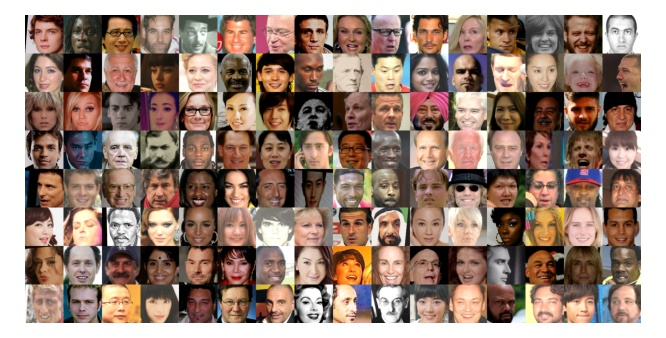
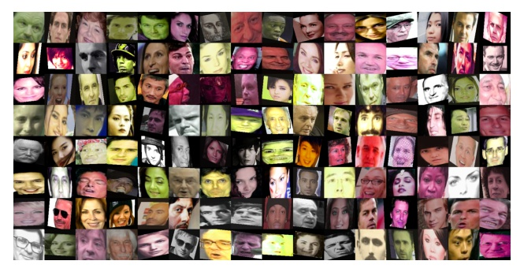
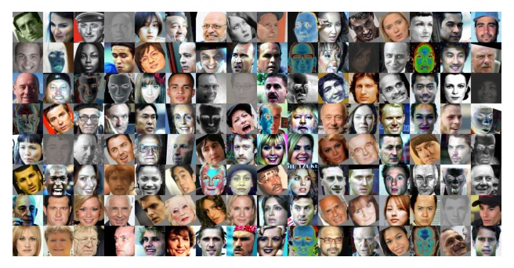
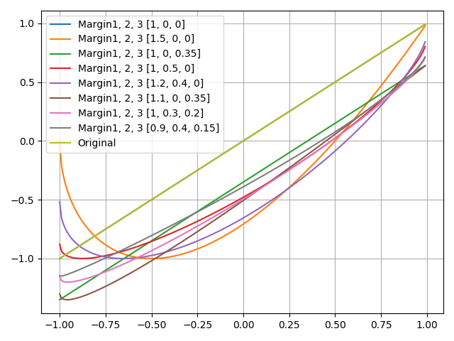
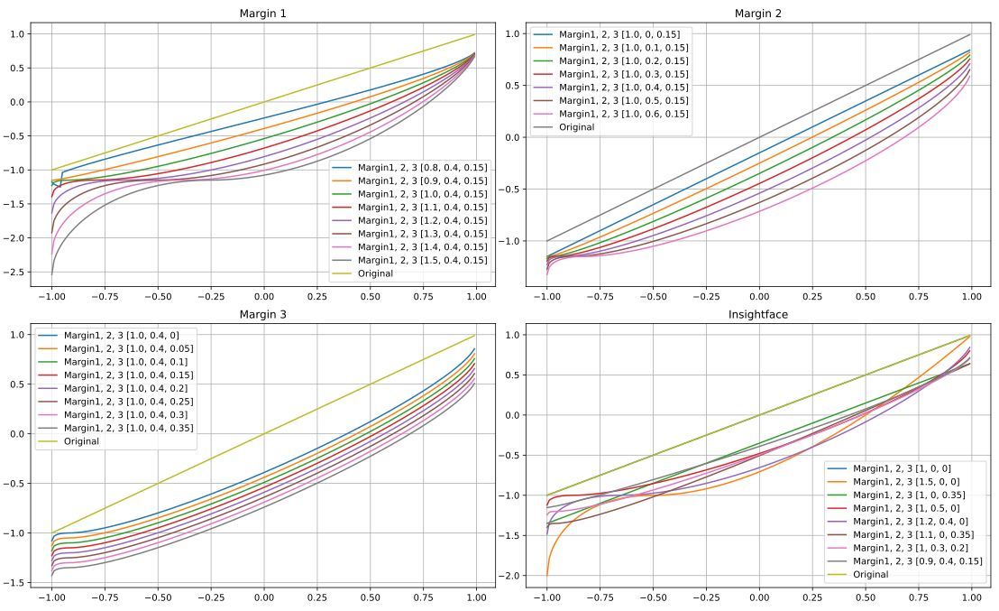
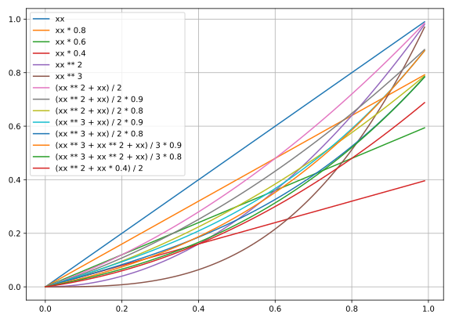
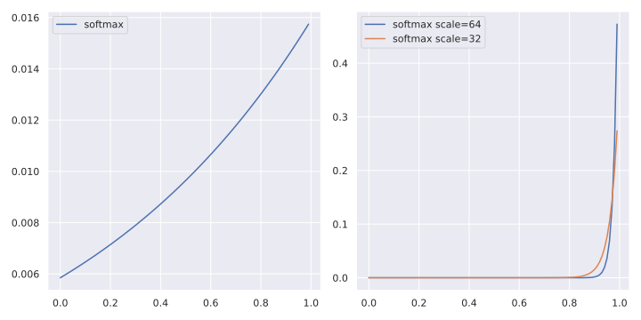

# ___2019 - 11 - 18 Keras Insightface___
***

# 目录
  <!-- TOC depthFrom:1 depthTo:6 withLinks:1 updateOnSave:1 orderedList:0 -->

  - [___2019 - 11 - 18 Keras Insightface___](#2019-11-18-keras-insightface)
  - [目录](#目录)
  - [Insightface MXNet 模型使用](#insightface-mxnet-模型使用)
  	- [Insightface](#insightface)
  	- [模型加载与特征提取](#模型加载与特征提取)
  	- [模型训练](#模型训练)
  	- [代码分析](#代码分析)
  	- [Fine tune](#fine-tune)
  - [Highest Accuracy](#highest-accuracy)
  	- [Deepinsight Accuracy](#deepinsight-accuracy)
  	- [Mobilenet 256 Embeddings](#mobilenet-256-embeddings)
  	- [Mobilenet 512 embeddings](#mobilenet-512-embeddings)
  	- [Vargface](#vargface)
  - [人脸识别损失函数](#人脸识别损失函数)
  - [ImageDataGenerator](#imagedatagenerator)
  - [训练模型拟合 embeddings](#训练模型拟合-embeddings)
  	- [First try](#first-try)
  	- [数据处理](#数据处理)
  	- [模型训练](#模型训练)
  	- [模型测试](#模型测试)
  - [Keras Insightface](#keras-insightface)
  	- [Project](#project)
  	- [Data](#data)
  	- [Arcface loss](#arcface-loss)
  	- [Softmax](#softmax)
  	- [Offline Triplet loss train SUB](#offline-triplet-loss-train-sub)
  	- [TF 通用函数](#tf-通用函数)
  - [nmslib dot svm dist calculation comparing](#nmslib-dot-svm-dist-calculation-comparing)
  - [Docker 封装](#docker-封装)

  <!-- /TOC -->
***

# Insightface MXNet 模型使用
## Insightface
  - [deepinsight/insightface](https://github.com/deepinsight/insightface)
  - **MXNet**
    ```sh
    # 安装 cuda-10-0 对应的 mxnet 版本
    pip install mxnet-cu100
    ```
## 模型加载与特征提取
  ```py
  # cd ~/workspace/face_recognition_collection/insightface/deploy
  import face_model
  import argparse
  import cv2
  import os

  home_path = os.environ.get("HOME")
  args = argparse.ArgumentParser().parse_args([])
  args.image_size = '112,112'
  args.model = os.path.join(home_path, 'workspace/models/insightface_mxnet_model/model-r100-ii/model,0')
  args.ga_model = os.path.join(home_path, "workspace/models/insightface_mxnet_model/gamodel-r50/model,0")
  args.gpu = 0
  args.det = 0
  args.flip = 0
  args.threshold = 1.05
  model = face_model.FaceModel(args)

  img = cv2.imread('./Tom_Hanks_54745.png')
  bbox, points = model.detector.detect_face(img, det_type = model.args.det)

  import matplotlib.pyplot as plt
  aa = bbox[0, :4].astype(np.int)
  bb = points[0].astype(np.int).reshape(2, 5).T

  # landmarks
  plt.imshow(img)
  plt.scatter(ii[:, 0], ii[:, 1])

  # cropped image
  plt.imshow(img[aa[1]:aa[3], aa[0]:aa[2], :])

  # By face_preprocess.preprocess
  cd ../src/common
  import face_preprocess
  cc = face_preprocess.preprocess(img, aa, bb, image_size='112,112')
  plt.imshow(cc)

  # export image feature, OUT OF MEMORY
  emb = model.get_feature(model.get_input(img))
  ```
## 模型训练
  - **Insightface Mobilenet**
    ```sh
    # My 2-stage pipeline:
    # Train softmax with lr=0.1 for 120K iterations.
    # LRSTEPS='240000,360000,440000'
    CUDA_VISIBLE_DEVICES='0,1,2,3' python -u train_softmax.py --data-dir $DATA_DIR --network "$NETWORK" --loss-type 0 --prefix "$PREFIX" --per-batch-size 128 --lr-steps "$LRSTEPS" --margin-s 32.0 --margin-m 0.1 --ckpt 2 --emb-size 128 --fc7-wd-mult 10.0 --wd 0.00004 --max-steps 140002

    # Switch to ArcFace loss to do normal training with '100K,140K,160K' iterations.
    # LRSTEPS='100000,140000,160000'
    CUDA_VISIBLE_DEVICES='0,1,2,3' python -u train_softmax.py --data-dir $DATA_DIR --network "$NETWORK" --loss-type 4 --prefix "$PREFIX" --per-batch-size 128 --lr-steps "$LRSTEPS" --margin-s 64.0 --margin-m 0.5 --ckpt 1 --emb-size 128 --fc7-wd-mult 10.0 --wd 0.00004 --pretrained '../models2/model-y1-test/model,70'

    # training dataset: ms1m
    # LFW: 99.50, CFP_FP: 88.94, AgeDB30: 95.91
    ```
  - **Resnet34 Casia**
    ```sh
    CUDA_VISIBLE_DEVICES='0' python -u train_softmax.py --data-dir /datasets/faces_casia --network "r50" --loss-type 0 --prefix "./model/mxnet_r50_casia" --per-batch-size 512 --lr-steps "20000,28000" --margin-s 32.0 --margin-m 0.1 --ckpt 2 --emb-size 512 --fc7-wd-mult 10.0 --wd 0.0005 --max-steps 12000

    CUDA_VISIBLE_DEVICES='0' python -u train_softmax.py --data-dir /datasets/faces_casia --network "r50" --loss-type 4 --prefix "./model/mxnet_r50_casia" --per-batch-size 512 --lr-steps "20000,28000" --margin-s 64.0 --margin-m 0.5 --ckpt 1 --emb-size 512 --fc7-wd-mult 10.0 --wd 0.0005 --pretrained './model/mxnet_r50_casia'

    # training dataset: ms1m
    # LFW: 99.50, CFP_FP: 88.94, AgeDB30: 95.91
    ```
  - **Mobilenet Casia**
    ```sh
    # 5822653 // 512 + 1 = 11373
    # 120000 / 11373 = 10.55
    CUDA_VISIBLE_DEVICES='0' python -u train_softmax.py --data-dir /datasets/faces_casia --network "m1" \
        --loss-type 0 --prefix "./model/mxnet_mobilenet_casia" --per-batch-size 512 --lr-steps "240000,360000,440000" \
        --margin-s 32.0 --margin-m 0.1 --ckpt 1 --emb-size 256 --fc7-wd-mult 10.0 --wd 0.00005 \
        --verbose 11373 --end-epoch 11 --ce-loss

    CUDA_VISIBLE_DEVICES='0' python -u train_softmax.py --data-dir /datasets/faces_casia --network "r50" --loss-type 4 --prefix "./model/mxnet_r50_casia" --per-batch-size 512 --lr-steps "20000,28000" --margin-s 64.0 --margin-m 0.5 --ckpt 1 --emb-size 512 --fc7-wd-mult 10.0 --wd 0.0005 --pretrained './model/mxnet_r50_casia'

    # training dataset: ms1m
    # LFW: 99.50, CFP_FP: 88.94, AgeDB30: 95.91
    ```
  - **Mobilenet emore**
    ```sh
    # 5822653 // 512 + 1 = 11373
    # 120000 / 11373 = 10.55
    CUDA_VISIBLE_DEVICES='0' python -u train_softmax.py --data-dir /datasets/faces_casia --network "m1" \
        --loss-type 0 --prefix "./model/mxnet_mobilenet_casia" --per-batch-size 512 --lr-steps "240000,360000,440000" \
        --margin-s 32.0 --margin-m 0.1 --ckpt 1 --emb-size 256 --fc7-wd-mult 10.0 --wd 0.00005 \
        --verbose 11373 --end-epoch 11 --ce-loss

    CUDA_VISIBLE_DEVICES='0' python -u train_softmax.py --data-dir /datasets/faces_casia --network "r50" --loss-type 4 --prefix "./model/mxnet_r50_casia" --per-batch-size 512 --lr-steps "20000,28000" --margin-s 64.0 --margin-m 0.5 --ckpt 1 --emb-size 512 --fc7-wd-mult 10.0 --wd 0.0005 --pretrained './model/mxnet_r50_casia'

    # training dataset: ms1m
    # LFW: 99.50, CFP_FP: 88.94, AgeDB30: 95.91
    ```
  **config.py 配置文件**
  ```py
  # config.py +78
  network.m1.emb_size = 512

  # config.py +117
  dataset.emore.dataset_path = '/datasets/faces_emore'
  dataset.emore.num_classes = 85742
  ...
  dataset.glint.dataset_path = '/datasets/faces_glint'
  dataset.glint.num_classes = 180855

  # config.py +147
  loss.arcface = edict()
  loss.arcface.loss_name = 'margin_softmax'
  loss.arcface.loss_s = 64.0
  loss.arcface.loss_m1 = 1.0
  loss.arcface.loss_m2 = 0.5
  loss.arcface.loss_m3 = 0.0

  # default settings
  default.lr = 0.1
  default.wd = 0.0005
  default.mom = 0.9
  ```
  **mobilenet 模型训练**
  ```sh
  export MXNET_ENABLE_GPU_P2P=0

  # arcface train
  CUDA_VISIBLE_DEVICES='0,1' python -u train_parall.py --network m1 --loss arcface --dataset emore --per-batch-size 96

  # triplet fine-tune
  CUDA_VISIBLE_DEVICES='0,1' python -u train.py --network m1 --loss arcface --dataset emore --per-batch-size 96 --pretrained ./models/m1-arcface-emore/model --lr 0.0001
  CUDA_VISIBLE_DEVICES='1' python -u train.py --network m1 --loss triplet --dataset emore --per-batch-size 150 --pretrained ./models/m1-triplet-emore_97083/model --lr 0.0001 --lr-steps '1000,100000,160000,220000,280000,340000'
  CUDA_VISIBLE_DEVICES='0' python -u train.py --network m1 --loss triplet --dataset glint --per-batch-size 150 --pretrained ./models/m1-triplet-emore_290445/model --pretrained-epoch 602 --lr 0.0001 --lr-steps '1000,100000,160000,220000,280000,340000'
  ```
  **Vargfacenet 模型训练**
  ```sh
  # Vargfacenet
  CUDA_VISIBLE_DEVICES='0,1' python3 -u train_parall.py --network vargfacenet --loss softmax --dataset emore --per-batch-size 96
  CUDA_VISIBLE_DEVICES='1' python3 -u train.py --network vargfacenet --loss arcface --dataset glint --per-batch-size 150 --pretrained ./models/vargfacenet-softmax-emore/model --pretrained-epoch 166 --lr 0.0001 --lr-steps '100000,160000,220000,280000,340000'
  ```
## 代码分析
  - **config**
    ```py
    # config.py
    config.bn_mom = 0.9
    config.net_output = 'E'
    config.ce_loss = True
    config.fc7_lr_mult = 1.0
    config.fc7_wd_mult = 1.0
    config.fc7_no_bias = False

    network.m1.net_name = 'fmobilenet'
    network.m1.emb_size = 256
    network.m1.net_output = 'GDC'
    network.m1.net_multiplier = 1.0

    network.vargfacenet.net_name = 'vargfacenet'
    network.vargfacenet.net_multiplier = 1.25
    network.vargfacenet.emb_size = 512
    network.vargfacenet.net_output='J'

    loss.arcface.loss_name = 'margin_softmax'
    loss.arcface.loss_s = 64.0
    loss.arcface.loss_m1 = 1.0
    loss.arcface.loss_m2 = 0.5
    loss.arcface.loss_m3 = 0.0

    loss.triplet.loss_name = 'triplet'
    loss.triplet.images_per_identity = 5
    loss.triplet.triplet_alpha = 0.3
    loss.triplet.triplet_bag_size = 7200
    loss.triplet.triplet_max_ap = 0.0
    loss.triplet.per_batch_size = 60
    loss.triplet.lr = 0.05
    ```
  - **symbol**
    ```py
    # symbol_utils.py
    def Linear(data, num_filter=1, kernel=(1, 1), stride=(1, 1), pad=(0, 0), num_group=1, name=None, suffix=''):
        conv = mx.sym.Convolution(data=data, num_filter=num_filter, kernel=kernel, num_group=num_group, stride=stride, pad=pad, no_bias=True, name='%s%s_conv2d' %(name, suffix))
        bn = mx.sym.BatchNorm(data=conv, name='%s%s_batchnorm' %(name, suffix), fix_gamma=False,momentum=bn_mom)    
        return bn

    def get_fc1(last_conv, num_classes, fc_type, input_channel=512):
      elif fc_type=='E':
        body = mx.sym.BatchNorm(data=body, fix_gamma=False, eps=2e-5, momentum=bn_mom, name='bn1')
        body = mx.symbol.Dropout(data=body, p=0.4)
        fc1 = mx.sym.FullyConnected(data=body, num_hidden=num_classes, name='pre_fc1')
        fc1 = mx.sym.BatchNorm(data=fc1, fix_gamma=True, eps=2e-5, momentum=bn_mom, name='fc1')
      elif fc_type=='FC':
        body = mx.sym.BatchNorm(data=body, fix_gamma=False, eps=2e-5, momentum=bn_mom, name='bn1')
        fc1 = mx.sym.FullyConnected(data=body, num_hidden=num_classes, name='pre_fc1')
        fc1 = mx.sym.BatchNorm(data=fc1, fix_gamma=True, eps=2e-5, momentum=bn_mom, name='fc1')
      elif fc_type=="GDC": #mobilefacenet_v1
        conv_6_dw = Linear(last_conv, num_filter=input_channel, num_group=input_channel, kernel=(7,7), pad=(0, 0), stride=(1, 1), name="conv_6dw7_7")  
        conv_6_f = mx.sym.FullyConnected(data=conv_6_dw, num_hidden=num_classes, name='pre_fc1')
        fc1 = mx.sym.BatchNorm(data=conv_6_f, fix_gamma=True, eps=2e-5, momentum=bn_mom, name='fc1')
      elif fc_type=='J':
        fc1 = mx.sym.FullyConnected(data=body, num_hidden=num_classes, name='pre_fc1')
        fc1 = mx.sym.BatchNorm(data=fc1, fix_gamma=True, eps=2e-5, momentum=bn_mom, name='fc1')
    ```
  - **fmobilenet**
    ```py
    # fmobilenet.py
    def get_symbol():
      conv_14 = Conv(conv_14_dw, num_filter=bf*32, kernel=(1, 1), pad=(0, 0), stride=(1, 1), name="conv_14") # 7/7
      body = conv_14
      fc1 = symbol_utils.get_fc1(body, num_classes, fc_type)
      return fc1
    ```
  - **train_parall**
    ```py
    # train_parall.py
    def get_symbol_embedding():
      embedding = eval(config.net_name).get_symbol()
      all_label = mx.symbol.Variable('softmax_label')
      #embedding = mx.symbol.BlockGrad(embedding)
      all_label = mx.symbol.BlockGrad(all_label)
      out_list = [embedding, all_label]
      out = mx.symbol.Group(out_list)
      return out

    def get_symbol_arcface(args):
      embedding = mx.symbol.Variable('data')
      all_label = mx.symbol.Variable('softmax_label')
      gt_label = all_label
      is_softmax = True
      #print('call get_sym_arcface with', args, config)
      _weight = mx.symbol.Variable("fc7_%d_weight"%args._ctxid, shape=(args.ctx_num_classes, config.emb_size),
          lr_mult=config.fc7_lr_mult, wd_mult=config.fc7_wd_mult)
      if config.loss_name=='softmax': #softmax
        fc7 = mx.sym.FullyConnected(data=embedding, weight = _weight, no_bias = True, num_hidden=args.ctx_num_classes, name='fc7_%d'%args._ctxid)
      elif config.loss_name=='margin_softmax':
        _weight = mx.symbol.L2Normalization(_weight, mode='instance')
        nembedding = mx.symbol.L2Normalization(embedding, mode='instance', name='fc1n_%d'%args._ctxid)
        fc7 = mx.sym.FullyConnected(data=nembedding, weight = _weight, no_bias = True, num_hidden=args.ctx_num_classes, name='fc7_%d'%args._ctxid)
        if config.loss_m1!=1.0 or config.loss_m2!=0.0 or config.loss_m3!=0.0:
          gt_one_hot = mx.sym.one_hot(gt_label, depth = args.ctx_num_classes, on_value = 1.0, off_value = 0.0)
          if config.loss_m1==1.0 and config.loss_m2==0.0:
            _one_hot = gt_one_hot*args.margin_b
            fc7 = fc7-_one_hot
          else:
            fc7_onehot = fc7 * gt_one_hot
            cos_t = fc7_onehot
            t = mx.sym.arccos(cos_t)
            if config.loss_m1!=1.0:
              t = t*config.loss_m1
            if config.loss_m2!=0.0:
              t = t+config.loss_m2
            margin_cos = mx.sym.cos(t)
            if config.loss_m3!=0.0:
              margin_cos = margin_cos - config.loss_m3
            margin_fc7 = margin_cos
            margin_fc7_onehot = margin_fc7 * gt_one_hot
            diff = margin_fc7_onehot - fc7_onehot
            fc7 = fc7+diff
        fc7 = fc7*config.loss_s

      out_list = []
      out_list.append(fc7)
      if config.loss_name=='softmax': #softmax
        out_list.append(gt_label)
      out = mx.symbol.Group(out_list)
      return out

    def train_net(args):
      esym = get_symbol_embedding()
      asym = get_symbol_arcface

      opt = optimizer.SGD(learning_rate=base_lr, momentum=base_mom, wd=base_wd, rescale_grad=_rescale)
    ```
## Fine tune
  - **fine-tuning** 在实践中，由于数据集不够大，很少会从头开始训练网络，常见的做法是使用预训练的网络来重新 **微调 fine-tuning**，或当做特征提取器
    - 卷积网络当做 **特征提取器**，使用在 ImageNet 上预训练的网络，去掉最后的全连接层，剩余部分当做特征提取器，得到特征后可以使用线性分类器 Liner SVM / Softmax 等来分类图像
    - **Fine-tuning 卷积网络** 替换掉网络的输入层，使用新的数据继续训练，可以选择 fine-tune 全部层或部分层，通常前面的层提取的是图像的 **通用特征 generic features**，如边缘 / 色彩特征，后面的层提取的是与特定类别有关的特征，因此常常只需要 fine-tuning 后面的层
    - 一般如果新数据集比较小且和原数据集相似，可以使用预训练网络当做特征提取器，用提取的特征训练线性分类器，如果新数据集足够大，可以 fine-tune 整个网络
    - 与重新训练相比，fine-tune 要使用 **更小的学习率**，因为训练好的网络模型权重已经平滑，不希望太快扭曲 distort 它们
***

# Highest Accuracy
## Deepinsight Accuracy

  | Method        | LFW(%) | CFP-FP(%) | AgeDB-30(%) | MegaFace(%)          |
  | ------------- | ------ | --------- | ----------- | -------------------- |
  | LResNet100E   | 99.77  | 98.27     | 98.28       | 98.47                |
  | LResNet50E    | 99.80  | 92.74     | 97.76       | 97.64                |
  | LResNet34E    | 99.65  | 92.12     | 97.70       | 96.70                |
  | MobileFaceNet | 99.50  | 88.94     | 95.91       | -----                |
  | VarGfaceNet   | 99.783 | 98.400    | 98.067      | 88.334 **DeepGlint** |
## Mobilenet 256 Embeddings

  | Step      | fc7_acc  | lfw     | cfp_fp  | agedb_30 | SUM     |
  | --------- | -------- | ------- | ------- | -------- | ------- |
  | **Loss**  | arcface  | **DS**  | glint   |          |         |
  | 1660K     | 0.25     | 0.99567 | 0.89529 | 0.96683  | 2.85779 |
  | **Loss**  | triplet  | **DS**  | emore   |          |         |
  | 840       | 0.062472 | 0.99633 | 0.93429 | 0.97083  | 2.90145 |
  | **Loss**  | triplet  | **DS**  | glint   |          |         |
  | 960[40]   | 0.064614 | 0.99617 | 0.93686 | 0.97017  | 2.90319 |
  | 2575[107] | 0.064761 | 0.99667 | 0.93829 | 0.96950  | 2.90445 |
## Mobilenet 512 embeddings
  | Step      | fc7_acc  | lfw     | cfp_fp  | agedb_30 | SUM     |
  | --------- | -------- | ------- | ------- | -------- | ------- |
  | **Loss**  | arcface  | **DS**  | emore   |          |         |
  | 1204K     | 0.015625 | 0.99533 | 0.93671 | 0.96367  | 2.89571 |
  | **Loss**  | triplet  | **DS**  | glint   |          |         |
  | 25[1]     | 0.146767 | 0.99567 | 0.93971 | 0.96500  | 2.90038 |
  | 532[20]   | 0.149680 | 0.99650 | 0.94614 | 0.96600  | 2.90864 |
  | 613[23]   | 0.146067 | 0.99683 | 0.94957 | 0.96300  | 2.90940 |
  | 668[25]   | 0.147614 | 0.99633 | 0.94757 | 0.96617  | 2.91007 |
  | 914[34]   | 0.148697 | 0.99650 | 0.94886 | 0.96517  | 2.91052 |
  | 996[37]   | 0.138909 | 0.99667 | 0.95014 | 0.96467  | 2.91148 |
  | 2809[102] | 0.146283 | 0.99600 | 0.95071 | 0.96783  | 2.91455 |
  | **Loss**  | triplet  | **DS**  | emore   |          |         |
  | 1697[65]  | 0.155924 | 0.99667 | 0.95129 | 0.96817  | 2.91612 |
## Vargface

  | Step     | fc7_acc    | lfw     | cfp_fp  | agedb_30 | SUM     |
  | -------- | ---------- | ------- | ------- | -------- | ------- |
  | **Loss** | softmax    | **DS**  | emore   |          |         |
  | 9.68K    | 0.265625   | 0.98383 | 0.82914 | 0.85117  |         |
  | 25.66K   | 0.28645834 | 0.98333 | 0.83729 | 0.85717  |         |
  | 62K      | 0.25520834 | 0.98067 | 0.83429 | 0.86517  |         |
  | 72K      | 0.3125     | 0.97683 | 0.81329 | 0.87217  |         |
  | 270K     | 0.7395833  | 0.99517 | 0.95086 | 0.93267  |         |
  | 332K     | 0.703125   | 0.99583 | 0.94857 | 0.93350  |         |
  | **Loss** | triplet    | **DS**  | glint   |          |         |
  | 175[10]  | 0.070560   | 0.99567 | 0.94314 | 0.95033  | 2.88914 |
  | 361[20]  | 0.056305   | 0.99683 | 0.94414 | 0.94867  | 2.88964 |
  | 648[35]  | 0.064737   | 0.99567 | 0.94700 | 0.95250  | 2.89517 |
  | **Loss** | triplet    | **DS**  | emore   |          |         |
***

# 人脸识别损失函数
  - 人脸识别模型训练的损失函数主要分为 **基于分类 softmax 的损失函数** 和 **基于 triplet loss 的损失函数** 两大类
    - **基于分类 softmax 的损失函数** 因为是否对 embedding 或分类权重 W 做归一化以及是否增加额外的间隔 margin 等产生了多种变体
    - **基于 triplet loss 的损失函数** 则分为基于欧氏距离和基于角度距离两种
  - **基于分类 softmax 的损失函数**
    - **基本的 softmax 分类** 通过将 embedding 输入一层全连接层以及 softmax 函数得到分类概率，由于 softmax 的分母对 embedding 在各个类别上的结果进行了求和，因此最小化这一损失一定程度上能够使类间距离变大，类内距离变小
      - N 表示样本数量
      - n 表示类别总数
      - yi 表示样本 xi 的真实类别
    - **Sphereface Loss** 在 softmax 的基础上进一步引入了显式的角度间隔 angular margin，从而训练时能够进一步缩小类内距离，扩大类间距离
    - **CosineFace Loss** 进一步对人脸表示 embedding 进行了归一化，从而使分类结果仅取决于夹角余弦，并进一步引入了余弦间隔 m，用于扩大类间距离，缩小类内距离。由于余弦的取值范围较小，为了使类别间差别更显著，进一步引入一个超参数 s 用于放大余弦值
    - **Arcface Loss** 为了使人脸表示 embedding 的学习更符合超球体流形假设，Arcface 进一步将 Cosineface 中的余弦间隔修改为角度间隔，得到如下损失

    | 损失函数   | 分类边界                      |
    | ---------- | ----------------------------- |
    | Softmax    | (W1 - W2) * x + b1 - b2 = 0   |
    | SphereFace | ∥x∥ * (cosmθ1 - cosθ2) = 0    |
    | CosineFace | s * (cosθ1 - m - cosθ2) = 0   |
    | ArcFace    | s * (cos(θ1 + m) - cosθ2) = 0 |

  - **基于 triplet loss 的损失函数** 与通过 softmax 优化使类内距离缩小，类间距离扩大不同，Triplet Loss 直接对样本间的距离进行优化，使不同类样本间的距离比同类样本间的距离大出一个间隔，因此计算 Triplet Loss 每次需要采样三个样本 anchor / positive / negative，其中，anchor 与 positive 样本属于同一类别，与 negative 样本属于不同类别

    - x代表人脸表示 embedding
    - 上标 a,p,n 分别表示 anchor，positive 和 negative
    - dist(x,y) 表示 x,y 的距离函数
    - m 则表示不同类样本间距离比同类样本间距离大出的间隔，这里的距离函数和间隔既可以是欧氏距离也可以是角度距离等形式
  - **softmax 损失与 Triplet Loss 结合**
    - Triplet Loss 直接对样本表示间的距离进行优化，在训练数据足够多，模型表示能力足够强的情况下，能够学得很好的结果
    - 其缺点是，一方面训练时模型收敛速度较慢，另一方面在构造triplet时需要选择合适的正样本对和负样本对，因此需要设计 triplet 的构造选择机制，这一过程通常比较复杂
    - 较好的训练方式是先用分类损失训练模型，然后再用 Triplet Loss 对模型进行 finetune 以进一步提升模型性能
***

# ImageDataGenerator
  - **基本使用**
    ```py
    import numpy as np
    import matplotlib.pyplot as plt
    from keras.preprocessing.image import ImageDataGenerator

    img = np.random.rand(1, 500, 500, 3)

    fig, ax = plt.subplots(1, 5, figsize=(20, 10))
    ax = ax.ravel()
    ax[0].imshow(img[0])
    ax[1].imshow(next(ImageDataGenerator().flow(img))[0])
    ax[2].imshow(next(ImageDataGenerator(brightness_range=(0., 0.)).flow(img))[0])
    ax[3].imshow(next(ImageDataGenerator(brightness_range=(1., 1.)).flow(img))[0])
    ax[4].imshow(next(ImageDataGenerator(brightness_range=(1., 1.)).flow(img))[0] / 255)
    ```
    
  - **flow_from_directory**
    ```py
    seed = 1
    from tensorflow.python.keras.preprocessing.image import ImageDataGenerator

    data_gen = ImageDataGenerator(rescale=1./255, validation_split=0.1)


    img_gen = data_gen.flow_from_directory('segmentation_dataset/tumorImage/', target_size=(512, 512), batch_size=4,
                                           class_mode=None, seed=seed, color_mode='grayscale')
    mask_gen = data_gen.flow_from_directory('segmentation_dataset/maskImage/', target_size=(512, 512), batch_size=4,
                                           class_mode=None, seed=seed, color_mode='grayscale')

    train_gen = zip(img_gen, mask_gen)
    ```
  - **模型训练 fit_generator**
    ```py
    from keras.preprocessing.image import ImageDataGenerator
    # construct the training image generator for data augmentation
    aug = ImageDataGenerator(rotation_range=20, zoom_range=0.15,
        width_shift_range=0.2, height_shift_range=0.2, shear_range=0.15,
        horizontal_flip=True, fill_mode="nearest")

    model.fit_generator(aug.flow(trainX, trainY, batch_size=BS),
      	validation_data=(testX, testY), steps_per_epoch=len(trainX) // BS,
      	epochs=EPOCHS)
    ```
  - **ImageDataGenerator 生成图像数据与对应 mask**
    - TF 1.14 与 TF 2.0 中的 `ImageDataGenerator` 实现不能将 `zip` 对象识别为 `generators` / `sequences`，需要转化为 **内联的生成器 inline generator**
      ```py
      train_gen = (pair for pair in zip(img_gen, mask_gen))
      ```
      ```py
      data_gen_args = dict(rotation_range=0.2,
                          width_shift_range=0.05,
                          height_shift_range=0.05,
                          shear_range=0.05,
                          zoom_range=0.05,
                          horizontal_flip=True,
                          fill_mode='nearest',
                          rescale=1./255)

      image_generator = tf.keras.preprocessing.image.ImageDataGenerator(data_gen_args)
      mask_generator = tf.keras.preprocessing.image.ImageDataGenerator(data_gen_args)

      imageGenerator = image_generator.flow_from_directory('membrane/train', color_mode="grayscale", classes=['image'], class_mode=None, batch_size=5)
      maskGenerator = mask_generator.flow_from_directory('membrane/train', color_mode="grayscale", classes=['label'], class_mode=None, batch_size=5)

      train_generator = (pair for pair in zip(imageGenerator, maskGenerator))


      history = model.fit_generator(train_generator, steps_per_epoch=100, epochs=3)
      ```
    - **ImageDataGenerator 转化为 `tf.data.Dataset`** 提升读取效率
      ```py
      def my_input_fn(total_items, epochs):
          dataset = tf.data.Dataset.from_generator(lambda: my_generator(total_items),
                                                   output_types=(tf.float64, tf.int64))

          dataset = dataset.repeat(epochs)
          dataset = dataset.batch(32)
          return dataset

      if __name__ == "__main__":
          tf.enable_eager_execution()

          model = tf.keras.Sequential([tf.keras.layers.Flatten(input_shape=(4, 20, 1)),
                                       tf.keras.layers.Dense(64, activation=tf.nn.relu),
                                       tf.keras.layers.Dense(12, activation=tf.nn.softmax)])

          model.compile(optimizer='adam',
                        loss='categorical_crossentropy',
                        metrics=['accuracy'])

          total_items = 100
          batch_size = 32
          epochs = 10
          num_batches = int(total_items/batch_size)
          dataset = my_input_fn(total_items, epochs)
          model.fit_generator(dataset, epochs=epochs, steps_per_epoch=num_batches)
      ```
***

# 训练模型拟合 embeddings
## First try
  ```py
  import glob2
  from skimage.io import imread

  loaded = tf.saved_model.load('model_resnet')
  interf = loaded.signatures['serving_default']
  teacher_model_interf = lambda images: interf(tf.convert_to_tensor(images, dtype=tf.float32))['output'].numpy()

  def data_gen(path, teacher_model_interf, batch_size=64, base_path_replace=[]):
      image_path_files = glob2.glob(os.path.join(path, '*/*'))
      total = len(image_path_files)
      while True:
          image_path_files = np.random.permutation(image_path_files)
          print("This should be the epoch start, total files = %d" % (image_path_files.shape[0]))
          for id in range(0, total, batch_size):
              image_batch_data = image_path_files[id: id + batch_size]
              if len(base_path_replace) != 0:
                  image_batch_data = [ii.replace(base_path_replace[0], base_path_replace[1]) for ii in image_batch_data]
              images = (np.array([imread(ii) for ii in image_batch_data]) / 255).astype('float32')
              embs = teacher_model_interf(images)
              yield (images, embs)
              print("Processed Id: %d - %d" % (id, id + batch_size))

  gpus = tf.config.experimental.list_physical_devices('GPU')
  tf.config.experimental.set_visible_devices(gpus[0], 'GPU')
  tf.config.experimental.set_memory_growth(gpus[0], True)

  BATCH_SIZE = 100
  DATA_PATH = './'
  # train_gen = data_gen(DATA_PATH, batch_size=BATCH_SIZE, base_path_replace=['/media/uftp/images', '/home/leondgarse/workspace/images'])
  train_gen = data_gen(DATA_PATH, teacher_model_interf, batch_size=BATCH_SIZE)
  steps_per_epoch = int(np.ceil(5822653 / BATCH_SIZE))
  ixx, iyy = next(train_gen)
  print(ixx.shape, iyy.shape)
  # (100, 112, 112, 3) (100, 512)

  xx = tf.keras.applications.MobileNetV2(input_shape=[112, 112, 3], include_top=False, weights=None)
  # xx = tf.keras.applications.NASNetMobile(input_shape=[112, 112, 3], include_top=False, weights=None)
  xx.trainable = True
  model = tf.keras.models.Sequential([
      xx,
      tf.keras.layers.GlobalAveragePooling2D(),
      tf.keras.layers.BatchNormalization(),
      tf.keras.layers.Dropout(0.1),
      tf.keras.layers.Dense(512)
  ])
  model.compile(optimizer='adam', loss='mse', metrics=["mae",'accuracy'])
  model.summary()

  hist = model.fit_generator(train_gen, epochs=50, steps_per_epoch=steps_per_epoch, verbose=1)
  ```
## 数据处理
  - 生成图像数据集对应的 embedding 数据
  ```py
  from skimage.io import imread
  gpus = tf.config.experimental.list_physical_devices('GPU')
  tf.config.experimental.set_visible_devices(gpus[0], 'GPU')
  tf.config.experimental.set_memory_growth(gpus[0], True)

  ''' 图片路径列表 '''
  pp = '/datasets/faces_emore_112x112_folders/'
  with open('faces_emore_img.foo', 'w') as ff:
      for dd in os.listdir(pp):
          dd = os.path.join(pp, dd)
          for ii in os.listdir(dd):
              ff.write(os.path.join(dd, ii) + '\n')
  # 5822653

  ''' 分割图片路径列表，每 100000 张图片作为一个文件 '''
  with open('faces_emore_img.foo', 'r') as ff:
      tt = [ii.strip() for ii in ff.readlines()]

  for ii in range(59):
      print(ii * 100000, (ii+1) * 100000)
      with open('./{}_img.foo'.format(ii), 'w') as ff:
          ff.write('\n'.join(tt[ii * 100000: (ii+1) * 100000]))

  ''' 加载目标模型 '''
  loaded = tf.saved_model.load('./model_resnet')
  _interp = loaded.signatures["serving_default"]
  interp = lambda ii: _interp(tf.convert_to_tensor(ii, dtype="float32"))["output"].numpy()

  ''' 转化特征向量 embedding 值 '''
  import glob2
  for fn in glob2.glob('./*_img.foo'):
      with open(fn, 'r') as ff:
          tt = [ii.strip() for ii in ff.readlines()]
      target_file = fn.replace('_img.foo', '_emb')
      print(fn, len(tt), target_file)

      ees = []
      for id, ii in enumerate(tt):
          # ii = ii.replace('/media/uftp', '/home/leondgarse/workspace')
          imm = imread(ii)
          ees.append(interp([imm])[0])
          if id % 100 == 0:
              print("Processing %d..." % id)
      ees = np.array(ees)
      print(ees.shape)
      np.save(target_file, ees)

  ''' 合并处理完的数据 '''
  import glob2

  path = '/home/tdtest/workspace/insightface-master/faces_emore_img/emb_done'
  image_path_files = glob2.glob(os.path.join(path, '*_img.foo'))
  emb_files = [ii.replace('_img.foo', '_emb.npy') for ii in image_path_files]
  image_names = []
  image_embs = []
  for ii, ee in zip(image_path_files, emb_files):
      with open(ii, 'r') as ff:
          image_names.extend([ii.strip() for ii in ff.readlines()])
      image_embs.append(np.load(ee))
  image_embs = np.concatenate(image_embs)
  image_classes = np.array([int(os.path.basename(os.path.dirname(ii))) for ii in image_names])
  image_names=np.array(image_names)
  classes = np.max(image_classes) + 1

  np.savez('faces_emore_class_emb', image_names=image_names, image_classes=image_classes, image_embs=image_embs)
  print(image_names.shape, image_classes.shape, image_embs.shape, classes)
  # (5822653,) (5822653,) (5822653, 512) 85742
  ```
## 模型训练
  ```py
  from keras.preprocessing.image import ImageDataGenerator
  from tensorflow.keras import layers
  from tensorflow.keras.callbacks import ModelCheckpoint, EarlyStopping, ReduceLROnPlateau

  aa = np.load('faces_emore_class_emb.npz')
  image_names, image_classes, image_embs = aa['image_names'], aa['image_classes'], aa['image_embs']
  classes = np.max(image_classes) + 1
  print(image_names.shape, image_classes.shape, image_embs.shape, classes)
  # (5822653,) (5822653,) (5822653, 512) 85742

  data_df = pd.DataFrame({"image_names": image_names, "image_classes": image_classes, "image_embs": list(image_embs)})
  image_gen = ImageDataGenerator(rescale=1./255, validation_split=0.1)
  train_data_gen = image_gen.flow_from_dataframe(data_df, directory=None, x_col='image_names', y_col=["image_classes", "image_embs"], class_mode='multi_output', target_size=(112, 112), batch_size=128, seed=1, subset='training', validate_filenames=False)
  # Found 5240388 non-validated image filenames.
  val_data_gen = image_gen.flow_from_dataframe(data_df, directory=None, x_col='image_names', y_col=["image_classes", "image_embs"], class_mode='multi_output', target_size=(112, 112), batch_size=128, seed=1, subset='validation', validate_filenames=False)
  # Found 582265 non-validated image filenames.

  xx = tf.keras.applications.MobileNetV2(include_top=False, weights=None)
  xx.trainable = True
  inputs = layers.Input(shape=(112, 112, 3))
  nn = xx(inputs)
  nn = layers.GlobalAveragePooling2D()(nn)
  nn = layers.BatchNormalization()(nn)
  nn = layers.Dropout(0.1)(nn)
  embedding = layers.Dense(512, name="embeddings")(nn)
  logits = layers.Dense(classes, activation='softmax', name="logits")(embedding)

  model = keras.models.Model(inputs, [logits, embedding])
  model.compile(optimizer='adam', loss=[keras.losses.sparse_categorical_crossentropy, keras.losses.mse])
  # model.compile(optimizer='adam', loss=[keras.losses.sparse_categorical_crossentropy, keras.losses.mse], metrics=['accuracy', 'mae'])
  model.summary()

  reduce_lr = ReduceLROnPlateau('val_loss', factor=0.1, patience=5, verbose=1)
  model_checkpoint = ModelCheckpoint("./keras_checkpoints", 'val_loss', verbose=1, save_best_only=True)
  callbacks = [model_checkpoint, reduce_lr]
  hist = model.fit_generator(train_data_gen, validation_data=val_data_gen, epochs=200, verbose=1, callbacks=callbacks)
  ```
## 模型测试
  ```py
  from skimage.io import imread
  from sklearn.preprocessing import normalize

  def model_test(image_paths, model_path, scale=1.0, output_key="output"):
      loaded = tf.saved_model.load(model_path)
      interf = loaded.signatures['serving_default']
      images = [imread(ipp) * scale for ipp in image_paths]

      preds = interf(tf.convert_to_tensor(images, dtype='float32'))[output_key].numpy()
      return np.dot(normalize(preds), normalize(preds).T), preds

  images = ['/home/leondgarse/workspace/samba/1770064353.jpg', '/home/leondgarse/workspace/samba/541812715.jpg']
  model_test(images, 'keras_checkpoints/', output_key='embeddings')
  ```
***

# Keras Insightface
## Project
  - [Github Keras_insightface](https://github.com/leondgarse/Keras_insightface)
## Data
  - Download from [Insightface Dataset Zoo](https://github.com/deepinsight/insightface/wiki/Dataset-Zoo)
  - **Data preprocess**
    ```py
    CUDA_VISIBLE_DEVICES='-1' ./prepare_data.py -D /datasets/faces_emore -T lfw.bin cfp_fp.bin agedb_30.bin
    ```
  - **Loading data by Dataset**
    ```py
    import data
    train_ds, steps_per_epoch, classes = data.prepare_dataset('/datasets/faces_emore_112x112_folders/')
    # 5822653 5822653 85742

    image_batch, label_batch = next(iter(train_ds))
    print(image_batch.shape, label_batch.shape, np.min(image_batch), np.max(image_batch))
    # (128, 112, 112, 3) (128, 85742) -1.0 1.0

    cc = (image_batch + 1) / 2
    plt.imshow(np.vstack([np.hstack(cc[ii * 16:(ii+1)*16]) for ii in range(int(np.ceil(cc.shape[0] / 16)))]))
    ```
    
  - **ImageDataGenerator 加载数据集** 可以应用 **数据增强 / autoaugment**，分割 **训练/验证数据集**，但速度慢
    ```py
    import data_gen

    train_ds, steps_per_epoch, classes = data_gen.prepare_dataset('/datasets/faces_emore_112x112_folders/', random_status=3)
    image_batch, label_batch = next(iter(train_ds))
    print(image_batch.shape, label_batch.shape, np.min(image_batch), np.max(image_batch))
    # (128, 112, 112, 3) (128, 85742) -1.0 1.0
    ```
    
    ```py
    # AutoAugment
    train_ds, steps_per_epoch, classes = data_gen.prepare_dataset('/datasets/faces_emore_112x112_folders/', random_status=-1)
    ```
    
## Arcface loss
  - **Mxnet Insigntface Arcface loss**
    ```py
    def plot_arc_trans(margin_list, new_fig=True):
        xx = np.arange(-1, 1, 0.01)
        y_true = tf.ones_like(xx)
        if new_fig:
            fig = plt.figure()
        for margin1, margin2, margin3 in margin_list:
            y_pred_vals = xx[tf.cast(y_true, dtype=tf.bool)]
            theta = tf.cos(tf.acos(y_pred_vals) * margin1 + margin2) - margin3
            theta_one_hot = (theta - y_pred_vals) * y_true
            arcface_logits = (theta_one_hot + xx).numpy()
            plt.plot(xx, arcface_logits, label="Margin1, 2, 3 [{}, {}, {}]".format(margin1, margin2, margin3))
        plt.plot(xx, xx, label="Original")
        plt.legend()
        plt.grid()
        plt.tight_layout()

    insightface_results = {
        "W&F Norm Softmax": [1, 0, 0],
        "SphereFace": [1.5, 0, 0],
        "CosineFace": [1, 0, 0.35],
        "ArcFace": [1, 0.5, 0],
        "Combined Margin_1": [1.2, 0.4, 0],
        "Combined Margin_2": [1.1, 0, 0.35],
        "Combined Margin_3": [1, 0.3, 0.2],
        "Combined Margin_4": [0.9, 0.4, 0.15],
    }
    plot_arc_trans(list(insightface_results.values()))
    ```
    
  - **Modified Arcface loss** 限制转化后的值不能大于原值
    ```py
    def plot_arc_trans(margin_list, new_fig=True):
        xx = np.arange(-1, 1, 0.01)
        y_true = tf.ones_like(xx)
        if new_fig:
            fig = plt.figure()
        for margin1, margin2, margin3 in margin_list:
            threshold = np.cos((np.pi - margin2) / margin1)
            y_pred_vals = xx[tf.cast(y_true, dtype=tf.bool)]
            theta = tf.cos(tf.acos(y_pred_vals) * margin1 + margin2) - margin3
            # theta_valid = tf.where(y_pred_vals > threshold, theta, y_pred_vals - threshold - 1)
            theta_valid = tf.where(y_pred_vals > threshold, theta, (-1 - margin3) * 2 - theta)
            theta_one_hot = (theta_valid - y_pred_vals) * y_true
            arcface_logits = (theta_one_hot + xx).numpy()
            plt.plot(xx, arcface_logits, label="Margin1, 2, 3 [{}, {}, {}]".format(margin1, margin2, margin3))
        plt.plot(xx, xx, label="Original")
        plt.legend()
        plt.grid()
        plt.tight_layout()

    fig = plt.figure()
    ax = plt.subplot(2, 2, 1)
    plot_arc_trans([[ii, 0.4, 0.15] for ii in [0.8, 0.9, 1.0, 1.1, 1.2, 1.3, 1.4, 1.5]], new_fig=False)
    plt.title('Margin 1')
    ax = plt.subplot(2, 2, 2)
    plot_arc_trans([[1.0, ii, 0.15] for ii in [0, 0.1, 0.2, 0.3, 0.4, 0.5, 0.6]], new_fig=False)
    plt.title('Margin 2')
    ax = plt.subplot(2, 2, 3)
    plot_arc_trans([[1.0, 0.4, ii] for ii in [0, 0.05, 0.1, 0.15, 0.2, 0.25, 0.3, 0.35]], new_fig=False)
    plt.title('Margin 3')
    ax = plt.subplot(2, 2, 4)
    plot_arc_trans(list(insightface_results.values()), new_fig=False)
    plt.title('Insightface')
    fig.tight_layout()
    ```
    
## Softmax
  - **Margin Softmax loss** 直接调整 softmax 值
    ```py
    xx = np.arange(0, 1, 0.01)
    plt.plot(xx, xx, label="xx")
    plt.plot(xx, xx * 0.8, label="xx * 0.8")
    plt.plot(xx, xx * 0.6, label="xx * 0.6")
    plt.plot(xx, xx * 0.4, label="xx * 0.4")
    plt.plot(xx, xx ** 2, label="xx ** 2")
    plt.plot(xx, xx ** 3, label="xx ** 3")
    plt.plot(xx, (xx ** 2 + xx) / 2, label="(xx ** 2 + xx) / 2")
    plt.plot(xx, (xx ** 2 + xx) / 2 * 0.9, label="(xx ** 2 + xx) / 2 * 0.9")
    plt.plot(xx, (xx ** 2 + xx) / 2 * 0.8, label="(xx ** 2 + xx) / 2 * 0.8")
    plt.plot(xx, (xx ** 3 + xx) / 2 * 0.9, label="(xx ** 3 + xx) / 2 * 0.9")
    plt.plot(xx, (xx ** 3 + xx) / 2 * 0.8, label="(xx ** 3 + xx) / 2 * 0.8")
    plt.plot(xx, (xx ** 3 + xx ** 2 + xx) / 3 * 0.9, label="(xx ** 3 + xx ** 2 + xx) / 3 * 0.9")
    plt.plot(xx, (xx ** 3 + xx ** 2 + xx) / 3 * 0.8, label="(xx ** 3 + xx ** 2 + xx) / 3 * 0.8")
    plt.plot(xx, (xx ** 2 + xx * 0.4) / 2, label="(xx ** 2 + xx * 0.4) / 2")
    plt.legend()
    plt.grid()
    plt.tight_layout()
    ```
    
  - **scale softmax loss**
    ```py
    fig, axes = plt.subplots(1, 2, figsize=(10, 5))
    axes[0].plot(xx, tf.nn.softmax(xx), label="softmax")
    axes[1].plot(xx, tf.nn.softmax(xx * 64), label="softmax scale=64")
    axes[1].plot(xx, tf.nn.softmax(xx * 32), label="softmax scale=32")
    axes[0].legend()
    axes[1].legend()
    fig.tight_layout()
    ```
    
## Offline Triplet loss train SUB
  ```py
  import pickle
  with open('faces_emore_img_class_shuffle.pkl', 'rb') as ff:
      aa = pickle.load(ff)
  image_names, image_classes = aa['image_names'], aa['image_classes']
  classes = np.max(image_classes) + 1
  print(len(image_names), len(image_classes), classes)
  # 5822653 5822653 85742

  from sklearn.preprocessing import normalize
  from tqdm import tqdm
  import pandas as pd

  class Triplet_datasets:
      def __init__(self, image_names, image_classes, batch_size_t=64, alpha=0.2, image_per_class=4, max_class=10000):
          self.AUTOTUNE = tf.data.experimental.AUTOTUNE
          image_dataframe = pd.DataFrame({'image_names': image_names, "image_classes" : image_classes})
          self.image_dataframe = image_dataframe.groupby("image_classes").apply(lambda xx: xx.image_names.values)
          self.image_per_class = image_per_class
          self.max_class = max_class
          self.alpha = alpha
          self.batch_size_trip = batch_size_t
          self.batch_size_emb = batch_size_t * 3
          self.sub_total = np.ceil(max_class * image_per_class / self.batch_size_emb)

      def update_triplet_datasets(self):
          list_ds = self.prepare_sub_list_dataset()
          anchors, poses, negs = self.mine_triplet_data_pairs(list_ds)
          return self.gen_triplet_train_dataset(anchors, poses, negs)

      def process_path(self, img_name, img_shape=(112, 112)):
          parts = tf.strings.split(img_name, os.path.sep)[-2]
          label = tf.cast(tf.strings.to_number(parts), tf.int32)
          img = tf.io.read_file(img_name)
          img = tf.image.decode_jpeg(img, channels=3)
          img = tf.image.convert_image_dtype(img, tf.float32)
          img = tf.image.resize(img, img_shape)
          img = tf.image.random_flip_left_right(img)
          return img, label, img_name

      def prepare_sub_list_dataset(self):
          cc = np.random.choice(self.image_dataframe.shape[0], self.max_class)
          tt = self.image_dataframe[cc].map(lambda xx: np.random.permutation(xx)[:self.image_per_class])
          ss = np.concatenate(tt.values)
          list_ds = tf.data.Dataset.from_tensor_slices(ss)
          list_ds = list_ds.map(self.process_path, num_parallel_calls=self.AUTOTUNE)
          list_ds = list_ds.batch(self.batch_size_emb)
          list_ds = list_ds.prefetch(buffer_size=self.AUTOTUNE)
          return list_ds

      def batch_triplet_image_process(self, anchors, poses, negs):
          anchor_labels = tf.zeros_like(anchors, dtype=tf.float32)
          labels = tf.concat([anchor_labels, anchor_labels + 1, anchor_labels + 2], 0)
          image_names = tf.concat([anchors, poses, negs], 0)
          images = tf.map_fn(lambda xx: self.process_path(xx)[0], image_names, dtype=tf.float32)
          return images, labels

      def mine_triplet_data_pairs(self, list_ds):
          embs, labels, img_names = [], [], []
          for imgs, label, img_name in tqdm(list_ds, "Embedding", total=self.sub_total):
              emb = basic_model.predict(imgs)
              embs.extend(emb)
              labels.extend(label.numpy())
              img_names.extend(img_name.numpy())
          embs = np.array(embs)
          not_nan_choice = np.isnan(embs).sum(1) == 0
          embs = embs[not_nan_choice]
          # embs = normalize(embs)
          labels = np.array(labels)[not_nan_choice]
          img_names = np.array(img_names)[not_nan_choice]

          '''
          where we have same label: pos_idx --> [10, 11, 12, 13]
          image names: pose_imgs --> ['a', 'b', 'c', 'd']
          anchor <--> pos: {10: [11, 12, 13], 11: [12, 13], 12: [13]}
          distance of anchor and pos: stack_pos_dists -->
              [[10, 11], [10, 12], [10, 13], [11, 12], [11, 13], [12, 13]]
          anchors image names: stack_anchor_name --> ['a', 'a', 'a', 'b', 'b', 'c']
          pos image names: stack_pos_name --> ['b', 'c', 'd', 'c', 'd', 'd']
          distance between anchor and all others: stack_dists -->
              [d(10), d(10), d(10), d(11), d(11), d(12)]
          distance between pos and neg for all anchor: neg_pos_dists -->
              [d([10, 11]) - d(10), d([10, 12]) - d(10), d([10, 13]) - d(10),
               d([11, 12]) - d(11), d([11, 13]) - d(11),
               d([12, 13]) - d(12)]
          valid pos indexes: neg_valid_x --> [0, 0, 0, 1, 1, 1, 2, 5, 5, 5]
          valid neg indexss: neg_valid_y --> [1022, 312, 3452, 6184, 294, 18562, 82175, 9945, 755, 8546]
          unique valid pos indexes: valid_pos --> [0, 1, 2, 5]
          random valid neg indexs in each pos: valid_neg --> [1022, 294, 82175, 8546]
          anchor names: stack_anchor_name[valid_pos] --> ['a', 'a', 'a', 'c']
          pos names: stack_pos_name[valid_pos] --> ['b', 'c', 'd', 'd']
          '''
          anchors, poses, negs = [], [], []
          for label in tqdm(np.unique(labels), "Mining triplet pairs"):
          # for label in np.unique(labels):
              pos_idx = np.where(labels == label)[0]
              pos_imgs = img_names[pos_idx]
              total = pos_idx.shape[0]
              pos_embs = embs[pos_idx[:-1]]
              dists = np.dot(pos_embs, embs.T)
              pos_dists = [dists[id, pos_idx[id + 1:]] for id in range(total - 1)]
              stack_pos_dists = np.expand_dims(np.hstack(pos_dists), -1)

              elem_repeats = np.arange(1, total)[::-1]
              stack_anchor_name = pos_imgs[:-1].repeat(elem_repeats, 0)
              stack_pos_name = np.hstack([pos_imgs[ii:] for ii in range(1, total)])
              stack_dists = dists.repeat(elem_repeats, 0)

              neg_pos_dists = stack_pos_dists - stack_dists - self.alpha
              neg_pos_dists[:, pos_idx] = 1
              neg_valid_x, neg_valid_y = np.where(neg_pos_dists < 0)

              if len(neg_valid_x) > 0:
                  valid_pos = np.unique(neg_valid_x)
                  valid_neg = [np.random.choice(neg_valid_y[neg_valid_x == ii]) for ii in valid_pos]
                  anchors.extend(stack_anchor_name[valid_pos])
                  poses.extend(stack_pos_name[valid_pos])
                  negs.extend(img_names[valid_neg])
                  # self.minning_print_func(pos_imgs, valid_pos, valid_neg, stack_anchor_name, stack_pos_name, labels, stack_dists)
          print(">>>> %d triplets found." % (len(anchors)))
          return anchors, poses, negs

      def gen_triplet_train_dataset(self, anchors, poses, negs):
          num_triplets = len(anchors)
          train_dataset = tf.data.Dataset.from_tensor_slices((anchors, poses, negs))
          train_dataset = train_dataset.shuffle(num_triplets + 1)
          train_dataset = train_dataset.batch(self.batch_size_trip)
          train_dataset = train_dataset.map(self.batch_triplet_image_process, num_parallel_calls=self.AUTOTUNE)
          train_dataset = train_dataset.repeat()
          train_dataset = train_dataset.prefetch(buffer_size=self.AUTOTUNE)

          steps_per_epoch = np.ceil(num_triplets / self.batch_size_trip)
          return train_dataset, steps_per_epoch

      def minning_print_func(self, pose_imgs, valid_pos, valid_neg, stack_anchor_name, stack_pos_name, labels, stack_dists):
          img2idx = dict(zip(pose_imgs, range(len(pose_imgs))))
          valid_anchor_idx = [img2idx[stack_anchor_name[ii]] for ii in valid_pos]
          valid_pos_idx = [img2idx[stack_pos_name[ii]] for ii in valid_pos]
          print("anchor: %s" % (list(zip(valid_anchor_idx, labels[pos_idx[valid_anchor_idx]]))))
          print("pos: %s" % (list(zip(valid_pos_idx, labels[pos_idx[valid_pos_idx]]))))
          print("neg: %s" % (labels[valid_neg]))
          print("pos dists: %s" % ([stack_dists[ii, pos_idx[jj]] for ii, jj in zip(valid_pos, valid_pos_idx)]))
          print("neg dists: %s" % ([stack_dists[ii, jj] for ii, jj in zip(valid_pos, valid_neg)]))
          print()

  def triplet_loss(labels, embeddings, alpha=0.2):
      labels = tf.squeeze(labels)
      labels.set_shape([None])
      anchor_emb = embeddings[labels == 0]
      pos_emb = embeddings[labels == 1]
      neg_emb = embeddings[labels == 2]
      pos_dist = tf.reduce_sum(tf.multiply(anchor_emb, pos_emb), -1)
      neg_dist = tf.reduce_sum(tf.multiply(anchor_emb, neg_emb), -1)
      basic_loss = neg_dist - pos_dist + alpha
      return tf.reduce_mean(tf.maximum(basic_loss, 0.0), axis=0)

  basic_model.compile(optimizer='adamax', loss=triplet_loss)
  triplet_datasets = Triplet_datasets(image_names, image_classes, image_per_class=5, max_class=10000)
  train_per_dataset = 1
  for epoch in range(0, 100, train_per_dataset):
      train_dataset, steps_per_epoch = triplet_datasets.update_triplet_datasets()
      basic_model.fit(train_dataset, epochs=epoch+train_per_dataset, verbose=1, callbacks=callbacks, steps_per_epoch=steps_per_epoch, initial_epoch=epoch, use_multiprocessing=True, workers=4)
  ```
  ```py
  def mine_triplet_data_pairs(embs, labels, img_names, alpha=0.2):
      anchors, poses, negs = [], [], []
      for idx, (emb, label) in enumerate(zip(embs, labels)):
          dist = np.dot(emb, embs.T)
          pos_indexes = np.where(labels == label)[0]
          pos_indexes = pos_indexes[pos_indexes > idx]
          neg_indxes = np.where(labels != label)[0]
          for pos in pos_indexes:
              if pos == idx:
                  continue
              pos_dist = dist[pos]
              neg_valid = neg_indxes[pos_dist - dist[neg_indxes] < alpha]
              if neg_valid.shape[0] == 0:
                  continue
              neg_random = np.random.choice(neg_valid)
              anchors.append(img_names[idx])
              poses.append(img_names[pos])
              negs.append(img_names[neg_random])
              print("label: %d, pos: %d, %f, neg: %d, %f" % (label, labels[pos], dist[pos], labels[neg_random], dist[neg_random]))
      return anchors, poses, negs
  ```
## TF 通用函数
  - **tf.compat.v1.scatter_sub** 将 `ref` 中 `indices` 指定位置的值减去 `updates`，会同步更新 `ref`
    ```py
    scatter_sub(ref, indices, updates, use_locking=False, name=None)
    ```
    ```py
    ref = tf.Variable([1, 2, 3, 4, 5, 6, 7, 8],dtype = tf.int32)
    indices = tf.constant([4, 3, 1, 7],dtype = tf.int32)
    updates = tf.constant([9, 10, 11, 12],dtype = tf.int32)
    print(tf.compat.v1.scatter_sub(ref, indices, updates).numpy())
    # [ 1 -9  3 -6 -4  6  7 -4]
    print(ref.numpy())
    [ 1 -9  3 -6 -4  6  7 -4]
    ```
  - **tf.tensor_scatter_nd_sub** 多维数据的 `tf.compat.v1.scatter_sub`
    ```py
    tensor = tf.ones([8], dtype=tf.int32)
    indices = tf.constant([[4], [3], [1] ,[7]])
    updates = tf.constant([9, 10, 11, 12])
    print(tf.tensor_scatter_nd_sub(tensor, indices, updates).numpy())
    # [ 1 -9  3 -6 -4  6  7 -4]
    ```
  - **tf.gather** 根据 `indices` 切片选取 `params` 中的值
    ```py
    gather_v2(params, indices, validate_indices=None, axis=None, batch_dims=0, name=None)
    ```
    ```py
    print(tf.gather([[1, 2, 3], [4, 5, 6], [7, 8, 9]], [0, 1, 0]).numpy())
    # [[1 2 3] [4 5 6] [1 2 3]]
    ```
  - **l2 normalize**
    ```py
    aa = [x1, x2]
    bb = [[y1, y2], [y3, y4]]

    ''' tf.nn.l2_normalize(tf.matmul(aa, bb)) '''
    tf.matmul(aa, bb) = [x1 * y1 + x2 * y3, x1 * y2 + x2 * y4]
    tf.nn.l2_normalize(tf.matmul(aa, bb)) = [
        (x1 * y1 + x2 * y3) / sqrt((x1 * y1 + x2 * y3) ** 2 + (x1 * y2 + x2 * y4) ** 2)
        (x1 * y2 + x2 * y4) / sqrt((x1 * y1 + x2 * y3) ** 2 + (x1 * y2 + x2 * y4) ** 2)
    ]

    ''' tf.matmul(tf.nn.l2_normalize(aa), tf.nn.l2_normalize(bb)) '''
    tf.nn.l2_normalize(aa) = [x1 / sqrt(x1 ** 2 + x2 ** 2), x2 / sqrt(x1 ** 2 + x2 ** 2)]
    tf.nn.l2_normalize(bb) = [[y1 / sqrt(y1 ** 2 + y3 ** 2), y2 / sqrt(y2 ** 2 + y4 ** 2)],
                              [y3 / sqrt(y1 ** 2 + y3 ** 2), y4 / sqrt(y2 ** 2 + y4 ** 2)]]
    tf.matmul(tf.nn.l2_normalize(aa), tf.nn.l2_normalize(bb)) = [
        (x1 * y1 + x2 * y3) / sqrt((x1 ** 2 + x2 ** 2) * (y1 ** 2 + y3 ** 2)),
        (x1 * y2 + x2 * y4) / sqrt((x1 ** 2 + x2 ** 2) * (y2 ** 2 + y4 ** 2))
    ]
    ```
    ```py
    aa = tf.convert_to_tensor([[1, 2]], dtype='float32')
    bb = tf.convert_to_tensor(np.arange(4).reshape(2, 2), dtype='float32')
    print(aa.numpy())
    # [[1. 2.]]
    print(bb.numpy())
    # [[0. 1.] [2. 3.]]

    print(tf.matmul(aa, bb).numpy())
    # [[4. 7.]]
    print(tf.nn.l2_normalize(tf.matmul(aa, bb), axis=1).numpy())
    # [[0.49613893 0.8682431 ]]

    print(tf.nn.l2_normalize(aa, 1).numpy())
    # [[0.4472136 0.8944272]]
    print(tf.nn.l2_normalize(bb, 0).numpy())
    # [[0.         0.31622776] [1.         0.94868326]]
    print(tf.matmul(tf.nn.l2_normalize(aa, 1), tf.nn.l2_normalize(bb, 0)).numpy())
    # [[0.8944272  0.98994946]]
    ```
  - **模型输出添加 l2_normalize 层**
    ```py
    from tensorflow.keras import layers
    basic_model = keras.models.load_model('./keras_checkpoints_mobilenet_hard_63.h5', compile=False)
    inputs = basic_model.inputs[0]
    embedding = basic_model.outputs[0]
    norm_emb = layers.Lambda(tf.nn.l2_normalize, name='norm_embedding', arguments={'axis': 1})(embedding)
    norm_basic_model = keras.models.Model(inputs, norm_emb)
    norm_basic_model.summary()
    tf.saved_model.save(norm_basic_model, './model_mobilenet_norm_hard_63')
    ```
***

# nmslib dot svm dist calculation comparing
  ```py
  !pip install nmslib
  import nmslib
  data = np.random.randn(1000, 512).astype(np.float32)
  index = nmslib.init(method='hnsw', space='cosinesimil')
  index.addDataPointBatch(data)
  %time index.createIndex({'post': 2}, print_progress=True)
  # CPU times: user 520 ms, sys: 27.8 ms, total: 548 ms
  # Wall time: 70.3 ms

  neighbours = index.knnQueryBatch(data[:10], k=1, num_threads=4)

  from sklearn import metrics
  from sklearn.svm import SVC
  model = SVC()
  %time model.fit(data, np.arange(data.shape[0]))
  # CPU times: user 2.44 s, sys: 15.1 ms, total: 2.46 s
  # Wall time: 2.46 s

  ''' nmslib '''
  %timeit index.knnQueryBatch(data[:10], k=1, num_threads=4)
  # 306 µs ± 2.71 µs per loop (mean ± std. dev. of 7 runs, 1000 loops each)

  ''' dot '''
  %timeit np.argmax(np.dot(data, data[:10].T), 0)
  # 46.5 µs ± 179 ns per loop (mean ± std. dev. of 7 runs, 10000 loops each)

  ''' svm '''
  %timeit model.predict(data[:10])
  # 36.1 ms ± 422 µs per loop (mean ± std. dev. of 7 runs, 10 loops each)
  ```
  ```py
  import nmslib
  data = np.random.randn(100000, 512).astype(np.float32)
  index = nmslib.init(method='hnsw', space='cosinesimil')
  index.addDataPointBatch(data)

  %time index.createIndex({'post': 2}, print_progress=True)
  # CPU times: user 20min 7s, sys: 667 ms, total: 20min 7s
  # Wall time: 1min 42s

  neighbours = index.knnQueryBatch(data[:10], k=1, num_threads=4)

  ''' nmslib '''
  %timeit index.knnQueryBatch(data[:10], k=1, num_threads=4)
  # 1.17 ms ± 2.06 µs per loop (mean ± std. dev. of 7 runs, 1000 loops each)

  ''' dot '''
  %timeit np.argmax(np.dot(data, data[:10].T), 0)
  # 10.9 ms ± 14.1 µs per loop (mean ± std. dev. of 7 runs, 100 loops each)
  ```
***

# Docker 封装
  ```sh
  sudo apt-get install -y nvidia-docker2
  docker run --runtime=nvidia -v /home/tdtest/workspace/:/home/tdtest/workspace -it tensorflow/tensorflow:latest-gpu-py3 bash

  pip install --upgrade pip
  pip install -i https://pypi.tuna.tsinghua.edu.cn/simple sklearn scikit-image waitress python-crontab opencv-python mtcnn requests

  apt update && apt install python3-opencv

  nohup ./server_flask.py -l 0 > app.log 2>&1 &

  docker ps -a | grep tensorflow | cut -d ' ' -f 1
  docker exec  -p 8082:9082 -it `docker ps -a | grep tensorflow | cut -d ' ' -f 1` bash

  docker commit `docker ps -a | grep tensorflow | cut -d ' ' -f 1` insightface
  docker run -e CUDA_VISIBLE_DEVICES='1' -v /home/tdtest/workspace/:/workspace -it -p 9082:8082 -w /workspace/insightface-master insightface:latest ./server_flask.py
  ```
***

# Face recognition test
  ```py
  import glob2
  import insightface
  from sklearn.preprocessing import normalize
  from skimage import transform

  def face_align_landmarks_sk(img, landmarks, image_size=(112, 112), method='similar'):
      tform = transform.AffineTransform() if method == 'affine' else transform.SimilarityTransform()
      src = np.array([[38.2946, 51.6963], [73.5318, 51.5014], [56.0252, 71.7366], [41.5493, 92.3655], [70.729904, 92.2041]], dtype=np.float32)
      ret = []
      for landmark in landmarks:
          # landmark = np.array(landmark).reshape(2, 5)[::-1].T
          tform.estimate(landmark, src)
          ret.append(transform.warp(img, tform.inverse, output_shape=image_size))
      return (np.array(ret) * 255).astype(np.uint8)

  imms = glob2.glob('./*.jpg')
  imgs = [imread(ii)[:, :, :3] for ii in imms]
  det = insightface.model_zoo.face_detection.retinaface_r50_v1()
  det.prepare(-1)
  idds = {nn: ii for nn, ii in zip(imms, imgs)}
  dds = {nn: det.detect(ii[:, :, ::-1]) for nn, ii in zip(imms, imgs)}

  nimgs = np.array([face_align_landmarks_sk(idds[kk], vv[1])[0] for kk, vv in dds.items() if len(vv[1]) != 0])
  plt.imshow(np.hstack(nimgs))
  plt.tight_layout()
  nimgs_norm = (nimgs[:, :, :, :3] - 127.5) / 127

  ees = normalize(mm(nimgs_norm))
  np.dot(ees, ees.T)
  [kk for kk, vv in dds.items() if len(vv[1]) != 0]

  mm = face_model.FaceModel()
  ees = normalize(mm.interp(nimgs_norm))
  ```
  ```py
  mm = keras.models.load_model("../Keras_insightface/checkpoints/mobilenet_adamw_BS256_E80_arc_trip128_basic_agedb_30_epoch_89_batch_15000_0.953333.h5")
  mm = keras.models.load_model("../Keras_insightface/checkpoints/mobilenet_adamw_BS256_E80_arc_trip_basic_agedb_30_epoch_114_batch_5000_0.954500.h5")
  mm = keras.models.load_model("../Keras_insightface/checkpoints/mobilenet_adamw_BS256_E80_arc_c64_basic_agedb_30_epoch_103_batch_5000_0.953667.h5")
  ```
  ```py
  mmns = [
      "T_mobilenetv3L_adamw_5e5_arc_trip64_BS1024_basic_agedb_30_epoch_125_batch_2000_0.953833.h5",
      "T_mobilenet_adamw_5e5_arc_trip64_BS1024_basic_agedb_30_epoch_114_batch_4000_0.952000.h5",
      "mobilenet_adamw_BS256_E80_arc_tripD_basic_agedb_30_epoch_123_0.955333.h5",
      "keras_se_mobile_facenet_emore_triplet_basic_agedb_30_epoch_100_0.958333.h5",
      "keras_se_mobile_facenet_emore_IV_basic_agedb_30_epoch_48_0.957833.h5",
  ]
  for mmn in mmns:
      mm = keras.models.load_model("../Keras_insightface/checkpoints/" + mmn)
      ees = normalize(mm(nimgs_norm))
      np.dot(ees, ees.T)
      print(">>>>", mmn)
      print(np.dot(ees, ees.T))
  ```
  ```py
  # Resnest101
  array([[1.        , 0.1558015 , 0.15456064, 0.13313395, 0.16850811, 0.71167467],
         [0.1558015 , 1.        , 0.19925219, 0.20134368, 0.37451308, 0.15747676],
         [0.15456064, 0.19925219, 1.        , 0.33097531, 0.60421063, 0.18203224],
         [0.13313395, 0.20134368, 0.33097531, 1.        , 0.26904165, 0.19666012],
         [0.16850811, 0.37451308, 0.60421063, 0.26904165, 1.        , 0.28212154],
         [0.71167467, 0.15747676, 0.18203224, 0.19666012, 0.28212154, 1.        ]])

  # Mobilenet
  array([[1.        , 0.29774572, 0.09815505, 0.15720329, 0.17226598, 0.72166827],
         [0.29774572, 1.        , 0.34869616, 0.1973212 , 0.45947366, 0.25320448],
         [0.09815505, 0.34869616, 1.        , 0.26055445, 0.5881257 , 0.18348087],
         [0.15720329, 0.1973212 , 0.26055445, 1.        , 0.30415184, 0.24423493],
         [0.17226598, 0.45947366, 0.5881257 , 0.30415184, 1.        , 0.14440171],
         [0.72166827, 0.25320448, 0.18348087, 0.24423493, 0.14440171, 1.        ]])

  # MXNet resnet101
  array([[0.9999998 , 0.24837211, 0.1303953 , 0.21556515, 0.23038697, 0.7216288 ],
         [0.24837211, 1.        , 0.34982952, 0.17353785, 0.3337898 , 0.28773898],
         [0.1303953 , 0.34982952, 1.        , 0.21442819, 0.71804786, 0.13172513],
         [0.21556515, 0.17353785, 0.21442819, 1.        , 0.21935105, 0.24629946],
         [0.23038697, 0.3337898 , 0.71804786, 0.21935105, 1.0000001 , 0.20667821],
         [0.7216288 , 0.28773898, 0.13172513, 0.24629946, 0.20667821, 1.0000001 ]])
  ```
  ```py
  # MXNet resnet101
  array([[0.9999999 , 0.12421323, 0.36465803, 0.47377837, 0.21408823, 0.35779008, 0.23447886, 0.30594954, 0.54214454],
         [0.12421323, 0.9999999 , 0.2692185 , 0.07800525, 0.12620914, 0.24759631, 0.32376158, 0.30534476, 0.07428315],
         [0.36465803, 0.2692185 , 0.99999994, 0.30244786, 0.2776268 , 0.7250889 , 0.12520632, 0.19832084, 0.4338043 ],
         [0.47377837, 0.07800525, 0.30244786, 1.0000001 , 0.17683765, 0.31931424, 0.20238054, 0.20936331, 0.5031358 ],
         [0.21408823, 0.12620914, 0.2776268 , 0.17683765, 1.0000002 , 0.2316848 , 0.25115657, 0.22379392, 0.20974487],
         [0.35779008, 0.24759631, 0.7250889 , 0.31931424, 0.2316848 , 0.9999999 , 0.12169009, 0.22123177, 0.4395604 ],
         [0.23447886, 0.32376158, 0.12520632, 0.20238054, 0.25115657, 0.12169009, 1.0000001 , 0.7024463 , 0.17882678],
         [0.30594954, 0.30534476, 0.19832084, 0.20936331, 0.22379392, 0.22123177, 0.7024463 , 0.99999994, 0.19508064],
         [0.54214454, 0.07428315, 0.4338043 , 0.5031358 , 0.20974487, 0.4395604 , 0.17882678, 0.19508064, 1.        ]])

  # Resnest101
  array([[1.        , 0.09653112, 0.34567068, 0.35957315, 0.09873741, 0.3647217 , 0.32881509, 0.32723336, 0.51869996],
         [0.09653112, 1.        , 0.14862806, 0.20942087, 0.1459171 , 0.11868739, 0.15710884, 0.29315572, 0.06172519],
         [0.34567068, 0.14862806, 1.        , 0.23773459, 0.20453881, 0.64531339, 0.15824395, 0.25539223, 0.35883342],
         [0.35957315, 0.20942087, 0.23773459, 1.        , 0.34161757, 0.27761874, 0.06426631, 0.11394879, 0.29227217],
         [0.09873741, 0.1459171 , 0.20453881, 0.34161757, 1.        , 0.10085443, 0.33029246, 0.26362839, 0.20034649],
         [0.3647217 , 0.11868739, 0.64531339, 0.27761874, 0.10085443, 1.        , 0.12520004, 0.12369476, 0.2990151 ],
         [0.32881509, 0.15710884, 0.15824395, 0.06426631, 0.33029246, 0.12520004, 1.        , 0.60281276, 0.16362239],
         [0.32723336, 0.29315572, 0.25539223, 0.11394879, 0.26362839, 0.12369476, 0.60281276, 1.        , 0.17242818],
         [0.51869996, 0.06172519, 0.35883342, 0.29227217, 0.20034649, 0.2990151 , 0.16362239, 0.17242818, 1.        ]])

  # Mobilenet triplet 128
  array([[1.        , 0.41836702, 0.41450289, 0.5285159 , 0.39815743, 0.59143796, 0.39294739, 0.39449755, 0.58467363],
         [0.41836702, 1.        , 0.41646123, 0.3481795 , 0.34727307, 0.36440841, 0.47861499, 0.62125792, 0.25343142],
         [0.41450289, 0.41646123, 1.        , 0.30024778, 0.39975276, 0.78776638, 0.24419089, 0.27779964, 0.32785577],
         [0.5285159 , 0.3481795 , 0.30024778, 1.        , 0.28179755, 0.39157149, 0.22987079, 0.32495614, 0.52379275],
         [0.39815743, 0.34727307, 0.39975276, 0.28179755, 1.        , 0.44091393, 0.35736952, 0.41333531, 0.40843123],
         [0.59143796, 0.36440841, 0.78776638, 0.39157149, 0.44091393, 1.        , 0.33504632, 0.34104602, 0.52528929],
         [0.39294739, 0.47861499, 0.24419089, 0.22987079, 0.35736952, 0.33504632, 1.        , 0.68957433, 0.40338012],
         [0.39449755, 0.62125792, 0.27779964, 0.32495614, 0.41333531, 0.34104602, 0.68957433, 1.        , 0.43240437],
         [0.58467363, 0.25343142, 0.32785577, 0.52379275, 0.40843123, 0.52528929, 0.40338012, 0.43240437, 1.        ]])

  # Mobilenet triplet 64
  array([[1.        , 0.31283942, 0.36502096, 0.40771537, 0.29296445, 0.52262759, 0.19741207, 0.1872439 , 0.43291409],
         [0.31283942, 1.        , 0.24724888, 0.2878407 , 0.24942819, 0.3370249 , 0.44580004, 0.45603498, 0.21947548],
         [0.36502096, 0.24724888, 1.        , 0.32684813, 0.2597726 , 0.6709674 , 0.1321767 , 0.2345897 , 0.2343204 ],
         [0.40771537, 0.2878407 , 0.32684813, 1.        , 0.22050977, 0.31049397, 0.21690768, 0.25340733, 0.39517784],
         [0.29296445, 0.24942819, 0.2597726 , 0.22050977, 1.        , 0.18286361, 0.29566625, 0.36705299, 0.25452527],
         [0.52262759, 0.3370249 , 0.6709674 , 0.31049397, 0.18286361, 1.        , 0.12788039, 0.2380372 , 0.29876387],
         [0.19741207, 0.44580004, 0.1321767 , 0.21690768, 0.29566625, 0.12788039, 1.        , 0.64417225, 0.27175968],
         [0.1872439 , 0.45603498, 0.2345897 , 0.25340733, 0.36705299, 0.2380372 , 0.64417225, 1.        , 0.29206764],
         [0.43291409, 0.21947548, 0.2343204 , 0.39517784, 0.25452527, 0.29876387, 0.27175968, 0.29206764, 1.        ]])

  # Mobilenet arc only
  array([[1.        , 0.27447427, 0.33093477, 0.44366778, 0.12657129, 0.42529421, 0.23941177, 0.14257544, 0.45117096],
         [0.27447427, 1.        , 0.20500087, 0.23143572, 0.19713553, 0.30256486, 0.37154384, 0.41321225, 0.1484183 ],
         [0.33093477, 0.20500087, 1.        , 0.31254969, 0.25402285, 0.70438819, 0.14027923, 0.13860752, 0.20007214],
         [0.44366778, 0.23143572, 0.31254969, 1.        , 0.13716888, 0.27382582, 0.22073898, 0.18395958, 0.36093491],
         [0.12657129, 0.19713553, 0.25402285, 0.13716888, 1.        , 0.14737819, 0.22610791, 0.31317051, 0.17809208],
         [0.42529421, 0.30256486, 0.70438819, 0.27382582, 0.14737819, 1.        , 0.09306854, 0.15856636, 0.20832577],
         [0.23941177, 0.37154384, 0.14027923, 0.22073898, 0.22610791, 0.09306854, 1.        , 0.56017446, 0.26547573],
         [0.14257544, 0.41321225, 0.13860752, 0.18395958, 0.31317051, 0.15856636, 0.56017446, 1.        , 0.16801733],
         [0.45117096, 0.1484183 , 0.20007214, 0.36093491, 0.17809208, 0.20832577, 0.26547573, 0.16801733, 1.        ]])

  # res2-6-10-2-dim256
  array([[ 0.99999976,  0.02275476,  0.19566718,  0.39551505,  0.11382857, 0.2418991 ,  0.1621489 ,  0.20770606,  0.54685557],
         [ 0.02275476,  1.0000001 ,  0.18565616,  0.12622942,  0.07543389, 0.15768072,  0.18987912,  0.24687825,  0.00755703],
         [ 0.19566718,  0.18565616,  1.        ,  0.1135577 ,  0.17233118, 0.64797974,  0.13736339,  0.15125085,  0.28536692],
         [ 0.39551505,  0.12622942,  0.1135577 ,  0.9999999 ,  0.1203843 , 0.1491866 ,  0.13995048,  0.10306323,  0.40521592],
         [ 0.11382857,  0.07543389,  0.17233118,  0.1203843 ,  0.9999999 , 0.19507906,  0.21430498,  0.28658438,  0.23534644],
         [ 0.2418991 ,  0.15768072,  0.64797974,  0.1491866 ,  0.19507906, 1.0000001 , -0.01007168,  0.14095978,  0.29420048],
         [ 0.1621489 ,  0.18987912,  0.13736339,  0.13995048,  0.21430498, -0.01007168,  1.0000002 ,  0.58440447,  0.11922266],
         [ 0.20770606,  0.24687825,  0.15125085,  0.10306323,  0.28658438, 0.14095978,  0.58440447,  0.99999994,  0.11037809],
         [ 0.54685557,  0.00755703,  0.28536692,  0.40521592,  0.23534644, 0.29420048,  0.11922266,  0.11037809,  1.        ]])

  # res4-8-46-4-dim256
  array([[ 0.9999999 ,  0.02085986,  0.21933755,  0.3805598 ,  0.14618638, 0.26807183,  0.18817256,  0.2006281 ,  0.5925854 ],
         [ 0.02085986,  0.99999976,  0.10873765,  0.05561617,  0.0148335 , 0.10101061,  0.19646968,  0.25535637, -0.0167736 ],
         [ 0.21933755,  0.10873765,  1.        ,  0.20362249,  0.3145762 , 0.54968023,  0.11722751,  0.14334169,  0.3327023 ],
         [ 0.3805598 ,  0.05561617,  0.20362249,  0.99999994,  0.10594524, 0.14630523,  0.14106289,  0.18696074,  0.33167878],
         [ 0.14618638,  0.0148335 ,  0.3145762 ,  0.10594524,  0.9999999 , 0.10847133,  0.17860007,  0.21755098,  0.24645992],
         [ 0.26807183,  0.10101061,  0.54968023,  0.14630523,  0.10847133, 1.        , -0.05039748,  0.04296025,  0.30741566],
         [ 0.18817256,  0.19646968,  0.11722751,  0.14106289,  0.17860007, -0.05039748,  0.99999994,  0.67188215,  0.1417823 ],
         [ 0.2006281 ,  0.25535637,  0.14334169,  0.18696074,  0.21755098, 0.04296025,  0.67188215,  1.0000001 ,  0.20449154],
         [ 0.5925854 , -0.0167736 ,  0.3327023 ,  0.33167878,  0.24645992, 0.30741566,  0.1417823 ,  0.20449154,  1.        ]])
  ```
  ```py
  >>>> T_mobilenetv3L_adamw_5e5_arc_trip64_BS1024_basic_agedb_30_epoch_125_batch_2000_0.953833.h5
  [[ 1.00000000e+00  4.29695178e-01  7.41433247e-01 -7.58692589e-02 2.86694661e-01  3.34029962e-01  6.29330699e-01  1.17840146e-01 3.66203455e-02  2.99279494e-01  6.30978385e-02  6.59875585e-02 5.94344468e-02  3.53909248e-01  6.03454735e-01]
   [ 4.29695178e-01  1.00000000e+00  3.88810500e-01  9.24215575e-02 4.15714712e-01  4.63776141e-01  2.79021334e-01  1.93106090e-01 6.14039079e-02  4.36266536e-01  3.05092272e-01  2.72503414e-01 2.36863946e-02  6.27761959e-01  3.04508917e-01]
   [ 7.41433247e-01  3.88810500e-01  1.00000000e+00 -8.04484453e-02 3.43371120e-01  3.93705692e-01  6.68397522e-01  1.49977210e-01 5.28993824e-03  2.39942221e-01  9.20759722e-02  1.52024917e-01 -2.34210041e-02  3.01573152e-01  4.68741484e-01]
   [-7.58692589e-02  9.24215575e-02 -8.04484453e-02  1.00000000e+00 2.52538475e-01  1.14712040e-01 -2.36838923e-02  2.59420105e-01 7.84408310e-02  2.51792454e-01  2.80058815e-01  4.23255287e-01 1.51056557e-01  1.32943884e-01  2.65491689e-02]
   [ 2.86694661e-01  4.15714712e-01  3.43371120e-01  2.52538475e-01 1.00000000e+00  2.90129739e-01  2.17371170e-01  2.82333790e-01 -5.69787095e-02  7.85161600e-01  1.66002096e-01  2.51595070e-01 2.42157661e-02  3.74642881e-01  2.56471164e-01]
   [ 3.34029962e-01  4.63776141e-01  3.93705692e-01  1.14712040e-01 2.90129739e-01  1.00000000e+00  2.86759557e-01  2.77230969e-01 2.14522410e-01  2.02422667e-01  1.55801281e-01  1.49006801e-01 1.26711035e-01  4.63698546e-01  2.58617719e-01]
   [ 6.29330699e-01  2.79021334e-01  6.68397522e-01 -2.36838923e-02 2.17371170e-01  2.86759557e-01  1.00000000e+00  8.41929262e-02 1.78889130e-01  1.38994904e-01  6.16348781e-02  1.53765124e-01 1.03469038e-01  1.58587708e-01  5.00574712e-01]
   [ 1.17840146e-01  1.93106090e-01  1.49977210e-01  2.59420105e-01 2.82333790e-01  2.77230969e-01  8.41929262e-02  1.00000000e+00 4.31928564e-02  2.13714179e-01  2.72829371e-01  2.02678373e-01 2.12908894e-01  1.79022369e-01  1.73207374e-01]
   [ 3.66203455e-02  6.14039079e-02  5.28993824e-03  7.84408310e-02 -5.69787095e-02  2.14522410e-01  1.78889130e-01  4.31928564e-02 1.00000000e+00 -5.68161294e-02  6.44153122e-04 -2.58861422e-02 5.50812631e-01  6.06255037e-02  9.14468134e-02]
   [ 2.99279494e-01  4.36266536e-01  2.39942221e-01  2.51792454e-01 7.85161600e-01  2.02422667e-01  1.38994904e-01  2.13714179e-01 -5.68161294e-02  1.00000000e+00  1.30310857e-01  2.53251215e-01 -4.04040813e-02  4.23246367e-01  3.45164837e-01]
   [ 6.30978385e-02  3.05092272e-01  9.20759722e-02  2.80058815e-01 1.66002096e-01  1.55801281e-01  6.16348781e-02  2.72829371e-01 6.44153122e-04  1.30310857e-01  1.00000000e+00  6.27957001e-01 9.73341356e-02  3.44253814e-01  9.72629729e-02]
   [ 6.59875585e-02  2.72503414e-01  1.52024917e-01  4.23255287e-01 2.51595070e-01  1.49006801e-01  1.53765124e-01  2.02678373e-01 -2.58861422e-02  2.53251215e-01  6.27957001e-01  1.00000000e+00 5.20221954e-02  2.71369178e-01  1.03349736e-01]
   [ 5.94344468e-02  2.36863946e-02 -2.34210041e-02  1.51056557e-01 2.42157661e-02  1.26711035e-01  1.03469038e-01  2.12908894e-01 5.50812631e-01 -4.04040813e-02  9.73341356e-02  5.20221954e-02 1.00000000e+00 -5.65003059e-02  5.94529807e-02]
   [ 3.53909248e-01  6.27761959e-01  3.01573152e-01  1.32943884e-01 3.74642881e-01  4.63698546e-01  1.58587708e-01  1.79022369e-01 6.06255037e-02  4.23246367e-01  3.44253814e-01  2.71369178e-01 -5.65003059e-02  1.00000000e+00  2.86708117e-01]
   [ 6.03454735e-01  3.04508917e-01  4.68741484e-01  2.65491689e-02 2.56471164e-01  2.58617719e-01  5.00574712e-01  1.73207374e-01 9.14468134e-02  3.45164837e-01  9.72629729e-02  1.03349736e-01 5.94529807e-02  2.86708117e-01  1.00000000e+00]]

  >>>> T_mobilenet_adamw_5e5_arc_trip64_BS1024_basic_agedb_30_epoch_114_batch_4000_0.952000.h5
  [[ 1.00000000e+00  3.40127229e-01  7.42367761e-01  9.77221874e-02 2.27505597e-01  3.38114298e-01  6.62165021e-01  2.86542628e-01 6.27376177e-02  2.64824894e-01  8.98881711e-02  1.96263220e-01 1.38312027e-01  2.59788144e-01  5.67146784e-01]
   [ 3.40127229e-01  1.00000000e+00  4.63760455e-01  1.78377113e-01 4.41031952e-01  5.63879258e-01  3.30656585e-01  2.71374052e-01 2.83991623e-02  4.92803750e-01  2.83944627e-01  3.10024507e-01 -2.52927263e-03  4.23298203e-01  2.14691822e-01]
   [ 7.42367761e-01  4.63760455e-01  1.00000000e+00  1.19289468e-01 2.12030153e-01  3.79822104e-01  7.05061793e-01  1.98442319e-01 2.69456223e-02  2.59063466e-01  8.65879339e-02  1.54904172e-01 -3.60709414e-03  1.97223187e-01  4.65837005e-01]
   [ 9.77221874e-02  1.78377113e-01  1.19289468e-01  1.00000000e+00 1.94240239e-01  2.80580214e-01  1.82881875e-01  1.33683145e-01 2.35610243e-01  3.02979263e-01  3.36326864e-01  4.61680298e-01 1.55318379e-01  1.54522633e-01  1.95128360e-01]
   [ 2.27505597e-01  4.41031952e-01  2.12030153e-01  1.94240239e-01 1.00000000e+00  3.65266644e-01  1.52581522e-01  3.64339901e-01 2.33655351e-02  7.48629914e-01  2.40550686e-01  2.99422519e-01 1.00063718e-02  3.46281858e-01  1.19450206e-01]
   [ 3.38114298e-01  5.63879258e-01  3.79822104e-01  2.80580214e-01 3.65266644e-01  1.00000000e+00  4.16392402e-01  3.88906795e-01 2.51990080e-01  4.97731379e-01  2.86117684e-01  3.66880718e-01 7.92414701e-02  4.10441979e-01  3.53212579e-01]
   [ 6.62165021e-01  3.30656585e-01  7.05061793e-01  1.82881875e-01 1.52581522e-01  4.16392402e-01  1.00000000e+00  1.44187902e-01 2.07984983e-01  1.73525770e-01  2.82954211e-02  1.17332713e-01 1.20478080e-01  1.42130694e-01  5.43879167e-01]
   [ 2.86542628e-01  2.71374052e-01  1.98442319e-01  1.33683145e-01 3.64339901e-01  3.88906795e-01  1.44187902e-01  1.00000000e+00 -6.04172017e-02  4.03472338e-01  3.23831760e-01  3.09279216e-01 3.66082570e-02  3.64953442e-01  1.27283955e-01]
   [ 6.27376177e-02  2.83991623e-02  2.69456223e-02  2.35610243e-01 2.33655351e-02  2.51990080e-01  2.07984983e-01 -6.04172017e-02 1.00000000e+00  5.83566348e-02  6.13434470e-02  5.84754874e-02 6.74269715e-01  5.26982486e-02  2.11072771e-01]
   [ 2.64824894e-01  4.92803750e-01  2.59063466e-01  3.02979263e-01 7.48629914e-01  4.97731379e-01  1.73525770e-01  4.03472338e-01 5.83566348e-02  1.00000000e+00  2.76139975e-01  4.28514901e-01 -6.98304466e-04  4.47151176e-01  1.57057293e-01]
   [ 8.98881711e-02  2.83944627e-01  8.65879339e-02  3.36326864e-01 2.40550686e-01  2.86117684e-01  2.82954211e-02  3.23831760e-01 6.13434470e-02  2.76139975e-01  1.00000000e+00  6.30786455e-01 -5.77923624e-02  2.58146191e-01  7.82584319e-02]
   [ 1.96263220e-01  3.10024507e-01  1.54904172e-01  4.61680298e-01 2.99422519e-01  3.66880718e-01  1.17332713e-01  3.09279216e-01 5.84754874e-02  4.28514901e-01  6.30786455e-01  1.00000000e+00 4.80950608e-03  2.77168455e-01  1.49742426e-01]
   [ 1.38312027e-01 -2.52927263e-03 -3.60709414e-03  1.55318379e-01 1.00063718e-02  7.92414701e-02  1.20478080e-01  3.66082570e-02 6.74269715e-01 -6.98304466e-04 -5.77923624e-02  4.80950608e-03 1.00000000e+00 -5.17101664e-02  4.35576539e-02]
   [ 2.59788144e-01  4.23298203e-01  1.97223187e-01  1.54522633e-01 3.46281858e-01  4.10441979e-01  1.42130694e-01  3.64953442e-01 5.26982486e-02  4.47151176e-01  2.58146191e-01  2.77168455e-01 -5.17101664e-02  1.00000000e+00  1.68841703e-01]
   [ 5.67146784e-01  2.14691822e-01  4.65837005e-01  1.95128360e-01 1.19450206e-01  3.53212579e-01  5.43879167e-01  1.27283955e-01 2.11072771e-01  1.57057293e-01  7.82584319e-02  1.49742426e-01 4.35576539e-02  1.68841703e-01  1.00000000e+00]]

  >>>> mobilenet_adamw_BS256_E80_arc_tripD_basic_agedb_30_epoch_123_0.955333.h5
  [[ 1.          0.41995046  0.72045217  0.14276859  0.17353927  0.25630641 0.72570569  0.31259563  0.14555155  0.31257568  0.22750018  0.22630342 0.13320194  0.45702378  0.57295065]
   [ 0.41995046  1.          0.4343083   0.25114369  0.3457262   0.41600223 0.3831861   0.20682873  0.09373844  0.52028971  0.17897687  0.21537132 0.08827312  0.54672629  0.26120827]
   [ 0.72045217  0.4343083   1.          0.05976454  0.1291929   0.28230939 0.73592407  0.14744738  0.15618992  0.28359686  0.13008813  0.10878404 0.07561229  0.36095247  0.43146426]
   [ 0.14276859  0.25114369  0.05976454  1.          0.28050121  0.18802487 0.12192914  0.19248151  0.1614934   0.28875296  0.35986638  0.45585616 0.22853697  0.16217371  0.24177532]
   [ 0.17353927  0.3457262   0.1291929   0.28050121  1.          0.25971277 0.15233854  0.26623758  0.08054116  0.727568    0.11586712  0.18685093 0.07124111  0.27318993  0.26957086]
   [ 0.25630641  0.41600223  0.28230939  0.18802487  0.25971277  1.  0.28283108  0.15134039  0.23407477  0.25908109  0.13018991  0.19951519 0.06343216  0.40855905  0.41172223]
   [ 0.72570569  0.3831861   0.73592407  0.12192914  0.15233854  0.28283108 1.          0.2351004   0.28629809  0.19598139  0.17258618  0.20843697 0.22102642  0.35971177  0.56085978]
   [ 0.31259563  0.20682873  0.14744738  0.19248151  0.26623758  0.15134039 0.2351004   1.          0.11567138  0.23213774  0.28010928  0.32430955 0.16913989  0.23879342  0.19629286]
   [ 0.14555155  0.09373844  0.15618992  0.1614934   0.08054116  0.23407477 0.28629809  0.11567138  1.          0.06126115 -0.01562102  0.02848535 0.56563011  0.20275155  0.24363542]
   [ 0.31257568  0.52028971  0.28359686  0.28875296  0.727568    0.25908109 0.19598139  0.23213774  0.06126115  1.          0.1488665   0.21466271 -0.01354127  0.3675338   0.30999004]
   [ 0.22750018  0.17897687  0.13008813  0.35986638  0.11586712  0.13018991 0.17258618  0.28010928 -0.01562102  0.1488665   1.          0.65452039 0.03520288  0.22426077  0.19856089]
   [ 0.22630342  0.21537132  0.10878404  0.45585616  0.18685093  0.19951519 0.20843697  0.32430955  0.02848535  0.21466271  0.65452039  1.  0.08200381  0.28916965  0.22271837]
   [ 0.13320194  0.08827312  0.07561229  0.22853697  0.07124111  0.06343216 0.22102642  0.16913989  0.56563011 -0.01354127  0.03520288  0.08200381 1.          0.08978504  0.11078503]
   [ 0.45702378  0.54672629  0.36095247  0.16217371  0.27318993  0.40855905 0.35971177  0.23879342  0.20275155  0.3675338   0.22426077  0.28916965 0.08978504  1.          0.4145425 ]
   [ 0.57295065  0.26120827  0.43146426  0.24177532  0.26957086  0.41172223 0.56085978  0.19629286  0.24363542  0.30999004  0.19856089  0.22271837 0.11078503  0.4145425   1.        ]]

  >>>> keras_se_mobile_facenet_emore_triplet_basic_agedb_30_epoch_100_0.958333.h5
  [[1.         0.61478385 0.8973454  0.15718107 0.5926555  0.58813182 0.92300232 0.45091071 0.3164522  0.5968713  0.37408453 0.30994958 0.40522699 0.65396296 0.83518201]
   [0.61478385 1.         0.66360599 0.36545365 0.67394194 0.5910911 0.66880568 0.51033195 0.3596981  0.69880752 0.56744638 0.45521595 0.41459763 0.72988871 0.55831343]
   [0.8973454  0.66360599 1.         0.17525107 0.5584644  0.68718486 0.86782025 0.50264027 0.33017282 0.53835818 0.39080338 0.32353151 0.36372143 0.67215952 0.80071578]
   [0.15718107 0.36545365 0.17525107 1.         0.31412549 0.40733733 0.25785307 0.43937926 0.38964902 0.31744369 0.58116134 0.61701738 0.39894503 0.39162109 0.32306835]
   [0.5926555  0.67394194 0.5584644  0.31412549 1.         0.50954788 0.62572916 0.60725355 0.1909226  0.89496291 0.54618607 0.45310902 0.35389693 0.74746891 0.51459188]
   [0.58813182 0.5910911  0.68718486 0.40733733 0.50954788 1.  0.65470876 0.51524153 0.51829348 0.47027365 0.37630522 0.40607065 0.42410082 0.68561522 0.65426112]
   [0.92300232 0.66880568 0.86782025 0.25785307 0.62572916 0.65470876 1.         0.50959772 0.43159469 0.61265041 0.43510244 0.35097861 0.46370049 0.66316858 0.81414746]
   [0.45091071 0.51033195 0.50264027 0.43937926 0.60725355 0.51524153 0.50959772 1.         0.24266423 0.55925443 0.51402934 0.40525766 0.42429972 0.58113889 0.48454077]
   [0.3164522  0.3596981  0.33017282 0.38964902 0.1909226  0.51829348 0.43159469 0.24266423 1.         0.15768315 0.26993046 0.28630734 0.75963755 0.20986197 0.36556155]
   [0.5968713  0.69880752 0.53835818 0.31744369 0.89496291 0.47027365 0.61265041 0.55925443 0.15768315 1.         0.53241526 0.45763469 0.34710827 0.72942182 0.55309736]
   [0.37408453 0.56744638 0.39080338 0.58116134 0.54618607 0.37630522 0.43510244 0.51402934 0.26993046 0.53241526 1.         0.749129 0.31426637 0.56523865 0.40658124]
   [0.30994958 0.45521595 0.32353151 0.61701738 0.45310902 0.40607065 0.35097861 0.40525766 0.28630734 0.45763469 0.749129   1.  0.26827176 0.46411074 0.41938556]
   [0.40522699 0.41459763 0.36372143 0.39894503 0.35389693 0.42410082 0.46370049 0.42429972 0.75963755 0.34710827 0.31426637 0.26827176 1.         0.27497352 0.40184703]
   [0.65396296 0.72988871 0.67215952 0.39162109 0.74746891 0.68561522 0.66316858 0.58113889 0.20986197 0.72942182 0.56523865 0.46411074 0.27497352 1.         0.64524276]
   [0.83518201 0.55831343 0.80071578 0.32306835 0.51459188 0.65426112 0.81414746 0.48454077 0.36556155 0.55309736 0.40658124 0.41938556 0.40184703 0.64524276 1.        ]]

  >>>> keras_se_mobile_facenet_emore_IV_basic_agedb_30_epoch_48_0.957833.h5
  [[1.         0.52452019 0.79764335 0.01922559 0.34479842 0.41821113 0.83882856 0.17354656 0.18959271 0.36957028 0.14057233 0.10494926 0.27162717 0.49565217 0.65373726]
   [0.52452019 1.         0.57140449 0.18228006 0.47906092 0.44123847 0.5275844  0.20980341 0.20691296 0.46903743 0.34897468 0.2765814 0.194298   0.61766128 0.39762093]
   [0.79764335 0.57140449 1.         0.07529915 0.30094927 0.53102282 0.75710164 0.24882642 0.14580214 0.28065893 0.16415297 0.1474415 0.17211926 0.49134935 0.60505851]
   [0.01922559 0.18228006 0.07529915 1.         0.20317396 0.28491703 0.10819204 0.20830958 0.25527885 0.21926467 0.37335406 0.42986572 0.30167764 0.23739102 0.20924116]
   [0.34479842 0.47906092 0.30094927 0.20317396 1.         0.29358603 0.39203468 0.44237078 0.09325511 0.81655135 0.26954425 0.26361311 0.25743398 0.5550894  0.3253638 ]
   [0.41821113 0.44123847 0.53102282 0.28491703 0.29358603 1.  0.4785178  0.27395942 0.36109232 0.23813071 0.16109122 0.2450794 0.2005094  0.57975659 0.49980962]
   [0.83882856 0.5275844  0.75710164 0.10819204 0.39203468 0.4785178 1.         0.25265195 0.29839689 0.37215297 0.1977397  0.17022776 0.34383761 0.487475   0.65087879]
   [0.17354656 0.20980341 0.24882642 0.20830958 0.44237078 0.27395942 0.25265195 1.         0.01756419 0.35887119 0.35585282 0.28417292 0.20165476 0.31740708 0.22444148]
   [0.18959271 0.20691296 0.14580214 0.25527885 0.09325511 0.36109232 0.29839689 0.01756419 1.         0.04743121 0.13746886 0.15323205 0.71083048 0.12089917 0.23476041]
   [0.36957028 0.46903743 0.28065893 0.21926467 0.81655135 0.23813071 0.37215297 0.35887119 0.04743121 1.         0.23741816 0.25527783 0.20521458 0.54611248 0.35884441]
   [0.14057233 0.34897468 0.16415297 0.37335406 0.26954425 0.16109122 0.1977397  0.35585282 0.13746886 0.23741816 1.         0.69237788 0.18012348 0.29819382 0.17399155]
   [0.10494926 0.2765814  0.1474415  0.42986572 0.26361311 0.2450794 0.17022776 0.28417292 0.15323205 0.25527783 0.69237788 1.  0.15727922 0.2623953  0.2742645 ]
   [0.27162717 0.194298   0.17211926 0.30167764 0.25743398 0.2005094 0.34383761 0.20165476 0.71083048 0.20521458 0.18012348 0.15727922 1.         0.13275842 0.26789568]
   [0.49565217 0.61766128 0.49134935 0.23739102 0.5550894  0.57975659 0.487475   0.31740708 0.12089917 0.54611248 0.29819382 0.2623953 0.13275842 1.         0.47580607]
   [0.65373726 0.39762093 0.60505851 0.20924116 0.3253638  0.49980962 0.65087879 0.22444148 0.23476041 0.35884441 0.17399155 0.2742645 0.26789568 0.47580607 1.        ]]
  ```
***

# Replace ReLU with PReLU in mobilenet
  ```py
  def convert_ReLU(layer):
      # print(layer.name)
      if isinstance(layer, keras.layers.ReLU):
          print(">>>> Convert ReLU:", layer.name)
          return keras.layers.PReLU(shared_axes=[1, 2], name=layer.name)
      return layer

  mm = keras.applications.MobileNet(include_top=False, input_shape=(112, 112, 3), weights=None)
  mmn = keras.models.clone_model(mm, clone_function=convert_ReLU)
  ```
***

# ___Training___
***

# Training Record
## Loss function test on Mobilenet
  - This tests loss functions on `Mobilenet` for their efficiency, but only one epoch training may not be very valuable.
  - **Initialize training from scratch for 6 epochs**
    ```py
    from tensorflow import keras
    import losses
    import train
    basic_model = train.buildin_models("MobileNet", dropout=0.4, emb_shape=256)
    data_path = '/datasets/faces_emore_112x112_folders'
    eval_paths = ['/datasets/faces_emore/lfw.bin', '/datasets/faces_emore/cfp_fp.bin', '/datasets/faces_emore/agedb_30.bin']
    tt = train.Train(data_path, 'keras_mobilenet_256.h5', eval_paths, basic_model=basic_model, model=None, compile=False, lr_base=0.001, batch_size=128, random_status=3)
    sch = [{"loss": losses.ArcfaceLoss(), "optimizer": None, "epoch": 6}]
    tt.train(sch, 0)
    ```
  - **Train next epoch 7 using different loss functions**
    ```py
    ''' Load saved basic model '''
    import losses
    import train
    data_path = '/datasets/faces_emore_112x112_folders'
    eval_paths = ['/datasets/faces_emore/lfw.bin', '/datasets/faces_emore/cfp_fp.bin', '/datasets/faces_emore/agedb_30.bin']
    tt = train.Train(data_path, 'keras_mobilenet_256_V.h5', eval_paths, basic_model="./checkpoints/keras_mobilenet_256_basic_agedb_30_epoch_6_0.900333.h5", model=None, compile=False, lr_base=0.001, batch_size=128, random_status=3)

    ''' Choose one loss function each time --> train one epoch --> reload'''
    sch = [{"loss": keras.losses.categorical_crossentropy, "optimizer": "adam", "epoch": 1}]
    sch = [{"loss": losses.margin_softmax, "optimizer": "adam", "epoch": 1}]
    sch = [{"loss": losses.scale_softmax, "optimizer": "adam", "epoch": 1}]
    sch = [{"loss": losses.arcface_loss, "optimizer": "adam", "epoch": 1}]
    sch = [{"loss": losses.arcface_loss, "optimizer": "adam", "centerloss": True, "epoch": 1}]
    sch = [{"loss": losses.batch_hard_triplet_loss, "optimizer": "adam", "epoch": 1}]
    sch = [{"loss": losses.batch_all_triplet_loss, "optimizer": "adam", "epoch": 1}]

    !pip install -q --no-deps tensorflow-addons
    import tensorflow_addons as tfa
    sch = [{"loss": tfa.losses.TripletSemiHardLoss(), "optimizer": "adam", "epoch": 1, "type": tt.triplet}]

    ''' Train '''
    tt.train(sch, 6)
    ```
  - **Loss and accuracy**

    | Loss type               | loss    | accuracy | lfw      | lfw thresh | cfp_fp   | cfp_fp thresh | agedb_30 | agedb_30 thresh | total time | per step |
    | ----------------------- | ------- | -------- | -------- | ---------- | -------- | ------------- | -------- | --------------- | ---------- | -------- |
    | **Original Epoch 6**    | 22.6342 | 0.7855   | 0.987833 | 0.307455   | 0.891714 | 0.201755      | 0.900333 | 0.229057        | 5653s      | 124ms    |
    | **Train Epoch 7**       |         |          |          |            |          |               |          |                 |            |          |
    | softmax                 | 1.8196  | 0.6941   | 0.987333 | 0.345970   | 0.895286 | 0.204387      | 0.901667 | 0.265905        | 5677s      | 125ms    |
    | margin_softmax          | 3.8359  | 0.6294   | 0.989000 | 0.317540   | 0.889000 | 0.210142      | 0.897833 | 0.246658        | 5716s      | 126ms    |
    | scale_softmax           | 2.2430  | 0.6779   | 0.987333 | 0.340417   | 0.887857 | 0.204122      | 0.900333 | 0.273266        | 5702s      | 125ms    |
    | arcface_loss            | 22.3337 | 0.7928   | 0.987500 | 0.293580   | 0.886857 | 0.199602      | 0.904833 | 0.247436        | 6133s      | 135ms    |
    | center arcface_loss     | 22.5102 | 0.7924   | 0.987833 | 0.321488   | 0.884000 | 0.200262      | 0.894833 | 0.263254        | 5861s      | 129ms    |
    | batch_hard_triplet_loss | 0.2276  |          | 0.986333 | 0.386425   | 0.910571 | 0.245836      | 0.891333 | 0.354833        | 4622s      | 156ms    |
    | batch_all_triplet_loss  | 0.4749  |          | 0.984333 | 0.417722   | 0.902571 | 0.240187      | 0.837167 | 0.475637        | 4708s      | 159ms    |
    | TripletSemiHardLoss     | 0.0047  |          | 0.957500 | 0.520159   | 0.837857 | 0.441421      | 0.778833 | 0.626684        | 4400s      | 148ms    |
## Mobilefacenet
  - Training script is the last exampled one.
  - **Mobilefacenet Record** Two models are trained, with `batch_size=160` and `batch_size=768` respectively.
    | Loss               | Epochs | First epoch (batch_size=768)                        |
    | ------------------ | ------ | --------------------------------------------------- |
    | Softmax            | 15     | 12744s 2s/step - loss: 4.8241 - accuracy: 0.3282    |
    | Margin Softmax     | 10     | 13041s 2s/step - loss: 0.4096 - accuracy: 0.9323    |
    | Bottleneck Arcface | 4      | 4292s 566ms/step - loss: 21.6166 - accuracy: 0.8569 |
    | Arcface 64         | 35     | 12793s 2s/step - loss: 15.4268 - accuracy: 0.9441   |

  - **se_mobilefacenet Record** Two models are trained, with `label_smoothing=0` and `label_smoothing=0.1` respectively, `batch_size = 640`
    | Loss               | Epochs | First epoch (label_smoothing=0.1)                   | First epoch (label_smoothing=0)                     |
    | ------------------ | ------ | --------------------------------------------------- | --------------------------------------------------- |
    | Softmax            | 15     | 13256s 2s/step - loss: 5.9982 - accuracy: 0.3615    |                                                     |
    | Bottleneck Arcface | 4      | 4111s 452ms/step - loss: 21.7145 - accuracy: 0.8624 | 4104s 451ms/step - loss: 20.7879 - accuracy: 0.8643 |
    | Arcface 64         | 30     | 13043s 1s/step - loss: 16.7003 - accuracy: 0.9491   | 13092s 1s/step - loss: 15.0788 - accuracy: 0.9498   |
    | Triplet (BS 1440)  | 50     |                                                     | 6688s 2s/step - loss: 0.2319                        |

  - **Plot**
    ```py
    import plot
    # plot.hist_plot_split("./checkpoints/keras_mobile_facenet_emore_hist.json", [15, 10, 4, 35], ["Softmax", "Margin Softmax", "Bottleneck Arcface", "Arcface scale=64"])
    customs = ["agedb_30", "cfp_fp"]
    epochs = [15, 10, 4, 35]
    _, axes = plt.subplots(1, 3, figsize=(24, 8))
    axes, _ = plot.hist_plot_split("checkpoints/keras_mobile_facenet_emore_hist.json", epochs, customs=customs, axes=axes, fig_label="Mobilefacenet, BS=768")
    axes, _ = plot.hist_plot_split("checkpoints/keras_mobilefacenet_256_hist_all.json", epochs, customs=customs, axes=axes, fig_label="Mobilefacenet, BS=160")

    axes, _ = plot.hist_plot_split('checkpoints/keras_se_mobile_facenet_emore_VI_hist.json', epochs, customs=customs, axes=axes, fig_label="se, Cosine, BS = 640, LS=0.1")
    axes, _ = plot.hist_plot_split('checkpoints/keras_se_mobile_facenet_emore_VII_nadam_hist.json', epochs, customs=customs, axes=axes, fig_label="se, Cosine, BS = 640, nadam, LS=0.1", init_epoch=3)

    axes, _ = plot.hist_plot_split('checkpoints/keras_se_mobile_facenet_emore_VIII_hist.json', epochs, customs=customs, axes=axes, fig_label="new se_mobilefacenet, Cosine, center, BS = 640, nadam, LS=0.1")
    axes, _ = plot.hist_plot_split('checkpoints/keras_se_mobile_facenet_emore_VIII_PR_hist.json', epochs, customs=customs, axes=axes, fig_label="new se_mobilefacenet, PR, Cosine, center, BS = 640, nadam, LS=0.1")
    axes, _ = plot.hist_plot_split('checkpoints/keras_se_mobile_facenet_emore_X_hist.json', epochs, customs=customs, axes=axes, fig_label="new se_mobilefacenet, Cosine, center, leaky, BS = 640, nadam, LS=0.1")

    axes, pre_1 = plot.hist_plot_split('checkpoints/keras_se_mobile_facenet_emore_hist.json', epochs, names=["Softmax", "Margin Softmax"], customs=customs, axes=axes, fig_label="se, BS = 640, LS=0.1")
    axes, _ = plot.hist_plot_split('checkpoints/keras_se_mobile_facenet_emore_II_hist.json', [4, 35], customs=customs, init_epoch=25, pre_item=pre_1, axes=axes, fig_label="se, BS = 640, LS=0.1")
    axes, pre_2 = plot.hist_plot_split('checkpoints/keras_se_mobile_facenet_emore_III_hist_E45.json', [4, 35], names=["Bottleneck Arcface", "Arcface scale=64"], customs=customs, init_epoch=25, pre_item=pre_1, axes=axes, fig_label="se, BS = 640, LS=0")
    axes, _ = plot.hist_plot_split('checkpoints/keras_se_mobile_facenet_emore_triplet_III_hist.json', [10, 10, 10, 20], names=["Triplet alpha=0.35", "Triplet alpha=0.3", "Triplet alpha=0.25", "Triplet alpha=0.2"], customs=customs, init_epoch=59, pre_item=pre_2, axes=axes, save="", fig_label="se, BS = 640, triplet")
    ```
    
## Loss function test on Mobilefacenet epoch 44
  - For `Epoch 44`, trained steps are `15 epochs softmax + 10 epochs margin softmax + 4 epochs arcface bottleneck only + 15 epochs arcface`
  - Run a batch of `optimizer` + `loss` test. Each test run is `10 epochs`.
    ```py
    # This `train.Train` is the `batch_size = 160` one.
    sch = [{"loss": losses.ArcfaceLoss(), "epoch": 10}]  # Same as previous epochs
    sch = [{"loss": losses.Arcface(scale=32.0), "epoch": 10}] # fix lr == 1e-5
    sch = [{"loss": losses.Arcface(scale=32.0), "epoch": 10}] # lr decay, decay_rate = 0.1
    sch = [{"loss": losses.ArcfaceLoss(), "optimizer": keras.optimizers.SGD(0.001, momentum=0.9), "epoch": 10}]

    tt.train(sch, 40) # sub bottleneck only epochs
    ```
    From `Epoch 54`, Pick the best one `Scale=64.0, lr decay, optimizer=nadam`, run optimizer `nadam` / `adam` testing
    ```py
    sch = [{"loss": losses.ArcfaceLoss(), "epoch": 10}]
    sch = [{"loss": losses.ArcfaceLoss(), "optimizer": "adam", "epoch": 10}]
    tt.train(sch, 50) # sub bottleneck only epochs
    ```
  - **Result**
    ```py
    import plot
    axes, _ = plot.hist_plot_split('./checkpoints/keras_mobilefacenet_256_II_hist.json', [10], customs=["lr"], init_epoch=40, axes=None, fig_label="S=32, lr=5e-5, nadam")
    axes, _ = plot.hist_plot_split('./checkpoints/keras_mobilefacenet_256_III_hist.json', [10], customs=["lr"], init_epoch=40, axes=axes, save="", fig_label="S=32, lr decay, nadam")
    ```
    
    ```py
    import plot
    axes, _ = plot.hist_plot_split('./checkpoints/keras_mobilefacenet_256_IV_hist.json', [10], customs=["lr"], init_epoch=40, axes=None, fig_label="S=64, lr decay, SGD")
    axes, pre_1 = plot.hist_plot_split('./checkpoints/keras_mobilefacenet_256_VI_hist.json', [10], customs=["lr"], init_epoch=40, axes=axes, fig_label="S=64, lr decay, nadam")
    axes, _ = plot.hist_plot_split('./checkpoints/keras_mobilefacenet_256_VII_hist.json', [10], customs=["lr"], init_epoch=50, pre_item=pre_1, axes=axes, fig_label="S=64, lr decay, nadam")
    axes, _ = plot.hist_plot_split('./checkpoints/keras_mobilefacenet_256_VIII_hist.json', [10], customs=["lr"], init_epoch=50, pre_item=pre_1, axes=axes, save="", fig_label="S=64, lr decay, adam")
    ```
    
## ResNet101V2
  - **Training script** is similar with `Mobilefacenet`, just replace `basic_model` with `ResNet101V2`, and set a new `save_path`
    ```py
    basic_model = train.buildin_models("ResNet101V2", dropout=0.4, emb_shape=512)
    tt = train.Train(data_path, 'keras_resnet101_512.h5', eval_paths, basic_model=basic_model, batch_size=1024)
    ```
  - **Record** Two models are trained, with `batch_size=1024` and `batch_size=896, label_smoothing=0.1` respectively.
    | Loss               | epochs | First epoch (batch_size=896)                        | First epoch (2 GPUs, batch_size=1792)           |
    | ------------------ | ------ | --------------------------------------------------- | ----------------------------------------------- |
    | Softmax            | 25     | 11272s 2s/step - loss: 4.6730 - accuracy: 0.5484    |                                                 |
    | Bottleneck Arcface | 4      | 4053s 624ms/step - loss: 16.5645 - accuracy: 0.9414 |                                                 |
    | Arcface 64         | 35     | 11181s 2s/step - loss: 10.8983 - accuracy: 0.9870   | 6419s 2s/step - loss: 5.8991 - accuracy: 0.9896 |
    | Triplet            | 30     |                                                     | 5758s 2s/step - loss: 0.1562                    |

  - **Plot**
    ```py
    """ Evaluating accuracy is not improving from my end point """
    import plot
    # epochs = [15, 10, 4, 65, 15, 5, 5, 15]
    # history = ['./checkpoints/keras_resnet101_emore_hist.json', './checkpoints/keras_resnet101_emore_basic_hist.json']
    # plot.hist_plot_split("./checkpoints/keras_resnet101_emore_hist.json", [15, 10, 4, 35], ["Softmax", "Margin Softmax", "Bottleneck Arcface", "Arcface scale=64"])
    # axes, _ = plot.hist_plot_split(history, epochs, names=["Softmax", "Margin Softmax", "Bottleneck Arcface", "Arcface scale=64", "Triplet alpha=0.35", "Triplet alpha=0.3", "Triplet alpha=0.25", "Triplet alpha=0.2"], customs=customs, axes=axes, save="", fig_label='Resnet101, BS=896, label_smoothing=0.1')
    # axes, _ = plot.hist_plot_split(history, epochs, customs=customs, fig_label="ResNet101V2, BS=1024")
    customs = ["lfw", "agedb_30", "cfp_fp"]
    history = ['./checkpoints/keras_resnet101_emore_II_hist.json', './checkpoints/keras_resnet101_emore_II_triplet_hist.json']
    epochs = [25, 4, 35, 10, 10, 10, 10, 10]
    axes, _ = plot.hist_plot_split(history, epochs, names=["Softmax", "Bottleneck Arcface", "Arcface scale=64", "Triplet alpha=0.35", "Triplet alpha=0.3", "Triplet alpha=0.25", "Triplet alpha=0.2", "Triplet alpha=0.15"], customs=customs, save="", fig_label='Resnet101, BS=896, label_smoothing=0.1')
    ```
    
## EfficientNetB4
  - **Training script**
    ```py
    with tf.distribute.MirroredStrategy().scope():
        basic_model = train.buildin_models('EfficientNetB4', 0.4, 512)
        tt = train.Train(data_path, 'keras_EB4_emore.h5', eval_paths, basic_model=basic_model, batch_size=420, random_status=3)
    ```
  - **Record**
    | Loss               | epochs | First epoch (batch_size=420)                        | First epoch (2 GPUs, batch_size=840)                |
    | ------------------ | ------ | --------------------------------------------------- |--------------------------------------------------- |
    | Softmax            | 25     | 17404s 1s/step - loss: 4.4620 - accuracy: 0.5669    |                                                    |
    | Bottleneck Arcface | 4      | 4364s 629ms/step - loss: 18.1350 - accuracy: 0.9166 |                                                    |
    | Arcface 64         | 35     | 11047s 2s/step - loss: 11.3806 - accuracy: 0.9781   |                                                    |
    | Triplet            | 30     |                                                     |                                                    |

  - **Plot**
    ```py
    """ Comparing EfficientNetB4 and ResNet101 """
    import plot
    customs = ["lfw", "agedb_30", "cfp_fp"]
    epochs = [15, 10, 4, 30]
    axes, _ = plot.hist_plot_split("checkpoints/keras_resnet101_emore_II_hist.json", epochs, customs=customs, axes=None, fig_label='Resnet101, BS=1024, label_smoothing=0.1')
    axes, _ = plot.hist_plot_split("checkpoints/keras_EB4_emore_hist.json", epochs, names=["Softmax", "Margin Softmax", "Bottleneck Arcface", "Arcface scale=64", "Triplet"], customs=customs, axes=axes, save="", fig_label='EB4, BS=840, label_smoothing=0.1')
    ```
    
## ResNeSt101
  - **Training script** is similar with `Mobilefacenet`, just replace `basic_model` with `ResNest101`, and set a new `save_path`
    ```py
    basic_model = train.buildin_models("ResNeSt101", dropout=0.4, emb_shape=512)
    tt = train.Train(data_path, 'keras_ResNest101_emore.h5', eval_paths, basic_model=basic_model, batch_size=600)
    ```
  - **Record** Two models are trained, with `batch_size=128` and `batch_size=1024` respectively.
    | Loss               | epochs | First epoch (batch_size=600)                     | First epoch (2 GPUs, batch_size=1024)               |
    | ------------------ | ------ | ------------------------------------------------ | --------------------------------------------------- |
    | Softmax            | 25     | 16820s 2s/step - loss: 5.2594 - accuracy: 0.4863 |                                                     |
    | Bottleneck Arcface | 4      |                                                  | 2835s 499ms/step - loss: 14.9653 - accuracy: 0.9517 |
    | Arcface 64         | 65     |                                                  | 9165s 2s/step - loss: 9.4768 - accuracy: 0.9905     |
    | Triplet            | 30     |                                                  | 8217s 2s/step - loss: 0.1169                        |

  - **Plot**
    ```py
    import plot
    customs = ["lfw", "agedb_30", "cfp_fp"]
    epochs = [25, 4, 35, 10, 10, 10, 10, 10]
    history = ['./checkpoints/keras_resnet101_emore_II_hist.json', './checkpoints/keras_resnet101_emore_II_triplet_hist.json']
    axes, _ = plot.hist_plot_split(history, epochs, customs=customs, fig_label='Resnet101, BS=896, label_smoothing=0.1')
    hists = ['./checkpoints/keras_ResNest101_emore_arcface_60_hist.json', './checkpoints/keras_ResNest101_emore_triplet_hist.json']
    axes, _ = plot.hist_plot_split(hists, epochs, names=["Softmax", "Bottleneck Arcface", "Arcface scale=64", "Triplet alpha=0.35", "Triplet alpha=0.3", "Triplet alpha=0.25", "Triplet alpha=0.2", "Triplet alpha=0.15"], customs=customs, axes=axes, save="", fig_label='ResNeSt101, BS=600')
    ```
    
## Comparing early softmax training
  ```py
  import plot
  customs = ["agedb_30"]
  epochs = [15, 10]
  axes, _ = plot.hist_plot_split("checkpoints/keras_mobilefacenet_256_hist_all.json", epochs, customs=customs, axes=None, fig_label='Mobilefacenet, BS=160')
  axes, _ = plot.hist_plot_split("checkpoints/keras_mobile_facenet_emore_hist.json", epochs, customs=customs, axes=axes, fig_label='Mobilefacenet, BS=768')

  axes, _ = plot.hist_plot_split("checkpoints/keras_se_mobile_facenet_emore_hist.json", epochs, customs=customs, axes=axes, fig_label='se_mobilefacenet, BS=680, label_smoothing=0.1')
  axes, _ = plot.hist_plot_split('checkpoints/keras_se_mobile_facenet_emore_VI_hist.json', epochs, customs=customs, axes=axes, fig_label="se_mobilefacenet, Cosine, BS = 640, LS=0.1")
  axes, _ = plot.hist_plot_split('checkpoints/keras_se_mobile_facenet_emore_VII_nadam_hist.json', epochs, customs=customs, axes=axes, fig_label="se_mobilefacenet, Cosine, nadam, BS = 640, nadam, LS=0.1", init_epoch=3)
  axes, _ = plot.hist_plot_split('checkpoints/keras_se_mobile_facenet_emore_VIII_PR_hist.json', epochs, customs=customs, axes=axes, fig_label="new se_mobilefacenet, Cosine, center, BS = 640, nadam, LS=0.1")
  axes, _ = plot.hist_plot_split('checkpoints/keras_se_mobile_facenet_emore_IX_hist.json', epochs, customs=customs, axes=axes, fig_label="new se_mobilefacenet, Cosine, no center, BS = 640, nadam, LS=0.1")
  axes, _ = plot.hist_plot_split('checkpoints/keras_se_mobile_facenet_emore_X_hist.json', epochs, customs=customs, axes=axes, fig_label="new se_mobilefacenet, Cosine, center, leaky, BS = 640, nadam, LS=0.1")

  axes, _ = plot.hist_plot_split("checkpoints/keras_resnet101_512_II_hist.json", epochs, customs=customs, axes=axes, fig_label='Resnet101, BS=128')
  axes, _ = plot.hist_plot_split("checkpoints/keras_resnet101_emore_hist.json", epochs, customs=customs, axes=axes, fig_label='Resnet101, BS=1024')
  axes, _ = plot.hist_plot_split("checkpoints/keras_resnet101_emore_II_hist.json", epochs, customs=customs, axes=axes, fig_label='Resnet101, BS=960, label_smoothing=0.1')
  axes, _ = plot.hist_plot_split("checkpoints/keras_ResNest101_emore_hist.json", epochs, customs=customs, axes=axes, fig_label='Resnest101, BS=600, label_smoothing=0.1')
  axes, _ = plot.hist_plot_split("checkpoints/keras_EB4_emore_hist.json", epochs, names=["Softmax", "Margin Softmax"], customs=customs, axes=axes, fig_label='EB4, BS=420, label_smoothing=0.1')

  axes[0].plot((2, 15), (0.3807, 0.3807), 'k:')
  axes[1].plot((2, 15), (0.9206, 0.9206), 'k:')
  axes[0].plot((2, 15), (0.6199, 0.6199), 'k:')
  axes[1].plot((2, 15), (0.8746, 0.8746), 'k:')
  axes[0].figure.savefig('./checkpoints/softmax_compare.svg')
  ```
  
## MXNet record
  ```sh
  $ CUDA_VISIBLE_DEVICES="1" python -u train_softmax.py --data-dir /datasets/faces_casia --network "r34" --loss-type 4 --prefix "./model/mxnet_r34_wdm1_casia" --per-batch-size 512 --lr-steps "19180,28770" --margin-s 64.0 --margin-m 0.5 --ckpt 1 --emb-size 512 --fc7-wd-mult 1.0 --wd 0.0005 --verbose 959 --end-epoch 38400 --ce-loss

  Called with argument: Namespace(batch_size=512, beta=1000.0, beta_freeze=0, beta_min=5.0, bn_mom=0.9, ce_loss=True, ckpt=1, color=0, ctx_num=1, cutoff=0, data_dir='/datasets/faces_casia', easy_margin=0, emb_size=512, end_epoch=38400, fc7_lr_mult=1.0, fc7_no_bias=False, fc7_wd_mult=1.0, gamma=0.12, image_channel=3, image_h=112, image_size='112,112', image_w=112, images_filter=0, loss_type=4, lr=0.1, lr_steps='19180,28770', margin=4, margin_a=1.0, margin_b=0.0, margin_m=0.5, margin_s=64.0, max_steps=0, mom=0.9, network='r34', num_classes=10572, num_layers=34, per_batch_size=512, power=1.0, prefix='./model/mxnet_r34_wdm1_casia', pretrained='', rand_mirror=1, rescale_threshold=0, scale=0.9993, target='lfw,cfp_fp,agedb_30', use_deformable=0, verbose=959, version_act='prelu', version_input=1, version_multiplier=1.0, version_output='E', version_se=0, version_unit=3, wd=0.0005)
  ```
  ```py
  Called with argument: Namespace(batch_size=512, beta=1000.0, beta_freeze=0, beta_min=5.0, bn_mom=0.9, ce_loss=True,
  ckpt=1, color=0, ctx_num=1, cutoff=0, data_dir='/datasets/faces_casia', easy_margin=0, emb_size=512, end_epoch=38400,
  fc7_lr_mult=1.0, fc7_no_bias=False, fc7_wd_mult=1.0, gamma=0.12, image_channel=3, image_h=112, image_size='112,112',
  image_w=112, images_filter=0, loss_type=4, lr=0.1, lr_steps='19180,28770', margin=4, margin_a=1.0, margin_b=0.0,
  margin_m=0.5, margin_s=64.0, max_steps=0, mom=0.9, network='r34', num_classes=10572, num_layers=34, per_batch_size=512,
  power=1.0, prefix='./model/mxnet_r34_wdm1_lazy_false_casia', pretrained='', rand_mirror=1, rescale_threshold=0, scale=0.9993,
  target='lfw,cfp_fp,agedb_30', use_deformable=0, verbose=959, version_act='prelu', version_input=1, version_multiplier=1.0,
  version_output='E', version_se=0, version_unit=3, wd=0.0005)
  ```
  ```py
  from train_softmax import *
  sys.argv.extend('--data-dir /datasets/faces_casia --network "r34" --loss-type 4 --prefix "./model/mxnet_r34_wdm1_lazy_false_wd0_casia" --per-batch-size 512 --lr-steps "19180,28770" --margin-s 64.0 --margin-m 0.5 --ckpt 1 --emb-size 512 --fc7-wd-mult 1.0 --wd 5e-4 --verbose 959 --end-epoch 38400 --ce-loss'.replace('"', '').split(' '))
  args = parse_args()
  ```
  ```py
  import json

  def decode_mxnet_log(src_file, dest_file=None):
      with open(src_file, 'r') as ff:
          aa = ff.readlines()

      losses = [ii.strip() for ii in aa if 'Train-lossvalue=' in ii]
      losses = [float(ii.split('=')[-1]) for ii in losses]

      accs = [ii.strip() for ii in aa if 'Train-acc=' in ii]
      accs = [float(ii.split('=')[-1]) for ii in accs]

      lfws = [ii.strip() for ii in aa if 'Accuracy-Flip:' in ii and 'lfw' in ii]
      lfws = [float(ii.split(': ')[-1].split('+-')[0]) for ii in lfws]

      cfp_fps = [ii.strip() for ii in aa if 'Accuracy-Flip:' in ii and 'cfp_fp' in ii]
      cfp_fps = [float(ii.split(': ')[-1].split('+-')[0]) for ii in cfp_fps]

      agedb_30s = [ii.strip() for ii in aa if 'Accuracy-Flip:' in ii and 'agedb_30' in ii]
      agedb_30s = [float(ii.split(': ')[-1].split('+-')[0]) for ii in agedb_30s]

      lrs = [0.1] * 20 + [0.01] * 10 + [0.001] * (len(losses) - 20 - 10)

      bb = {
          "loss": losses,
          "accuracy": accs,
          "lr": lrs,
          "lfw": lfws,
          "cfp_fp": cfp_fps,
          "agedb_30": agedb_30s,
      }

      print({kk:len(bb[kk]) for kk in bb})

      if dest_file == None:
          dest_file = os.path.splitext(src_file)[0] + '.json'
      with open(dest_file, 'w') as ff:
          json.dump(bb, ff)
      return dest_file

  decode_mxnet_log('r34_wdm1_lazy_false.log')
  ```
***

# Model conversion
## ONNX
  - `tf2onnx` convert `saved model` to `tflite`, support `tf1.15.0`
    ```py
    tf.__version__
    # '1.15.0'

    # Convert to saved model first
    import glob2
    mm = tf.keras.models.load_model(glob2.glob('./keras_mobilefacenet_256_basic_*.h5')[0], compile=False)
    tf.keras.experimental.export_saved_model(mm, './saved_model')
    # tf.contrib.saved_model.save_keras_model(mm, 'saved_model') # TF 1.13

    ! pip install -U tf2onnx
    ! python -m tf2onnx.convert --saved-model ./saved_model --output model.onnx
    ```
  - [keras2onnx](https://github.com/onnx/keras-onnx)
    ```py
    ! pip install keras2onnx

    import keras2onnx
    import glob2
    mm = tf.keras.models.load_model(glob2.glob('./keras_mobilefacenet_256_basic_*.h5')[0], compile=False)
    onnx_model = keras2onnx.convert_keras(mm, mm.name)
    keras2onnx.save_model(onnx_model, 'mm.onnx')
    ```
## TensorRT
  - [Atom_notebook TensorRT](https://github.com/leondgarse/Atom_notebook/blob/master/public/2019/08-19_tensorrt.md)
## TFlite
  - Convert to TFlite
    ```py
    tf.__version__
    # '1.15.0'

    import glob2
    converter = tf.lite.TFLiteConverter.from_keras_model_file("checkpoints/keras_se_mobile_facenet_emore_triplet_basic_agedb_30_epoch_100_0.958333.h5")
    tflite_model = converter.convert()
    open('./model.tflite', 'wb').write(tflite_model)
    ```
    ```py
    tf.__version__
    # '2.1.0'

    import glob2
    mm = tf.keras.models.load_model(glob2.glob('./keras_mobilefacenet_256_basic_*.h5')[0], compile=False)
    converter = tf.lite.TFLiteConverter.from_keras_model(mm)
    tflite_model = converter.convert()
    open('./model_tf2.tflite', 'wb').write(tflite_model)
    ```
  - interpreter test
    ```py
    tf.__version__
    # '2.1.0'

    import glob2
    interpreter = tf.lite.Interpreter('./model.tflite')
    interpreter.allocate_tensors()
    input_index = interpreter.get_input_details()[0]["index"]
    output_index = interpreter.get_output_details()[0]["index"]

    def tf_imread(file_path):
        img = tf.io.read_file(file_path)
        img = tf.image.decode_jpeg(img, channels=3)
        img = tf.image.convert_image_dtype(img, tf.float32)
        img = (img - 0.5) * 2
        return tf.expand_dims(img, 0)

    imm = tf_imread('/datasets/faces_emore_112x112_folders/0/1.jpg')
    # imm = tf_imread('./temp_test/faces_emore_test/0/1.jpg')
    interpreter.set_tensor(input_index, imm)
    interpreter.invoke()
    aa = interpreter.get_tensor(output_index)[0]

    def foo(imm):
        interpreter.set_tensor(input_index, imm)
        interpreter.invoke()
        return interpreter.get_tensor(output_index)[0]
    %timeit -n 100 foo(imm)
    # 36.7 ms ± 471 µs per loop (mean ± std. dev. of 7 runs, 100 loops each)

    mm = tf.keras.models.load_model(glob2.glob('./keras_mobilefacenet_256_basic_*.h5')[0], compile=False)
    bb = mm(imm).numpy()
    assert np.allclose(aa, bb, rtol=1e-3)
    %timeit mm(imm).numpy()
    # 71.6 ms ± 213 µs per loop (mean ± std. dev. of 7 runs, 10 loops each)
    ```
  - **On ARM64 board**
    ```sh
    lscpu
    # Architecture:        aarch64

    python --version
    # Python 3.6.9

    sudo apt install python3-pip ipython cython3
    pip install ipython

    git clone https://github.com/noahzhy/tf-aarch64.git
    cd tf-aarch64/
    pip install tensorflow-1.9.0rc0-cp36-cp36m-linux_aarch64.whl
    pip install https://dl.google.com/coral/python/tflite_runtime-2.1.0.post1-cp36-cp36m-linux_aarch64.whl
    ```
    ```py
    import tensorflow as tf
    tf.enable_eager_execution()
    tf.__version__
    # 1.9.0-rc0

    import tflite_runtime
    tflite_runtime.__version__
    # 2.1.0.post1

    import tflite_runtime.interpreter as tflite
    interpreter = tflite.Interpreter('./mobilefacenet_tf2.tflite')
    interpreter.allocate_tensors()
    input_index = interpreter.get_input_details()[0]["index"]
    output_index = interpreter.get_output_details()[0]["index"]

    imm = tf.convert_to_tensor(np.ones([1, 112, 112, 3]), dtype=tf.float32)
    interpreter.set_tensor(input_index, imm)
    interpreter.invoke()
    out = interpreter.get_tensor(output_index)[0]

    def foo(imm):
        interpreter.set_tensor(input_index, imm)
        interpreter.invoke()
        return interpreter.get_tensor(output_index)[0]
    %timeit -n 100 foo(imm)
    # 42.4 ms ± 43.1 µs per loop (mean ± std. dev. of 7 runs, 100 loops each)

    %timeit -n 100 foo(imm) # EfficientNetB0
    # 71.2 ms ± 52.5 µs per loop (mean ± std. dev. of 7 runs, 100 loops each)
    ```
  - **Wapper trained model with `Rescale` / `L2_normalize`**
    ```py
    mm2 = keras.Sequential([
        keras.layers.Input((112, 112, 3)),
        keras.layers.experimental.preprocessing.Rescaling(1./127.5, offset=-1),
        mm,
        keras.layers.Lambda(tf.nn.l2_normalize, name='norm_embedding', arguments={'axis': 1})
    ])
    ```
    ```py
    mm2 = keras.Sequential([
        keras.layers.Input((112, 112, 3), dtype='uint8'),
        keras.layers.Lambda(lambda xx: (xx / 127) - 1),
        # keras.layers.experimental.preprocessing.Rescaling(1./127.5, offset=-1),
        mm,
        # keras.layers.Lambda(tf.nn.l2_normalize, name='norm_embedding', arguments={'axis': 1}),
        keras.layers.Lambda(lambda xx: tf.cast(xx / tf.sqrt(tf.reduce_sum(xx ** 2)) * 255, 'uint8')),
        # keras.layers.Lambda(lambda xx: tf.cast(xx * 255, 'uint8')),
    ])
    ```
    ```py
    inputs = keras.layers.Input([112, 112, 3])
    nn = (inputs - 127.5) / 128
    nn = mm(nn)
    nn = tf.divide(nn, tf.expand_dims(tf.sqrt(tf.reduce_sum(tf.pow(nn, 2), -1)), -1))
    bb = keras.models.Model(inputs, nn)
    ```
  - **Dynamic input shape**
    ```py
    mm3 = keras.Sequential([
        keras.layers.Input((None, None, 3)),
        keras.layers.experimental.preprocessing.Resizing(112 ,112),
        keras.layers.experimental.preprocessing.Rescaling(1./127.5, offset=-1),
        mm,
        keras.layers.Lambda(tf.nn.l2_normalize, name='norm_embedding', arguments={'axis': 1})
    ])

    converter = tf.lite.TFLiteConverter.from_keras_model(mm3)
    tflite_model = converter.convert()
    open('./norm_model_tf2.tflite', 'wb').write(tflite_model)

    interpreter = tf.lite.Interpreter('./norm_model_tf2.tflite')
    input_index = interpreter.get_input_details()[0]["index"]
    output_index = interpreter.get_output_details()[0]["index"]

    interpreter.resize_tensor_input(input_index, (1, 512, 512, 3))
    interpreter.allocate_tensors()
    interpreter.set_tensor(input_index, tf.ones([1, 512, 112, 3], dtype='float32'))
    interpreter.invoke()
    out = interpreter.get_tensor(output_index)[0]
    ```
  - **Integer-only quantization**
    ```py
    def tf_imread(file_path):
        img = tf.io.read_file(file_path)
        img = tf.image.decode_jpeg(img, channels=3)
        img = tf.image.convert_image_dtype(img, tf.float32)
        img = (img - 0.5) * 2
        return tf.expand_dims(img, 0)

    def representative_data_gen():
        for input_value in tf.data.Dataset.from_tensor_slices(image_names).batch(1).take(100):
            yield [tf_imread(input_value[0])]

    aa = np.load('faces_emore_112x112_folders_shuffle.pkl', allow_pickle=True)
    image_names, image_classes = aa["image_names"], aa["image_classes"]

    mm = tf.keras.models.load_model("checkpoints/keras_se_mobile_facenet_emore_triplet_basic_agedb_30_epoch_100_0.958333.h5", compile=False)
    converter = tf.lite.TFLiteConverter.from_keras_model(mm)
    converter.optimizations = [tf.lite.Optimize.DEFAULT]
    converter.representative_dataset = representative_data_gen
    # Ensure that if any ops can't be quantized, the converter throws an error
    converter.target_spec.supported_ops = [tf.lite.OpsSet.TFLITE_BUILTINS_INT8]
    # Set the input and output tensors to uint8 (APIs added in r2.3)
    converter.inference_input_type = tf.uint8
    converter.inference_output_type = tf.uint8

    tflite_model_quant = converter.convert()
    interpreter = tf.lite.Interpreter(model_content=tflite_model_quant)
    input_type = interpreter.get_input_details()[0]['dtype']
    print('input: ', input_type)
    output_type = interpreter.get_output_details()[0]['dtype']
    print('output: ', output_type)

    interpreter.allocate_tensors()
    input_index = interpreter.get_input_details()[0]["index"]
    output_index = interpreter.get_output_details()[0]["index"]
    interpreter.set_tensor(input_index, tf.ones([1, 112, 112, 3], dtype=input_type))
    interpreter.invoke()
    interpreter.get_tensor(output_index)[0]
    ```
***

# Tests
## Choose accuracy
  ```py
  import json

  def choose_accuracy(aa):
      print(">>>> agedb max:")
      for pp in aa:
          with open(pp, 'r') as ff:
              hh = json.load(ff)
          nn = os.path.splitext(os.path.basename(pp))[0]
          arg_max = np.argmax(hh['agedb_30'])
          print(nn, ":", arg_max, ["%s: %.4f" % (kk, hh[kk][arg_max]) for kk in ['lfw', 'cfp_fp', 'agedb_30']])

      print(">>>> all max:")
      for pp in aa:
          with open(pp, 'r') as ff:
              hh = json.load(ff)
          nn = os.path.splitext(os.path.basename(pp))[0]
          print(nn, ":", ["%s: %.4f, %d" % (kk, max(hh[kk]), np.argmax(hh[kk])) for kk in ['lfw', 'cfp_fp', 'agedb_30']])

      print(">>>> sum max:")
      for pp in aa:
          with open(pp, 'r') as ff:
              hh = json.load(ff)
          nn = os.path.splitext(os.path.basename(pp))[0]
          arg_max = np.argmax(np.sum([hh[kk] for kk in ['lfw', 'cfp_fp', 'agedb_30']], axis=0))
          print(nn, ":", arg_max, ["%s: %.4f" % (kk, hh[kk][arg_max]) for kk in ['lfw', 'cfp_fp', 'agedb_30']])
  ```
## Multi GPU losses test
  ```py
  sys.path.append('..')
  import losses, train
  with tf.distribute.MirroredStrategy().scope():
      basic_model = train.buildin_models("MobileNet", dropout=0.4, emb_shape=256)
      tt = train.Train('faces_emore_test', save_path='temp_test.h5', eval_paths=['lfw.bin'], basic_model=basic_model, lr_base=0.001, batch_size=16, random_status=3)
      sch = [
          {"loss": losses.scale_softmax, "epoch": 2},
          {"loss": losses.ArcfaceLoss(), "triplet": 10, "epoch": 2},
          {"loss": losses.margin_softmax, "centerloss": 20, "epoch": 2},
          {"loss": losses.ArcfaceLoss(), "centerloss": 10, "triplet": 20, "epoch": 2},
          {"loss": losses.BatchAllTripletLoss(0.3), "alpha": 0.1, "epoch": 2},
          {"loss": losses.BatchHardTripletLoss(0.25), "centerloss": 10, "triplet": 20, "epoch": 2},
          {"loss": losses.CenterLoss(num_classes=5, emb_shape=256), "epoch": 2},
          {"loss": losses.CenterLoss(num_classes=5, emb_shape=256), "triplet": 10, "epoch": 2}
      ]
      tt.train(sch)
  ```
## Mobilenet_V2 emore BS1024 train test
  ```py
  import plot
  epochs = [25, 4, 35]
  customs = ["cfp_fp", "agedb_30", "lfw", "center_embedding_loss", "triplet_embedding_loss", "arcface_loss"]
  axes = None
  axes, _ = plot.hist_plot_split("checkpoints/T_keras_mobilenet_basic_n_center_cos_emore_hist.json", epochs, axes=axes, names=["Softmax", "Bottleneck Arcface", "Arcface scale=64"], customs=customs, fig_label='exp, [soft + center, adam, E25] [arc + center, E35]', eval_split=True)
  # axes, _ = plot.hist_plot_split("checkpoints/T_keras_mobilenet_basic_emore_hist.json", epochs, axes=axes, customs=customs, fig_label='exp, [soft, nadam, E25] [arc, nadam, E35]')
  # axes, _ = plot.hist_plot_split("checkpoints/T_keras_mobilenet_basic_n_emore_hist.json", epochs, axes=axes, customs=customs, fig_label='exp, [soft, adam, E25] [arc, E35]')
  # axes, _ = plot.hist_plot_split("checkpoints/T_keras_mobilenet_cos_emore_hist.json", epochs, axes=axes, customs=customs, fig_label='cos, restarts=5, [soft, nadam, E25] [arc, nadam, E35]')
  # axes, _ = plot.hist_plot_split("checkpoints/T_keras_mobilenet_cos_4_emore_hist.json", epochs, axes=axes, customs=customs, fig_label='cos, restarts=4, [soft, adam, E25] [arc, E35]')

  epochs = [60, 4, 40, 20]
  axes, _ = plot.hist_plot_split("checkpoints/T_keras_mobilenet_basic_n_center_emore_hist.json", epochs, names=["", "Bottleneck Arcface", "Arcface scale=64", "Triplet"], axes=axes, customs=customs, fig_label='exp, [soft + center, adam, E60] [arc + center, E35]')
  # axes, _ = plot.hist_plot_split("checkpoints/T_keras_mobilenet_basic_n_center_ls_emore_hist.json", epochs, axes=axes, customs=customs, fig_label='exp, [soft + center, adam, E60] [arc ls=0.1 + center 64, E35]')

  # axes, _ = plot.hist_plot_split("checkpoints/T_keras_mobilenet_basic_n_center_triplet_emore_hist.json", epochs, axes=axes, customs=customs, fig_label='exp, [soft + center, adam, E60] [soft + triplet, E12]')
  # axes, _ = plot.hist_plot_split("checkpoints/T_keras_mobilenet_basic_n_center_triplet_ls_emore_hist.json", epochs, axes=axes, customs=customs, fig_label='exp, [soft + center, adam, E60] [soft ls=0.1 + triplet, E12]')
  # axes, _ = plot.hist_plot_split("checkpoints/T_keras_mobilenet_basic_n_center_triplet_center_emore_hist.json", epochs, axes=axes, customs=customs, fig_label='exp, [soft + center, adam, E60] [soft + triplet + center, E30]')
  # axes, _ = plot.hist_plot_split("checkpoints/T_keras_mobilenet_basic_n_center_triplet_center_ls_emore_hist.json", epochs, axes=axes, customs=customs, fig_label='exp, [soft + center, adam, E60] [soft ls=0.1 + triplet + center, E30]')

  # axes, _ = plot.hist_plot_split("checkpoints/T_keras_mobilenet_basic_adamw_2_emore_hist.json", epochs, names=["", "", "", "Triplet"], axes=axes, customs=customs+['center_embedding_loss', 'triplet_embedding_loss'], fig_label='exp, [soft,adamw 1e-5,E25] [C->10,A->5e-5,E25] [C->32,E20] [C->64,E35] [triplet 10,a0.3,E5]')
  # axes, _ = plot.hist_plot_split(["checkpoints/T_keras_mobilenet_basic_adamw_2_emore_hist_E105.json", "checkpoints/T_keras_mobilenet_basic_adamw_2_E105_trip20_0.3_hist.json"], epochs, axes=axes, customs=customs+['center_embedding_loss', 'triplet_embedding_loss'], fig_label='exp, [soft,adamw 5e-5, E105] [triplet 20,a0.3,E5]')

  # axes, _ = plot.hist_plot_split(["checkpoints/T_keras_mobilenet_basic_adamw_2_emore_hist_E105.json", "checkpoints/T_keras_mobilenet_basic_adamw_2_E105_trip32_0.3_hist.json"], epochs, axes=axes, customs=customs+['center_embedding_loss', 'triplet_embedding_loss'], fig_label='exp, [soft ls=0.1 + center, adamw 5e-5, E105] [triplet 32,a0.3,E25]')
  # axes, _ = plot.hist_plot_split(["checkpoints/T_keras_mobilenet_basic_adamw_2_emore_hist_E105.json", "checkpoints/T_keras_mobilenet_basic_adamw_2_E105_trip64_0.2_hist.json"], epochs, axes=axes, customs=customs+['center_embedding_loss', 'triplet_embedding_loss'], fig_label='exp, [soft ls=0.1 + center, adamw 5e-5, E105] [triplet 64,a0.2,E5]')

  # axes, _ = plot.hist_plot_split(["checkpoints/T_keras_mobilenet_basic_adamw_2_emore_hist_E25_bottleneck.json", "checkpoints/T_keras_mobilenet_basic_adamw_E25_arcloss_emore_hist.json"], epochs, axes=axes, customs=customs, fig_label=' exp, [soft ls=0.1 + center, adamw 1e-5, E25] [arc, adamw 5e-5, E35]')

  axes, _ = plot.hist_plot_split(["checkpoints/T_keras_mobilenet_basic_adamw_2_emore_hist_E70.json", "checkpoints/T_keras_mobilenet_basic_adamw_2_E70_arc_emore_hist.json"], epochs, axes=axes, customs=customs, fig_label='exp, [soft ls=0.1 + center, adamw 5e-5, E70] [arc, E35]')
  # axes, _ = plot.hist_plot_split(["checkpoints/T_mobilenetv2_adamw_5e5_arc_E80_hist.json", "checkpoints/T_mobilenetv2_adamw_5e5_E80_arc_trip64_hist.json"], epochs, axes=axes, customs=customs, fig_label='exp, [soft ls=0.1 + center, adamw 5e-5, E80] [arc, trip64, E20]')
  # axes, _ = plot.hist_plot_split(["checkpoints/T_mobilenetv2_adamw_5e5_arc_E80_hist.json", "checkpoints/T_mobilenetv2_adamw_5e5_E80_arc_trip32_hist.json"], epochs, axes=axes, customs=customs, fig_label='exp, [soft ls=0.1 + center, adamw 5e-5, E80] [arc, trip32, E20]')
  axes, _ = plot.hist_plot_split(["checkpoints/T_mobilenetv2_adamw_5e5_arc_E80_hist.json", "checkpoints/T_mobilenetv2_adamw_5e5_E80_arc_trip64_A10_hist.json"], epochs, axes=axes, customs=customs, fig_label='exp, [soft ls=0.1 + center, adamw 5e-5, E80] [arc, trip32, A10]')

  axes, _ = plot.hist_plot_split("checkpoints/T_keras_mobilenet_basic_adamw_3_emore_hist.json", epochs, axes=axes, customs=customs, fig_label='exp, [soft, adamw 5e-5, dr 0.4, E10]')
  axes, _ = plot.hist_plot_split("checkpoints/T_mobilenetv2_adamw_5e5_hist.json", epochs, axes=axes, customs=customs, fig_label='exp, [soft, adamw 5e-5, dr 0, E60] [C->64, E20] [C->128, E20]')

  # axes, _ = plot.hist_plot_split(["checkpoints/T_mobilenetv2_adamw_1e4_hist_E80.json", "checkpoints/T_mobilenetv2_adamw_1e4_E80_arc_trip64_hist.json"], epochs, axes=axes, customs=customs, fig_label='exp, [soft, adamw 1e-4, dr 0, E10] [C->64, E20], [arc, trip64, E20]')
  # axes, _ = plot.hist_plot_split(["checkpoints/T_mobilenetv2_adamw_1e4_hist_E80.json", "checkpoints/T_mobilenetv2_adamw_1e4_E80_arc_trip64_A10_hist.json"], epochs, axes=axes, customs=customs, fig_label='exp, [soft, adamw 1e-4, dr 0, E10] [C->64, E20], [arc, trip32, A10]')

  axes, _ = plot.hist_plot_split(["checkpoints/mobilenet_adamw_BS256_E80_hist.json", "checkpoints/mobilenet_adamw_BS256_E80_arc_tripD_hist.json"], epochs, axes=axes, customs=customs, fig_label='exp,mobilenet,BS256,[soft,adamw 5e-5,dr 0 E80] [arc+trip 64,alpha decay,E40]')

  axes, _ = plot.hist_plot_split(["checkpoints/T_mobilenet_adamw_5e5_BS1024_hist.json", "checkpoints/T_mobilenet_adamw_5e5_arc_trip64_BS1024_hist.json"], epochs, axes=axes, customs=customs, fig_label='exp,mobilenet,BS1024,[soft,adamw 5e-5,dr 0 E80] [arc+trip 64,alpha decay,E40]')
  axes, _ = plot.hist_plot_split(["checkpoints/T_mobilenetv3L_adamw_5e5_BS1024_hist.json", "checkpoints/T_mobilenetv3L_adamw_5e5_arc_trip64_BS1024_hist.json"], epochs, axes=axes, customs=customs, fig_label='exp,mobilenetV3L,BS1024,[soft,adamw 5e-5,dr 0 E80] [arc+trip 64,alpha decay,E40]')

  axes, _ = plot.hist_plot_split(["checkpoints/T_mobilenet_adamw_5e5_BS1024_hist.json", "checkpoints/T_mobilenet_adamw_5e5_arc_trip32_BS1024_hist.json"], epochs, axes=axes, customs=customs, fig_label='exp,mobilenet,BS1024,[soft,adamw 5e-5,dr 0 E80] [arc+trip 32,alpha decay,E40]')
  axes, _ = plot.hist_plot_split(["checkpoints/T_mobilenetv3L_adamw_5e5_BS1024_hist.json", "checkpoints/T_mobilenetv3L_adamw_5e5_arc_trip32_BS1024_hist.json"], epochs, axes=axes, customs=customs, fig_label='exp,mobilenetV3L,BS1024,[soft,adamw 5e-5,dr 0 E80] [arc+trip 32,alpha decay,E40]')
  ```
## Mobilnet emore BS256
  ```py
  import plot
  axes = None
  customs = ["cfp_fp", "agedb_30", "lfw", "center_embedding_loss", "triplet_embedding_loss"]
  epochs = [10, 10, 10, 10, 10, 10, 10, 10]
  names = ["Softmax + Center = 1", "Softmax + Center = 10", "Softmax + Center = 20", "Softmax + Center = 30", "Softmax + Center = 40", "Softmax + Center = 50", "Softmax + Center = 60", "Softmax + Center = 70"]
  axes, pre = plot.hist_plot_split("checkpoints/keras_mxnet_test_sgdw_hist.json", epochs, names=names, axes=axes, customs=customs, fig_label='exp, mobilenet, [soft ls=0.1 + center, adamw 5e-5, dr 0, E10]', eval_split=True)

  epochs = [2, 10, 10, 10, 10, 50]
  names = ["Arcloss Bottleneck Only", "Arcloss + Triplet 64 alpha 0.35", "Arcloss + Triplet 64 alpha 0.3", "Arcloss + Triplet 64 alpha 0.25", "Arcloss + Triplet 64 alpha 0.2", "Arcloss + Triplet 64 alpha 0.15"]
  axes, _ = plot.hist_plot_split("checkpoints/mobilenet_adamw_BS256_E80_arc_c64_hist.json", epochs, names=names, axes=axes, customs=customs, fig_label='exp, mobilenet, [soft, E80] [arc, E40]', pre_item=pre, init_epoch=80)
  axes, _ = plot.hist_plot_split("checkpoints/mobilenet_adamw_BS256_E80_arc_trip_hist.json", epochs, axes=axes, customs=customs, fig_label='exp,mobilenet,[soft, E80] [arc+trip 32,E20] [arc+trip 64,alpha0.3,E40]', pre_item=pre, init_epoch=80)
  # axes, _ = plot.hist_plot_split("checkpoints/mobilenet_adamw_BS256_E80_arc_trip128_hist.json", epochs, axes=axes, customs=customs, fig_label='exp,mobilenet,[soft, E80] [arc+trip 128,alpha0.3,E40]', pre_item=pre, init_epoch=80)
  axes, _ = plot.hist_plot_split("checkpoints/mobilenet_adamw_BS256_E80_arc_trip64_hist.json", epochs, axes=axes, customs=customs, fig_label='exp,mobilenet,[soft, E80] [arc+trip 64,alpha0.3,E40]', pre_item=pre, init_epoch=80)
  axes, _ = plot.hist_plot_split("checkpoints/mobilenet_adamw_BS256_E80_arc_tripD_hist.json", epochs, axes=axes, customs=customs, fig_label='exp,mobilenet,[soft, E80] [arc+trip 64,alpha decay,E40]', pre_item=pre, init_epoch=80)

  axes, _ = plot.hist_plot_split("checkpoints/mobilenet_adamw_5e5_dr0_BS256_triplet_E20_arc_emore_hist.json", [20, 2, 20, 20, 20, 20], axes=axes, customs=customs, fig_label='exp,mobilenet,[soft+Triplet,E20] [arc+trip,alpha decay,E80]')
  ```
## ResNet34 CASIA
  ```py
  axes = None
  customs = ["cfp_fp", "agedb_30", "lfw", "lr", "regular_loss"]
  epochs = [1, 19, 10, 50]
  limit_loss_max = 30
  names = ["Warmup", "Arcfacelose learning rate 0.1", "Arcfacelose learning rate 0.01", "Arcfacelose learning rate 0.001"]

  # axes, pre = plot.hist_plot_split("checkpoints/MXNET_r34_casia.json", epochs, axes=axes, customs=customs, names=names)
  # axes, pre = plot.hist_plot_split("checkpoints/mxnet_r34_wdm1.json", epochs, axes=axes, customs=customs)
  axes, pre = plot.hist_plot_split("checkpoints/mxnet_r34_wdm1_lazy_false.json", epochs, axes=axes, customs=customs, names=names)
  pp = {"epochs": epochs, "customs": customs, "axes": axes}

  # axes, pre = plot.hist_plot_split("checkpoints/r34_wdm1_lazy_false_wd0_no_rescale.json", **pp)
  axes, pre = plot.hist_plot_split("checkpoints/r34_wdm1_lazy_false_wd0.json", **pp)
  axes, pre = plot.hist_plot_split("checkpoints/NNNN_resnet34_MXNET_E_sgdw_5e4_dr4_lr1e1_wd10_random0_arc32_E1_arcT4_BS512_casia_hist.json", limit_loss_max=limit_loss_max, **pp)
  axes, pre = plot.hist_plot_split("checkpoints/NNNN_resnet34_MXNET_E_sgdw_5e4_dr4_lr1e1_wdm1_random0_arcT4_32_E5_BS512_casia_hist.json", limit_loss_max=limit_loss_max, **pp)
  axes, pre = plot.hist_plot_split("checkpoints/NNNN_resnet34_MXNET_E_baseline_SGD_lr1e1_random0_arcT4_32_E5_BS512_casia_hist.json", limit_loss_max=limit_loss_max, **pp)

  # axes, pre = plot.hist_plot_split("checkpoints/NNNN_resnet34_MXNET_E_REG_SGD_5e4_lr1e1_random0_arcT4_32_E5_BS512_casia_hist.json", **pp)
  # axes, pre = plot.hist_plot_split("checkpoints/NNNN_resnet34_MXNET_E_REG_BN_SGD_5e4_lr1e1_random0_arcT4_32_E5_BS512_casia_hist.json", **pp)
  # axes, pre = plot.hist_plot_split("checkpoints/NNNN_resnet34_MXNET_E_REG_SGD_5e5_lr1e1_random0_arcT4_32_E1_BS512_casia_hist.json", **pp)
  # axes, pre = plot.hist_plot_split("checkpoints/NNNN_resnet34_MXNET_E_REG_BN_SGD_5e5_lr1e1_random0_arcT4_BS512_casia_hist.json", **pp)
  # axes, pre = plot.hist_plot_split("checkpoints/NNNN_resnet34_MXNET_E_REG_BN_SGD_5e4_lr1e1_random0_arcT4_S32_E1_BS512_casia_hist.json", **pp)
  # axes, pre = plot.hist_plot_split("checkpoints/NNNN_resnet34_MXNET_E_REG_BN_SGD_1e4_lr1e1_random0_arcT4_S32_E1_BS512_casia_hist.json", **pp)
  # axes, pre = plot.hist_plot_split("checkpoints/NNNN_resnet34_MXNET_E_REG_BN_SGD_1e3_lr1e1_random0_arcT4_S32_E1_BS512_casia_2_hist.json", **pp)
  # axes, pre = plot.hist_plot_split("checkpoints/NNNN_resnet34_MXNET_E_REG_BN_SGD_1e4_lr1e1_random0_arcT4_S32_E1_BS512_casia_2_hist.json", **pp)
  # axes, pre = plot.hist_plot_split("checkpoints/NNNN_resnet34_MXNET_E_REG_SGD_1e4_lr1e1_random0_arcT4_S32_E1_BS512_casia_2_hist.json", **pp)
  # axes, pre = plot.hist_plot_split("checkpoints/NNNN_resnet34_MXNET_E_REG_SGD_5e4_lr1e1_random0_arcT4_S32_E1_BS512_casia_E20_E20_hist.json", **pp)
  # axes, pre = plot.hist_plot_split("checkpoints/NNNN_resnet34_MXNET_E_REG_SGD_5e4_lr1e1_random0_arcT4_S32_E1_BS512_casia_E20_opt_E10_3_hist.json", **pp)
  axes, pre = plot.hist_plot_split("checkpoints/NNNN_resnet34_MXNET_E_REG_SGD_5e4_lr1e1_random0_arcT4_S32_E1_BS512_casia_E20_opt_E10_3_hist_wo_reg.json", **pp)
  # axes, pre = plot.hist_plot_split("checkpoints/NNNN_resnet34_MXNET_E_REG_BN_SGD_1e3_lr1e1_random0_arcT4_S32_E1_BS512_casia_3_hist.json", **pp)
  axes, pre = plot.hist_plot_split("checkpoints/NNNN_resnet34_MXNET_E_REG_BN_SGD_1e3_lr1e1_random0_arcT4_S32_E1_BS512_casia_3_hist_no_reg.json", **pp)
  # axes, pre = plot.hist_plot_split("checkpoints/NNNN_resnet34_MXNET_E_REG_SGD_1e3_lr1e1_random0_arcT4_S32_E1_BS512_casia_3_hist.json", **pp)
  axes, pre = plot.hist_plot_split("checkpoints/NNNN_resnet34_MXNET_E_REG_SGD_1e3_lr1e1_random0_arcT4_S32_E1_BS512_casia_3_hist_no_reg.json", **pp)
  # axes, pre = plot.hist_plot_split("checkpoints/NNNN_resnet34_MXNET_E_REG_BN_SGD_5e4_lr1e1_random0_arcT4_S32_E1_BS512_casia_3_hist.json", **pp)
  axes, pre = plot.hist_plot_split("checkpoints/NNNN_resnet34_MXNET_E_REG_BN_SGD_5e4_lr1e1_random0_arcT4_S32_E1_BS512_casia_3_hist_no_reg.json", **pp)

  axes, pre = plot.hist_plot_split("checkpoints/NNNN_resnet34_MXNET_E_SGDW_1e3_lr1e1_random0_arc_S32_E1_BS512_casia_4_hist.json", **pp)
  axes, pre = plot.hist_plot_split("checkpoints/NNNN_resnet34_MXNET_E_REG_BN_SGD_l2_5e4_lr1e1_random0_arc_S32_E1_BS512_casia_4_hist.json", **pp)

  axes, pre = plot.hist_plot_split("checkpoints/NNNN_resnet34_MXNET_E_SGD_REG_1e3_no_mom_lr1e1_random0_arc_S32_E1_BS512_casia_4_hist.json", **pp)
  axes, pre = plot.hist_plot_split("checkpoints/NNNN_resnet34_MXNET_E_SGDW_1e4_no_mom_lr1e1_random0_arc_S32_E1_BS512_casia_4_hist.json", **pp)
  ```
  ```py
  import plot
  axes = None
  customs = ["cfp_fp", "agedb_30", "lfw", "lr"]
  epochs = [1, 19, 10, 50]
  limit_loss_max = 80
  names = ["Warmup", "Arcfacelose learning rate 0.1", "Arcfacelose learning rate 0.01", "Arcfacelose learning rate 0.001"]
  pp = {"epochs": epochs, "customs": customs, "axes": None}
  axes, pre = plot.hist_plot_split("checkpoints/MXNET_r34_casia.json", epochs, axes=axes, customs=customs, names=names, limit_loss_max=limit_loss_max, fig_label='Orignal MXNet Resnet34')
  axes, pre = plot.hist_plot_split("checkpoints/mxnet_r34_wdm1.json", epochs, axes=axes, customs=customs)
  axes, pre = plot.hist_plot_split("checkpoints/mxnet_r34_wdm1_lazy_false.json", epochs, axes=axes, customs=customs)
  axes, pre = plot.hist_plot_split("checkpoints/r34_wdm1_lazy_false_wd0_no_rescale.json", epochs, axes=axes, customs=customs)
  axes, pre = plot.hist_plot_split("checkpoints/r34_wdm1_lazy_false_wd0.json", epochs, axes=axes, customs=customs, fig_label=None)

  axes, pre = plot.hist_plot_split("checkpoints/NNNN_resnet34_MXNET_E_sgdw_5e4_dr4_lr1e1_wd10_random0_arc32_E1_arcT4_BS512_casia_hist.json", epochs, axes=axes, customs=customs, limit_loss_max=limit_loss_max, fig_label='Resnet34, SGDW, E, weight_decay_mul 10, random 0, arc32T4, arcT4, bs512')
  axes, pre = plot.hist_plot_split("checkpoints/NNNN_resnet34_MXNET_E_sgdw_5e5_dr4_lr1e1_wdm1_random0_arcT4_BS512_casia_hist.json", epochs, axes=axes, customs=customs, limit_loss_max=limit_loss_max, fig_label=None)
  axes, pre = plot.hist_plot_split("checkpoints/NNNN_resnet34_MXNET_E_sgdw_5e4_dr4_lr1e1_wdm1_random0_arcT4_32_E5_BS512_casia_hist.json", epochs, axes=axes, customs=customs, limit_loss_max=limit_loss_max, fig_label=None)
  axes, pre = plot.hist_plot_split("checkpoints/NNNN_resnet34_MXNET_E_baseline_SGD_lr1e1_random0_arcT4_32_E5_BS512_casia_hist.json", epochs, axes=axes, customs=customs, limit_loss_max=limit_loss_max, fig_label=None)


  axes, pre = plot.hist_plot_split("checkpoints/NNNN_resnet34_MXNET_E_fix_gamma_sgdw_5e5_dr4_lr1e1_wdm1_random0_arcT4_BS512_casia_3_hist.json", epochs, axes=axes, customs=customs, limit_loss_max=limit_loss_max, fig_label=None)
  axes, pre = plot.hist_plot_split("checkpoints/NNNN_resnet34_MXNET_E_fix_gamma_sgdw_5e5_dr4_lr1e1_wdm10_random0_arcT4_BS512_casia_4_hist.json", epochs, axes=axes, customs=customs, limit_loss_max=limit_loss_max, fig_label=None)

  axes, pre = plot.hist_plot_split("checkpoints/NNNN_resnet34_MXNET_E_rand3_sgdw_5e4_dr0.4_wdm10_soft_E1_arc_BS480_casia_3_hist.json", epochs, axes=axes, customs=customs, limit_loss_max=limit_loss_max, fig_label='Resnet34, SGDW, weight_decay_mul 10, E, random 3, soft, arcT4, bs480')

  axes, pre = plot.hist_plot_split("checkpoints/NNNN_resnet34_MXNET_E_sgdw_5e5_dr4_lr1e1_wd10_random0_arcT4_BS512_casia_hist.json", epochs, axes=axes, customs=customs, limit_loss_max=limit_loss_max, fig_label=None)

  axes, pre = plot.hist_plot_split("checkpoints/NNNN_resnet34_MXNET_E_fix_gamma_sgdw_5e4_dr4_lr1e1_wdm10_random0_arcT4_BS512_casia_2_hist.json", epochs, axes=axes, customs=customs, limit_loss_max=limit_loss_max, fig_label=None)
  axes, pre = plot.hist_plot_split("checkpoints/NNNN_resnet34_MXNET_E_fix_gamma_sgdw_5e5_dr4_lr1e1_wdm10_random0_arcT4_BS512_casia_2_hist.json", epochs, axes=axes, customs=customs, limit_loss_max=limit_loss_max, fig_label=None)
  axes, pre = plot.hist_plot_split("checkpoints/NNNN_resnet34_MXNET_E_fix_gamma_sgdw_5e4_dr4_lr1e1_wdm10_random0_arcT4_BS512_casia_3_hist.json", epochs, axes=axes, customs=customs, limit_loss_max=limit_loss_max, fig_label=None)

  axes, pre = plot.hist_plot_split("checkpoints/NNNN_resnet34_MXNET_E_fix_gamma_sgdw_5e4_dr4_lr1e1_wdm10D_random0_arcT4_BS512_casia_3_hist.json", epochs, axes=axes, customs=customs, limit_loss_max=limit_loss_max, fig_label=None)
  axes, pre = plot.hist_plot_split("checkpoints/NNNN_resnet34_MXNET_E_fix_gamma_sgdw_5e5_dr4_lr1e1_wdm1_random0_arcT4_BS512_casia_3_hist.json", epochs, axes=axes, customs=customs, limit_loss_max=limit_loss_max, fig_label=None)
  axes, pre = plot.hist_plot_split("checkpoints/NNNN_resnet34_MXNET_E_fix_gamma_sgdw_5e5_dr4_lr1e1_wdm10_random0_arcT4_S16_S32_BS512_casia_5_hist.json", epochs, axes=axes, customs=customs, limit_loss_max=limit_loss_max, fig_label=None)
  axes, pre = plot.hist_plot_split("checkpoints/NNNN_resnet34_MXNET_E_fix_gamma_sgdw_5e5_dr4_lr1e1_wdm10_random0_arcT4_BS512_casia_4_hist.json", epochs, axes=axes, customs=customs, limit_loss_max=limit_loss_max, fig_label=None)


  axes, pre = plot.hist_plot_split("checkpoints/TF_resnet50_MXNET_E_sgdw_5e4_dr0.4_wdm10_soft_E10_arc_casia_hist.json", epochs, axes=axes, customs=customs, limit_loss_max=limit_loss_max, fig_label='Original TF resnet50, SGDW, weight_decay_mul 10, E')
  ```
  ```py
  import tensorflow_addons as tfa
  import train, losses

  data_basic_path = '/datasets/'
  data_path = data_basic_path + 'faces_casia_112x112_folders'
  eval_paths = [data_basic_path + ii for ii in ['faces_casia/lfw.bin', 'faces_casia/cfp_fp.bin', 'faces_casia/agedb_30.bin']]

  basic_model = train.buildin_models("resnet34", dropout=0.4, emb_shape=512, output_layer='E', bn_momentum=0.9, bn_epsilon=2e-5)
  basic_model = train.add_l2_regularizer_2_model(basic_model, 1e-4, apply_to_batch_normal=True)
  tt = train.Train(data_path, save_path='NNNN_resnet34_MXNET_E_REG_BN_SGD_1e4_lr1e1_random0_arcT4_S32_E1_BS512_casia_2.h5',
      eval_paths=eval_paths, basic_model=basic_model, model=None, lr_base=0.1, lr_decay=0.1, lr_decay_steps=[20, 30],
      batch_size=512, random_status=0, output_wd_multiply=1e-4, weight_decay=1)

  # AA = tfa.optimizers.extend_with_decoupled_weight_decay(tfa.optimizers.LazyAdam)
  # optimizer = AA(learning_rate=0.01, weight_decay=5e-5)
  # optimizer = tfa.optimizers.SGDW(learning_rate=0.1, weight_decay=5e-3, momentum=0.9)
  optimizer = keras.optimizers.SGD(learning_rate=0.1, momentum=0.9)
  sch = [
      # {"loss": keras.losses.CategoricalCrossentropy(), "epoch": 1, "optimizer": optimizer},
      {"loss": losses.ArcfaceLossT4(scale=32), "epoch": 1, "optimizer": optimizer},
      {"loss": losses.ArcfaceLossT4(scale=64), "epoch": 19},
  ]
  tt.train(sch, 0)
  ```
  ```py
  import plot
  axes = None
  customs = ["cfp_fp", "agedb_30", "lfw", "lr"]
  epochs = [1, 19, 10, 50]
  limit_loss_max = 30
  names = ["Warmup", "Arcfacelose learning rate 0.1", "Arcfacelose learning rate 0.01", "Arcfacelose learning rate 0.001"]

  # axes, pre = plot.hist_plot_split("checkpoints/MXNET_r34_casia.json", epochs, axes=axes, customs=customs, names=names)
  # axes, pre = plot.hist_plot_split("checkpoints/mxnet_r34_wdm1.json", epochs, axes=axes, customs=customs)
  axes, pre = plot.hist_plot_split("checkpoints/mxnet_r34_wdm1_lazy_false.json", epochs, axes=axes, customs=customs, names=names)
  pp = {"epochs": epochs, "customs": customs, "axes": axes}

  # axes, pre = plot.hist_plot_split("checkpoints/r34_wdm1_lazy_false_wd0_no_rescale.json", **pp)
  axes, pre = plot.hist_plot_split("checkpoints/r34_wdm1_lazy_false_wd0.json", **pp)
  axes, pre = plot.hist_plot_split("checkpoints/NNNN_resnet34_MXNET_E_sgdw_5e4_dr4_lr1e1_wd10_random0_arc32_E1_arcT4_BS512_casia_hist.json", limit_loss_max=limit_loss_max, **pp)

  axes, pre = plot.hist_plot_split("checkpoints/NNNN_resnet34_MXNET_E_sgdw_5e5_dr4_lr1e1_wdm1_random0_arcT4_BS512_casia_hist.json", limit_loss_max=limit_loss_max, **pp)
  axes, pre = plot.hist_plot_split("checkpoints/NNNN_resnet34_MXNET_E_sgdw_5e4_dr4_lr1e1_wdm1_random0_arcT4_32_E5_BS512_casia_hist.json", limit_loss_max=limit_loss_max, **pp)
  axes, pre = plot.hist_plot_split("checkpoints/NNNN_resnet34_MXNET_E_sgdw_5e4S_dr4_lr1e1_wdm1_random0_arcT4_32_E5_BS512_casia_hist.json", limit_loss_max=limit_loss_max, **pp)
  axes, pre = plot.hist_plot_split("checkpoints/NNNN_resnet34_MXNET_E_baseline_SGD_lr1e1_random0_arcT4_32_E5_BS512_casia_hist.json", limit_loss_max=limit_loss_max, **pp)

  axes, pre = plot.hist_plot_split("checkpoints/NNNN_resnet34_MXNET_E_REG_SGD_5e4_lr1e1_random0_arcT4_32_E5_BS512_casia_hist.json", **pp)
  axes, pre = plot.hist_plot_split("checkpoints/NNNN_resnet34_MXNET_E_REG_BN_SGD_5e4_lr1e1_random0_arcT4_32_E5_BS512_casia_hist.json", **pp)
  axes, pre = plot.hist_plot_split("checkpoints/NNNN_resnet34_MXNET_E_REG_SGD_5e5_lr1e1_random0_arcT4_32_E1_BS512_casia_hist.json", **pp)
  axes, pre = plot.hist_plot_split("checkpoints/NNNN_resnet34_MXNET_E_REG_BN_SGD_5e5_lr1e1_random0_arcT4_BS512_casia_hist.json", **pp)
  axes, pre = plot.hist_plot_split("checkpoints/NNNN_resnet34_MXNET_E_REG_BN_SGD_5e4_lr1e1_random0_arcT4_S32_E1_BS512_casia_hist.json", **pp)
  axes, pre = plot.hist_plot_split("checkpoints/NNNN_resnet34_MXNET_E_REG_BN_SGD_1e4_lr1e1_random0_arcT4_S32_E1_BS512_casia_hist.json", **pp)
  ```
  ```py
  axes, pre = plot.hist_plot_split("checkpoints/NNNN_resnet34_MXNET_E_fix_gamma_sgdw_5e5_dr4_lr1e1_wdm10_random0_arcT4_BS512_casia_4_hist.json", limit_loss_max=limit_loss_max, **pp)
  axes, pre = plot.hist_plot_split("checkpoints/NNNN_resnet34_MXNET_E_fix_gamma_sgdw_5e5_dr4_lr1e1_wdm1_random0_arcT4_BS512_casia_3_hist.json", limit_loss_max=limit_loss_max, **pp)
  axes, pre = plot.hist_plot_split("checkpoints/NNNN_resnet34_MXNET_E_fix_gamma_sgdw_5e4_dr4_lr1e1_wdm10D_random0_arcT4_BS512_casia_3_hist.json", limit_loss_max=limit_loss_max, **pp)
  axes, pre = plot.hist_plot_split("checkpoints/NNNN_resnet34_MXNET_E_fix_gamma_sgdw_5e4_dr4_lr1e1_wdm10_random0_arcT4_BS512_casia_3_hist.json", limit_loss_max=limit_loss_max, **pp)
  axes, pre = plot.hist_plot_split("checkpoints/NNNN_resnet34_MXNET_E_fix_gamma_sgdw_5e5_dr4_lr1e1_wdm10_random0_arcT4_BS512_casia_2_hist.json", limit_loss_max=limit_loss_max, **pp)
  axes, pre = plot.hist_plot_split("checkpoints/NNNN_resnet34_MXNET_E_fix_gamma_sgdw_5e4_dr4_lr1e1_wdm10_random0_arcT4_BS512_casia_2_hist.json", limit_loss_max=limit_loss_max, **pp)
  axes, pre = plot.hist_plot_split("checkpoints/NNNN_resnet34_MXNET_E_sgdw_5e5_dr4_lr1e1_wd10_random0_arcT4_BS512_casia_hist.json", limit_loss_max=limit_loss_max, **pp)
  axes, pre = plot.hist_plot_split("checkpoints/NNNN_resnet34_MXNET_E_sgdw_5e4_dr4_lr1e1_wd10_random0_arc32_E1_arcT4_BS480_casia_2_hist.json", limit_loss_max=limit_loss_max, **pp)
  axes, pre = plot.hist_plot_split("checkpoints/NNNN_resnet34_MXNET_E_sgdw_5e4_dr4_lr1e1_wd10_random0_arc32_E1_arcT4_BS512_casia_hist.json", limit_loss_max=limit_loss_max, **pp)
  axes, pre = plot.hist_plot_split("checkpoints/NNNN_resnet34_MXNET_E_sgdw_5e4_dr4_lr1e1_wd10_random2_arc32_E1_arcT4_BS512_casia_hist.json", limit_loss_max=limit_loss_max, **pp)
  axes, pre = plot.hist_plot_split("checkpoints/NNNN_resnet34_MXNET_E_sgdw_5e4_dr4_lr1e1_wd10_random2_arc32_E1_arc_BS512_casia_hist.json", limit_loss_max=limit_loss_max, **pp)
  axes, pre = plot.hist_plot_split("checkpoints/NNNN_resnet34_MXNET_E_sgdw_5e4_dr4_lr1e1_wd10_random0_arc32_E1_arc_BS512_casia_hist.json", limit_loss_max=limit_loss_max, **pp)
  axes, pre = plot.hist_plot_split("checkpoints/NNNN_resnet34_MXNET_E_sgdw_5e4_dr4_lr1e1_wd10_random0_soft_E1_arc_BS512_casia_hist.json", limit_loss_max=limit_loss_max, **pp)
  axes, pre = plot.hist_plot_split("checkpoints/NNNN_resnet34_MXNET_E_sgdw_5e4_dr4_lr1e1_wd10_random0_soft_E1_arc_trip_BS512_casia_hist.json", limit_loss_max=limit_loss_max, **pp)
  axes, pre = plot.hist_plot_split("checkpoints/NNNN_resnet34_MXNET_E_adamw_5e5_dr4_lr1e3_random0_soft_E1_arc_trip_BS512_casia_hist.json", limit_loss_max=limit_loss_max, **pp)
  axes, pre = plot.hist_plot_split("checkpoints/NNNN_resnet34_MXNET_E_adamw_5e5_dr4_lr1e3_random0_soft_E1_arc_BS512_casia_hist.json", limit_loss_max=limit_loss_max, **pp)
  axes, pre = plot.hist_plot_split("checkpoints/NNNN_resnet34_MXNET_E_sgdw_5e4C_dr4_lr1e1_random0_soft_E1_arc_BS512_casia_hist.json", limit_loss_max=limit_loss_max, **pp)
  axes, pre = plot.hist_plot_split("checkpoints/NNNN_resnet34_MXNET_E_sgdw_5e4_dr4_lr1e1_random2_soft_E1_arc_BS512_casia_hist.json", limit_loss_max=limit_loss_max, **pp)
  axes, pre = plot.hist_plot_split("checkpoints/NNNN_resnet34_MXNET_E_admw_5e5_E3_sgdw_5e4_dr4_lr1e3_random3_soft_E1_arc_BS512_casia_hist.json", limit_loss_max=limit_loss_max, **pp)
  axes, pre = plot.hist_plot_split("checkpoints/NNNN_resnet34_MXNET_E_sgdw_5e4_dr4_lr1e1_random3_soft_E1_arc_BS512_casia_hist.json", limit_loss_max=limit_loss_max, **pp)
  axes, pre = plot.hist_plot_split("checkpoints/NNNN_resnet34_MXNET_E_admw_5e5_dr4_lr1e3_random3_soft_E1_arc_BS512_casia_hist.json", limit_loss_max=limit_loss_max, **pp)
  axes, pre = plot.hist_plot_split("checkpoints/NNNN_resnet34_MXNET_E_admw_5e5_E5_sgdw5e4_dr4_lr1e2_random3_soft_E1_arc_BS480_casia_4_hist.json", limit_loss_max=limit_loss_max, **pp)
  axes, pre = plot.hist_plot_split("checkpoints/NNNN_resnet34_MXNET_E_rand3_sgdw_5e4_dr0.4_wdm10_soft_E1_arc_BS480_casia_3_hist.json", limit_loss_max=limit_loss_max, **pp)
  axes, pre = plot.hist_plot_split("checkpoints/NNNN_resnet34_MXNET_E_rand3_sgdw_5e4_dr0.4_wdm10_soft_E1_arc_trip32_BS480_casia_hist.json", limit_loss_max=limit_loss_max, **pp)
  axes, pre = plot.hist_plot_split("checkpoints/NNNN_resnet34_MXNET_E_rand3_sgdw_5e4_dr0.4_soft_E1_arc_BS480_casia_hist.json", limit_loss_max=limit_loss_max, **pp)
  axes, pre = plot.hist_plot_split("checkpoints/NNNN_resnet34_MXNET_E_rand3_sgdw_5e4_dr0.4_wdm10_soft_E1_arc_BS480_casia_hist.json", limit_loss_max=limit_loss_max, **pp)
  axes, pre = plot.hist_plot_split("checkpoints/NNNN_resnet34_MXNET_GDC_sgdw_5e4_dr0.4_wdm10_soft_E1_arc_BS480_casia_hist.json", limit_loss_max=limit_loss_max, **pp)
  axes, pre = plot.hist_plot_split("checkpoints/NNNN_resnet34_MXNET_E_sgdw_5e4_dr0.4_wdm10_soft_E1_arc_BS480_casia_hist.json", limit_loss_max=limit_loss_max, **pp)
  ```
## Optimizers with weight decay test
  ```py
  from tensorflow import keras
  import tensorflow_addons as tfa
  import losses, data, evals, myCallbacks, train
  # from tensorflow.keras.callbacks import LearningRateScheduler

  # Dataset
  data_path = '/datasets/faces_emore_112x112_folders'
  train_ds = data.prepare_dataset(data_path, batch_size=256, random_status=3, random_crop=(100, 100, 3))
  classes = train_ds.element_spec[-1].shape[-1]

  # Model
  basic_model = train.buildin_models("MobileNet", dropout=0, emb_shape=256)
  # model_output = keras.layers.Dense(classes, activation="softmax")(basic_model.outputs[0])
  model_output = train.NormDense(classes, name="arcface")(basic_model.outputs[0])
  model = keras.models.Model(basic_model.inputs[0], model_output)

  # Evals and basic callbacks
  save_name = 'keras_mxnet_test_sgdw'
  eval_paths = ['/datasets/faces_emore/lfw.bin', '/datasets/faces_emore/cfp_fp.bin', '/datasets/faces_emore/agedb_30.bin']
  my_evals = [evals.eval_callback(basic_model, ii, batch_size=256, eval_freq=1) for ii in eval_paths]
  my_evals[-1].save_model = save_name
  basic_callbacks = myCallbacks.basic_callbacks(checkpoint=save_name + '.h5', evals=my_evals, lr=0.001)
  basic_callbacks = basic_callbacks[:1] + basic_callbacks[2:]
  callbacks = my_evals + basic_callbacks
  # Compile and fit

  ss = myCallbacks.ConstantDecayScheduler([3, 5, 7], lr_base=0.1)
  optimizer = tfa.optimizers.SGDW(learning_rate=0.1, weight_decay=5e-4, momentum=0.9)

  model.compile(optimizer=optimizer, loss=losses.arcface_loss, metrics=["accuracy"])
  # model.compile(optimizer=optimizer, loss=keras.losses.categorical_crossentropy, metrics=["accuracy"])
  wd_callback = myCallbacks.OptimizerWeightDecay(optimizer.lr.numpy(), optimizer.weight_decay.numpy())
  model.fit(train_ds, epochs=15, callbacks=[ss, wd_callback, *callbacks], verbose=1)

  opt = tfa.optimizers.AdamW(weight_decay=lambda : None)
  opt.weight_decay = lambda : 5e-1 * opt.lr

  mlp.compile(optimizer=opt, loss=tf.keras.losses.BinaryCrossentropy())
  ```
  ```py
  class Foo:
      def __init__(self, wd):
          self.wd = wd
      def __call__(self):
          return self.wd
      def set_wd(self, wd):
          self.wd = wd

  class l2_decay_wdm(keras.regularizers.L2):
      def __init__(self, wd_func=None, **kwargs):
          super(l2_decay_wdm, self).__init__(**kwargs)
          self.wd_func = wd_func
      def __call__(self, x):
          self.l2 = self.wd_func()
          print("l2 =", self.l2)
          return super(l2_decay_wdm, self).__call__(x)
  ```
## Remove regular loss from total loss
  ```py
  import json

  def remove_reg_loss_from_hist(src_hist, dest_hist=None):
      with open(src_hist, 'r') as ff:
          aa = json.load(ff)
      aa['loss'] = [ii - jj for ii, jj in zip(aa['loss'], aa['regular_loss'])]
      if dest_hist == None:
          dest_hist = os.path.splitext(src_hist)[0] + "_no_reg.json"
      with open(dest_hist, 'w') as ff:
          json.dump(aa, ff)
      return dest_hist

  remove_reg_loss_from_hist('checkpoints/NNNN_resnet34_MXNET_E_REG_BN_SGD_1e3_lr1e1_random0_arcT4_S32_E1_BS512_casia_3_hist.json')
  ```
***

# Sub center
  - **MXNet**
    ```sh
    CUDA_VISIBLE_DEVICES='1' python train_parall.py --network r50 --per-batch-size 512
    INFO:root:Iter[20] Batch [8540] Speed: 301.72 samples/sec
    {fc7_acc} 236000 0.80078125
    CELOSS,236000,1.311261
    [lfw][236000]Accuracy-Flip: 0.99817+-0.00273
    [cfp_fp][236000]Accuracy-Flip: 0.97557+-0.00525
    [agedb_30][236000]Accuracy-Flip: 0.98167+-0.00707

    CUDA_VISIBLE_DEVICES='1' python drop.py --data /datasets/faces_emore --model models/r50-arcface-emore/model,1 --threshold 75 --k 3 --output /datasets/faces_emore_topk3_1
    ```
  - **Result and plot**
    ```py
    import plot
    axes = None
    customs = ["cfp_fp", "agedb_30", "lfw", "lr"]
    epochs = [5, 5, 10, 10, 40]
    names = ["ArcFace Scale 16, learning rate 0.1", "ArcFace Scale 32, learning rate 0.1", "ArcFace Scale 64, learning rate 0.1", "ArcFace Scale 64, learning rate 0.01", "ArcFace Scale 64, learning rate 0.001"]
    axes, _ = plot.hist_plot_split("checkpoints/TT_mobilenet_base_bs400_hist.json", epochs, axes=axes, customs=customs, names=names, fig_label='Mobilnet, CASIA, baseline, topk1, wdm1')
    axes, pre = plot.hist_plot_split("checkpoints/TT_mobilenet_topk_bs400_hist.json", epochs, axes=axes, customs=customs, fig_label='topk3, wdm1')
    axes, _ = plot.hist_plot_split("checkpoints/TT_mobilenet_topk1_bs400_hist.json", epochs, axes=axes, customs=customs, fig_label='topk3->1, wdm1')

    axes, _ = plot.hist_plot_split("checkpoints/TT_mobilenet_topk1_BTNO_bs400_hist.json", epochs, axes=axes, customs=customs, pre_item=pre, fig_label='topk3->1, wdm1, bottleneckOnly')
    axes, _ = plot.hist_plot_split("checkpoints/TT_mobilenet_topk1_BTNO_init_E40_bs400_hist.json", epochs, axes=axes, customs=customs, pre_item=pre, fig_label='topk3->1, wdm1, bottleneckOnly, init_epoch40')

    import json
    aa = ["checkpoints/TT_mobilenet_base_bs400_hist.json",
        "checkpoints/TT_mobilenet_topk_bs400_hist.json",
        "checkpoints/TT_mobilenet_topk1_bs400_hist.json",
        "checkpoints/TT_mobilenet_topk1_BTNO_bs400_hist.json",
        "checkpoints/TT_mobilenet_topk1_BTNO_init_E40_bs400_hist.json",
    ]

    choose_accuracy(aa)
    ```

    | Scenario                                    | Max lfw    | Max cfp_fp | Max agedb_30 |
    | ------------------------------------------- | ---------- | ---------- | ------------ |
    | Baseline, topk 1                            | 0.9822     | 0.8694     | 0.8695       |
    | TopK 3                                      | 0.9838     | **0.9044** | 0.8743       |
    | TopK 3->1                                   | 0.9838     | 0.8960     | 0.8768       |
    | TopK 3->1, bottleneckOnly, initial_epoch=0  | **0.9878** | 0.8920     | **0.8857**   |
    | TopK 3->1, bottleneckOnly, initial_epoch=40 | 0.9835     | **0.9030** | 0.8763       |
***

# Distillation
## MNIST example
  - [Github keras-team/keras-io knowledge_distillation.py](https://github.com/keras-team/keras-io/blob/master/examples/vision/knowledge_distillation.py)
  ```py
  import tensorflow as tf
  from tensorflow import keras
  from tensorflow.keras import layers
  import numpy as np

  # Create the teacher
  teacher = keras.Sequential(
      [
          layers.Conv2D(256, (3, 3), strides=(2, 2), padding="same"),
          layers.LeakyReLU(alpha=0.2),
          layers.MaxPooling2D(pool_size=(2, 2), strides=(1, 1), padding="same"),
          layers.Conv2D(512, (3, 3), strides=(2, 2), padding="same"),
          layers.Flatten(),
          layers.Dense(10),
      ],
      name="teacher",
  )

  # Create the student
  student = keras.Sequential(
      [
          layers.Conv2D(16, (3, 3), strides=(2, 2), padding="same"),
          layers.LeakyReLU(alpha=0.2),
          layers.MaxPooling2D(pool_size=(2, 2), strides=(1, 1), padding="same"),
          layers.Conv2D(32, (3, 3), strides=(2, 2), padding="same"),
          layers.Flatten(),
          layers.Dense(10),
      ],
      name="student",
  )

  # Prepare the train and test dataset.
  batch_size = 64
  # (x_train, y_train), (x_test, y_test) = keras.datasets.mnist.load_data()
  # x_train, x_test = np.reshape(x_train, (-1, 28, 28, 1)), np.reshape(x_test, (-1, 28, 28, 1))
  (x_train, y_train), (x_test, y_test) = keras.datasets.cifar10.load_data()

  # Normalize data
  x_train = x_train.astype("float32") / 255.0
  x_test = x_test.astype("float32") / 255.0

  # Train teacher as usual
  teacher.compile(
      optimizer=keras.optimizers.Adam(),
      loss=keras.losses.SparseCategoricalCrossentropy(from_logits=True),
      metrics=[keras.metrics.SparseCategoricalAccuracy()],
  )

  # Train and evaluate teacher on data.
  teacher.fit(x_train, y_train, epochs=15, validation_data=(x_test, y_test))
  teacher.evaluate(x_test, y_test)

  def create_distiller_model(teacher, student, clone=True):
      if clone:
          teacher_copy = keras.models.clone_model(teacher)
          student_copy = keras.models.clone_model(student)
      else:
          teacher_copy, student_copy = teacher, student

      teacher_copy.trainable = False
      student_copy.trainable = True
      inputs = teacher_copy.inputs[0]
      student_output = student_copy(inputs)
      teacher_output = teacher_copy(inputs)
      mm = keras.models.Model(inputs, keras.layers.Concatenate()([student_output, teacher_output]))
      return student_copy, mm

  class DistillerLoss(keras.losses.Loss):
      def __init__(self, student_loss_fn, distillation_loss_fn, alpha=0.1, temperature=10, **kwargs):
          super(DistillerLoss, self).__init__(**kwargs)
          self.student_loss_fn, self.distillation_loss_fn = student_loss_fn, distillation_loss_fn
          self.alpha, self.temperature = alpha, temperature

      def call(self, y_true, y_pred):
          student_output, teacher_output = tf.split(y_pred, 2, axis=-1)
          student_loss = self.student_loss_fn(y_true, student_output)
          distillation_loss = self.distillation_loss_fn(
              tf.nn.softmax(teacher_output / self.temperature, axis=1),
              tf.nn.softmax(student_output / self.temperature, axis=1),
          )
          loss = self.alpha * student_loss + (1 - self.alpha) * distillation_loss
          return loss

  def distiller_accuracy(y_true, y_pred):
      student_output, _ = tf.split(y_pred, 2, axis=-1)
      return keras.metrics.sparse_categorical_accuracy(y_true, student_output)

  distiller_loss = DistillerLoss(
      student_loss_fn=keras.losses.SparseCategoricalCrossentropy(from_logits=True),
      distillation_loss_fn=keras.losses.KLDivergence(),
      alpha=0.1,
      # temperature=100,
      temperature=10,
  )

  student_copy, mm = create_distiller_model(teacher, student)
  mm.compile(optimizer=keras.optimizers.Adam(), loss=distiller_loss, metrics=[distiller_accuracy])
  mm.summary()
  mm.fit(x_train, y_train, epochs=15, validation_data=(x_test, y_test))

  mm.evaluate(x_test, y_test)
  student_copy.compile(metrics=["accuracy"])
  student_copy.evaluate(x_test, y_test)

  # Train student scratch
  student_scratch = keras.models.clone_model(student)
  student_scratch.compile(
      optimizer=keras.optimizers.Adam(),
      loss=keras.losses.SparseCategoricalCrossentropy(from_logits=True),
      metrics=[keras.metrics.SparseCategoricalAccuracy()],
  )

  student_scratch.fit(x_train, y_train, epochs=15, validation_data=(x_test, y_test))
  student_scratch.evaluate(x_test, y_test)
  ```
## Embedding
  ```py
  from data import pre_process_folder
  from sklearn.preprocessing import normalize
  from tqdm import tqdm

  def tf_imread(file_path):
      img = tf.io.read_file(file_path)
      img = tf.image.decode_jpeg(img, channels=3) # [0, 255]
      img = tf.image.convert_image_dtype(img, tf.float32) # [0, 1]
      return (img * 2) - 1  # [-1, 1]

  data_path = '/datasets/faces_casia_112x112_folders'
  # model = "checkpoints/TT_mobilenet_topk1_BTNO_bs400_basic_agedb_30_epoch_32_0.885667.h5"
  model = "checkpoints/NNNN_resnet34_MXNET_E_sgdw_5e4_dr4_lr1e1_wd10_random0_arc32_E1_arcT4_BS512_casia_basic_agedb_30_epoch_37_0.946667.h5"
  batch_size = 256
  limit = -1
  dataset_pickle_file_dest= None

  image_names, image_classes, _, dataset_pickle_file_src = pre_process_folder(data_path)
  if limit != -1:
      image_names, image_classes = image_names[:limit], image_classes[:limit]
  AUTOTUNE = tf.data.experimental.AUTOTUNE
  ds = tf.data.Dataset.from_tensor_slices((image_names, image_classes))
  ds = ds.batch(batch_size)
  total = int(np.ceil(len(image_names) // batch_size)) + 1

  bb = tf.keras.models.load_model(model, compile=False)
  imms, labels, embs = [], [], []
  for imm, label in tqdm(ds, "Embedding", total=total):
      imgs = tf.stack([tf_imread(ii) for ii in imm])
      emb = bb(imgs)
      # emb = normalize(bb(img).numpy(), axis=1)
      # emb = normalize(bb.predict(img), axis=1)
      imms.extend(imm.numpy())
      labels.extend(label.numpy())
      embs.extend(normalize(emb.numpy(), axis=1))
  # imms, labels, embs = np.array(imms), np.array(labels), np.array(embs)

  if dataset_pickle_file_dest is None:
      src_name = os.path.splitext(os.path.basename(dataset_pickle_file_src))[0]
      dataset_pickle_file_dest = src_name + "_label_embs_normed_{}.pkl".format(embs[0].shape[0])
  with open(dataset_pickle_file_dest, "wb") as ff:
      pickle.dump({"image_names": imms, "image_classes": labels, "embeddings": embs}, ff)
  ```
  ```py
  def tf_imread(file_path):
      img = tf.io.read_file(file_path)
      img = tf.image.decode_jpeg(img, channels=3) # [0, 255]
      img = tf.image.convert_image_dtype(img, tf.float32) # [0, 1]
      return img

  data_path = "faces_casia_112x112_folders_shuffle_label_embs.pkl"
  batch_size = 64
  aa = np.load(data_path, allow_pickle=True)
  image_names, image_classes, embeddings = aa['image_names'], aa['image_classes'], aa['embeddings']
  classes = np.max(image_classes) + 1
  print(">>>> Image length: %d, Image class length: %d, embeddings: %s" % (len(image_names), len(image_classes), np.shape(embeddings)))
  # >>>> Image length: 490623, Image class length: 490623, embeddings: (490623, 256)

  AUTOTUNE = tf.data.experimental.AUTOTUNE
  dss = tf.data.Dataset.from_tensor_slices((image_names, image_classes, embeddings))
  ds = dss.map(lambda imm, label, emb: (tf_imread(imm), (tf.one_hot(label, depth=classes, dtype=tf.int32), emb)), num_parallel_calls=AUTOTUNE)

  ds = ds.batch(batch_size)  # Use batch --> map has slightly effect on dataset reading time, but harm the randomness
  ds = ds.map(lambda xx, yy: ((xx * 2) - 1, yy))
  ds = ds.prefetch(buffer_size=AUTOTUNE)

  xx = tf.keras.applications.MobileNetV2(include_top=False, weights=None)
  xx.trainable = True
  inputs = keras.layers.Input(shape=(112, 112, 3))
  nn = xx(inputs)
  nn = keras.layers.GlobalAveragePooling2D()(nn)
  nn = keras.layers.BatchNormalization()(nn)
  # nn = layers.Dropout(0)(nn)
  embedding = keras.layers.Dense(256, name="embeddings")(nn)
  logits = keras.layers.Dense(classes, activation='softmax', name="logits")(embedding)

  model = keras.models.Model(inputs, [logits, embedding])

  def distiller_loss(true_emb_normed, pred_emb):
      pred_emb_normed = tf.nn.l2_normalize(pred_emb, axis=-1)
      loss = tf.reduce_sum(tf.square(true_emb_normed - pred_emb_normed), axis=-1)
      return loss

  model.compile(optimizer='adam', loss=[keras.losses.categorical_crossentropy, distiller_loss], loss_weights=[1, 7])
  # model.compile(optimizer='adam', loss=[keras.losses.sparse_categorical_crossentropy, keras.losses.mse], metrics=['accuracy', 'mae'])
  model.summary()
  model.fit(ds)
  ```
## Result
  ```py
  import plot
  axes = None
  customs = ["cfp_fp", "agedb_30", "lfw", "lr", "embedding_loss"]
  epochs = [5, 5, 10, 10, 40]
  names = ["ArcFace Scale 16, learning rate 0.1", "ArcFace Scale 32, learning rate 0.1", "ArcFace Scale 64, learning rate 0.1", "ArcFace Scale 64, learning rate 0.01", "ArcFace Scale 64, learning rate 0.001"]
  axes, _ = plot.hist_plot_split("checkpoints/TT_mobilenet_base_emb512_dr0_bs400_hist.json", epochs, axes=axes, customs=customs, names=names, fig_label="Mobilenet, emb512, dr0, bs400, base")
  axes, _ = plot.hist_plot_split("checkpoints/TT_mobilenet_base_emb512_dr4_bs400_hist.json", epochs, axes=axes, customs=customs, fig_label="Mobilenet, emb512, dr0.4, bs400, base")

  axes, _ = plot.hist_plot_split("checkpoints/TT_mobilenet_distill_emb512_dr0_bs400_hist.json", epochs, axes=axes, customs=customs, fig_label="Mobilenet, emb512, dr0, bs400, Teacher r34")

  axes, _ = plot.hist_plot_split("checkpoints/TT_mobilenet_distill_emb512_dr0_bs400_r100_hist.json", epochs, axes=axes, customs=customs, fig_label="Mobilenet, emb512, dr0, bs400, Teacher r100")
  axes, _ = plot.hist_plot_split("checkpoints/TT_mobilenet_distill_emb512_dr4_bs400_2_hist.json", epochs, axes=axes, customs=customs, fig_label="Mobilenet, emb512, dr0.4, bs400, Teacher r100")

  # axes, _ = plot.hist_plot_split("checkpoints/TT_mobilenet_distill_32_emb512_dr4_arcT4_bs400_r100_hist.json", epochs, axes=axes, customs=customs, fig_label="Mobilenet, emb512, dr0.4, distill 32, bs400, arcT4, Teacher r100")

  axes, _ = plot.hist_plot_split("checkpoints/TT_mobilenet_distill_64_emb512_dr4_adamw_lr1e3_arcT4_bs400_r100_hist.json", epochs, axes=axes, customs=customs, fig_label="Mobilenet, emb512, dr0.4, distill 64, bs400, arcT4, adamw, Teacher r100")
  axes, _ = plot.hist_plot_split("checkpoints/TT_mobilenet_distill_64_emb512_dr4_arcT4_bs400_r100_hist.json", epochs, axes=axes, customs=customs, fig_label="Mobilenet, emb512, dr0.4, distill 64, bs400, arcT4, Teacher r100")

  aa = [
      "checkpoints/TT_mobilenet_base_emb512_dr0_bs400_hist.json",
      "checkpoints/TT_mobilenet_base_emb512_dr4_bs400_hist.json",
      "checkpoints/TT_mobilenet_distill_emb512_dr0_bs400_hist.json",
      "checkpoints/TT_mobilenet_distill_emb512_dr0_bs400_r100_hist.json",
      "checkpoints/TT_mobilenet_distill_emb512_dr4_bs400_2_hist.json",
      "checkpoints/TT_mobilenet_distill_32_emb512_dr4_arcT4_bs400_r100_hist.json",
      "checkpoints/TT_mobilenet_distill_64_emb512_dr4_adamw_lr1e3_arcT4_bs400_r100_hist.json",
      "checkpoints/TT_mobilenet_distill_64_emb512_dr4_arcT4_bs400_r100_hist.json",
  ]
  choose_accuracy(aa)
  ```

  | Teacher | Dropout | Optimizer | distill | Max lfw    | Max cfp_fp | Max agedb_30 |
  | ------- | ------- | --------- | ------- | ---------- | ---------- | ------------ |
  | None    | 0       | SGDW      | 0       | 0.9838     | 0.8730     | 0.8697       |
  | None    | 0.4     | SGDW      | 0       | 0.9837     | 0.8491     | 0.8745       |
  | r34     | 0       | SGDW      | 7       | 0.9890     | 0.9099     | 0.9058       |
  | r100    | 0       | SGDW      | 7       | 0.9900     | 0.9111     | 0.9068       |
  | r100    | 0.4     | SGDW      | 7       | 0.9905     | 0.9170     | 0.9112       |
  | r100    | 0.4     | SGDW      | 64      | **0.9938** | 0.9333     | **0.9435**   |
  | r100    | 0.4     | AdamW     | 64      | 0.9920     | **0.9346** | 0.9387       |
***

# Nesterov
  ```py
  import plot
  axes = None
  customs = ["cfp_fp", "agedb_30", "lfw", "lr"]
  epochs = [5, 5, 10, 10, 40]
  names = ["ArcFace Scale 16, learning rate 0.1", "ArcFace Scale 32, learning rate 0.1", "ArcFace Scale 64, learning rate 0.1", "ArcFace Scale 64, learning rate 0.01", "ArcFace Scale 64, learning rate 0.001"]
  axes, _ = plot.hist_plot_split("checkpoints/TT_mobilenet_base_bs400_hist.json", epochs, axes=axes, customs=customs, names=names, fig_label='Mobilnet, CASIA, baseline, topk1, wdm1')
  axes, _ = plot.hist_plot_split("checkpoints/TT_mobilenet_base_emb512_dr4_bs400_hist.json", epochs, axes=axes, customs=customs, fig_label="Mobilenet, emb512, dr0.4, bs400, base")

  axes, _ = plot.hist_plot_split("checkpoints/TT_mobilenet_base_nesterov_emb256_bs400_hist.json", epochs, axes=axes, customs=customs, fig_label="Mobilenet, emb256, dr0, bs400, nesterov_emb256")
  axes, _ = plot.hist_plot_split("checkpoints/TT_mobilenet_base_nesterov_emb512_dr4_bs400_hist.json", epochs, axes=axes, customs=customs, fig_label="Mobilenet, emb512, dr0.4, bs400, nesterov_emb512")

  aa = [
      "checkpoints/TT_mobilenet_base_bs400_hist.json",
      "checkpoints/TT_mobilenet_base_emb512_dr4_bs400_hist.json",
      "checkpoints/TT_mobilenet_base_nesterov_emb256_bs400_hist.json",
      "checkpoints/TT_mobilenet_base_nesterov_emb512_dr4_bs400_hist.json",
  ]

  choose_accuracy(aa)
  ```

  | emb | Dropout | nesterov | Max lfw       | Max cfp_fp    | Max agedb_30  |
  | --- | ------- | -------- | ------------- | ------------- | ------------- |
  | 256 | 0       | False    | 0.9822,38     | 0.8694,44     | 0.8695,36     |
  | 512 | 0.4     | False    | **0.9837**,43 | 0.8491,47     | 0.8745,40     |
  | 256 | 0       | True     | 0.9830,30     | **0.8739**,40 | 0.8772,34     |
  | 512 | 0.4     | True     | 0.9828,40     | 0.8673,42     | **0.8810**,31 |
***

## Label smoothing
## Emore
  - **Train schedulers**
    ```py
    basic_model = train.buildin_models("MobileNet", dropout=0.4, emb_shape=256)
    tt = train.Train(..., random_status=0)
    sch = [{"loss": keras.losses.CategoricalCrossentropy(label_smoothing=0), "optimizer": "nadam", "epoch": 3}]
    sch = [{"loss": keras.losses.CategoricalCrossentropy(label_smoothing=0.1), "optimizer": "nadam", "epoch": 3}]
    tt.train(sch, 0)

    sch = [{"loss": losses.ArcfaceLoss(label_smoothing=0), "epoch": 5}]
    tt.train(sch, 3)

    sch = [{"loss": losses.ArcfaceLoss(label_smoothing=0), "epoch": 3}]
    sch = [{"loss": losses.ArcfaceLoss(label_smoothing=0.1), "epoch": 3}]
    tt.train(sch, 8)

    tt = train.Train(..., random_status=3)
    sch = [{"loss": losses.ArcfaceLoss(label_smoothing=0), "epoch": 3}]
    tt.train(sch, 8)
    ```
  - **Result**
    ```py
    import plot
    axes, _ = plot.hist_plot_split('checkpoints/keras_mobilenet_256_hist.json', [3], init_epoch=0, axes=None, fig_label="LS=0, Softmax")
    axes, pre_1 = plot.hist_plot_split('checkpoints/keras_mobilenet_ls_0.1_256_hist.json', [3, 5], names=["Softmax", "Arcface"], init_epoch=0, axes=axes, fig_label="LS=0.1, Softmax")
    axes, _ = plot.hist_plot_split('checkpoints/keras_mobilenet_arcface_ls_0_256_hist.json', [3], init_epoch=8, pre_item=pre_1, axes=axes, fig_label="LS=0, Arcface")
    axes, _ = plot.hist_plot_split('checkpoints/keras_mobilenet_arcface_ls_0.1_256_hist.json', [3], init_epoch=8, pre_item=pre_1, axes=axes, fig_label="LS=0.1, Arcface")
    axes, _ = plot.hist_plot_split('checkpoints/keras_mobilenet_arcface_randaug_256_hist.json', [3], init_epoch=8, pre_item=pre_1, axes=axes, fig_label="Random=3, LS=0, Arcface")
    axes, _ = plot.hist_plot_split('checkpoints/keras_mobilenet_arcface_randaug_ls0.1_256_hist.json', [5], names=["Arcface"], init_epoch=8, pre_item=pre_1, axes=axes, fig_label="Random=3, LS=0.1, Arcface")
    axes[2].legend(fontsize=8, loc='lower center')
    axes[0].figure.savefig('./checkpoints/label_smoothing.svg')
    ```
    
## CASIA
  ```py
  import plot
  axes = None
  customs = ["cfp_fp", "agedb_30", "lfw", "lr"]
  epochs = [5, 5, 10, 10, 40]
  names = ["ArcFace Scale 16, learning rate 0.1", "ArcFace Scale 32, learning rate 0.1", "ArcFace Scale 64, learning rate 0.1", "ArcFace Scale 64, learning rate 0.01", "ArcFace Scale 64, learning rate 0.001"]
  axes, _ = plot.hist_plot_split("checkpoints/TT_mobilenet_base_bs400_hist.json", epochs, axes=axes, customs=customs, names=names, fig_label="Mobilenet, emb256, dr0, bs400, base")
  axes, _ = plot.hist_plot_split("checkpoints/TT_mobilenet_base_nesterov_emb256_bs400_hist.json", epochs, axes=axes, customs=customs, fig_label="Mobilenet, emb256, dr0, bs400, nesterov_emb256")

  axes, _ = plot.hist_plot_split("checkpoints/TT_mobilenet_base_ls1_emb256_bs400_hist.json", epochs, axes=axes, customs=customs, fig_label="Mobilenet, emb256, dr0, bs400, ls 0.1")
  axes, _ = plot.hist_plot_split("checkpoints/TT_mobilenet_base_nesterov_ls1_emb256_bs400_hist.json", epochs, axes=axes, customs=customs, fig_label="Mobilenet, emb256, dr0, bs400, nesterov, ls 0.1")

  aa = [
      "checkpoints/TT_mobilenet_base_bs400_hist.json",
      "checkpoints/TT_mobilenet_base_emb512_dr4_bs400_hist.json",
      "checkpoints/TT_mobilenet_base_nesterov_emb256_bs400_hist.json",
      "checkpoints/TT_mobilenet_base_nesterov_emb512_dr4_bs400_hist.json",
  ]

  choose_accuracy(aa)
  ```
***

# Weight decay
## MXNet SGD and tfa SGDW
  - The behavior of `weight_decay` in `mx.optimizer.SGD` and `tfa.optimizers.SGDW` is different.
  - **MXNet SGD** multiplies `wd` with `lr`.
    ```py
    import mxnet as mx
    help(mx.optimizer.SGD)
    # weight = weight - lr * (rescale_grad * clip(grad, clip_gradient) + wd * weight)
    #        = (1 - lr * wd) * weight - lr * (rescale_grad * clip(grad, clip_gradient))
    ```
    Test with `learning_rate=0.1, weight_decay=5e-4`, weight is actually modified by `5e-5`.
    ```py
    import mxnet as mx
    mm_loss_grad = mx.nd.array([[1., 1], [1, 1]])

    mm = mx.nd.array([[1., 1], [1, 1]])
    mopt = mx.optimizer.SGD(learning_rate=0.1)
    mopt.update(0, mm, mm_loss_grad, None)
    print(mm.asnumpy())  # Basic value is `mm - lr * mm_loss = 0.9`
    # [[0.9 0.9] [0.9 0.9]]

    mm = mx.nd.array([[1., 1], [1, 1]])
    mopt = mx.optimizer.SGD(learning_rate=0.1, wd=5e-4)
    mopt.update(0, mm, mm_loss_grad, None)
    print(mm.asnumpy())  # 0.9 - 0.89995 = 5e-5
    # [[0.89995 0.89995]  [0.89995 0.89995]]
    ```
  - **tfa SGDW** behaves different, it does NOT multiply `wd` with `lr`. With `learning_rate=0.1, weight_decay=5e-4`, weight is actually modified with `5e-4`.
    ```py
    # /opt/anaconda3/lib/python3.7/site-packages/tensorflow_addons/optimizers/weight_decay_optimizers.py
    # 170     def _decay_weights_op(self, var, apply_state=None):
    # 177             return var.assign_sub(coefficients["wd_t"] * var, self._use_locking)
    ```
    ```py
    import tensorflow_addons as tfa
    ww_loss_grad = tf.convert_to_tensor([[1., 1.], [1., 1.]])
    ww = tf.Variable([[1., 1.], [1., 1.]])
    opt = tfa.optimizers.SGDW(learning_rate=0.1, weight_decay=5e-4)
    opt.apply_gradients(zip([ww_loss_grad], [ww]))
    print(ww.numpy()) # 0.9 - 0.8995 = 5e-4
    # [[0.8995 0.8995] [0.8995 0.8995]]
    ```
    So `learning_rate=0.1, weight_decay=5e-4` in `mx.optimizer.SGD` is equal to `learning_rate=0.1, weight_decay=5e-5` in `tfa.optimizers.SGDW`.
  - **weight decay multiplier** If we set `wd_mult=10` in a MXNet layer, `wd` will mutiply by `10` in this layer. This means it will be `weight_decay == 5e-4` in a keras layer.
    ```py
    # https://github.com/apache/incubator-mxnet/blob/e6cea0d867329131fa6052e5f45dc5f626c00d72/python/mxnet/optimizer/optimizer.py#L482
    # 29  class Optimizer(object):
    # 482                lrs[i] *= self.param_dict[index].lr_mult
    ```
## L2 Regularization and Weight Decay
  - [Weight Decay == L2 Regularization?](https://towardsdatascience.com/weight-decay-l2-regularization-90a9e17713cd)
  - [PDF DECOUPLED WEIGHT DECAY REGULARIZATION](https://arxiv.org/pdf/1711.05101.pdf)
  - **Keras l2 regularization**
    ```py
    ww = tf.convert_to_tensor([[1.0, -2.0], [-3.0, 4.0]])

    # loss = l2 * reduce_sum(square(x))
    aa = keras.regularizers.L2(0.2)
    aa(ww)  # tf.reduce_sum(ww ** 2) * 0.2
    # 6.0

    # output = sum(t ** 2) / 2
    tf.nn.l2_loss(ww)
    # 15.0
    tf.nn.l2_loss(ww) * 0.2
    # 3.0
    ```
    Total loss with l2 regularization will be
    ```py
    total_loss = Loss(w) + λ * R(w)
    ```
  - `Keras.optimizers.SGD`
    ```py
    help(keras.optimizers.SGD)
    # w = w - learning_rate * g
    #   = w - learning_rate * g - learning_rate * Grad(l2_loss)
    ```
    So with `keras.regularizers.L2(λ)`, it should be
    ```py
    wd * weight = Grad(l2_loss)
        --> wd * weight = 2 * λ * weight
        --> λ = wd / 2
    ```
    **Test**
    ```py
    ww_loss_grad = tf.convert_to_tensor([[1., 1.], [1., 1.]])
    ww = tf.Variable([[1., 1.], [1., 1.]])
    opt = keras.optimizers.SGD(0.1)
    with tf.GradientTape() as tape:
        # l2_loss = tf.nn.l2_loss(ww) * 5e-4
        l2_loss = keras.regularizers.L2(5e-4 / 2)(ww)  # `tf.nn.l2_loss` divided the loss by 2, `keras.regularizers.L2` not
    l2_grad = tape.gradient(l2_loss, ww).numpy()
    opt.apply_gradients(zip([ww_loss_grad + l2_grad], [ww]))
    print(ww.numpy()) # 0.9 - 0.89995 = 5e-5
    # [[0.89995 0.89995] [0.89995 0.89995]]
    ```
    That means the `L2_regulalizer` will modify the weights value by `l2 * lr == 5e-4 * 0.1 = 5e-5`.
  - If we want the same result as `mx.optimizer.SGD(learning_rate=0.1, wd=5e-4)` and `wd_mult=10` in a MXNet layer, which actually decay this layer's weights with `wd * wd_mult * learning_rate == 5e-4`, and other layers `wd * learning_rate == 5e-5`.
    - Firstlly, the keras optimizer is `tfa.optimizers.SGDW(learning_rate=0.1, weight_decay=5e-5)`.
    - Then add a `keras.regularizers.L2` with `l2 == weight_decay / learning_rate * (wd_mult - 1) / 2` to this layer.
    ```py
    ww_loss_grad = tf.convert_to_tensor([[1., 1.], [1., 1.]])
    ww = tf.Variable([[1., 1.], [1., 1.]])
    opt = tfa.optimizers.SGDW(learning_rate=0.1, weight_decay=5e-5)
    with tf.GradientTape() as tape:
        l2_loss = keras.regularizers.L2(5e-5 / 0.1 * (10 - 1) / 2)(ww)
    l2_grad = tape.gradient(l2_loss, ww).numpy()
    opt.apply_gradients(zip([ww_loss_grad + l2_grad], [ww]))
    print(ww.numpy()) # 0.9 - 0.8995 = 5e-4
    # [[0.8995 0.8995] [0.8995 0.8995]]
    ```
## Model Training
  ```py
  import plot
  axes = None
  customs = ["cfp_fp", "agedb_30", "lfw", "lr"]
  epochs = [5, 5, 10, 10, 40]
  names = ["ArcFace Scale 16, learning rate 0.1", "ArcFace Scale 32, learning rate 0.1", "ArcFace Scale 64, learning rate 0.1", "ArcFace Scale 64, learning rate 0.01", "ArcFace Scale 64, learning rate 0.001"]
  axes, _ = plot.hist_plot_split("checkpoints/TT_mobilenet_base_nesterov_emb256_bs400_hist.json", epochs, axes=axes, customs=customs, fig_label="Mobilenet, emb256, dr0, bs400, nesterov_emb256")
  # axes, _ = plot.hist_plot_split("checkpoints/TT_mobilenet_base_nesterov_NWDM10_emb256_bs400_hist.json", epochs, axes=axes, customs=customs)
  # axes, _ = plot.hist_plot_split("checkpoints/TT_mobilenet_base_nesterov_wdm10_emb256_bs400_hist.json", epochs, axes=axes, customs=customs)
  axes, _ = plot.hist_plot_split("checkpoints/TT_mobilenet_base_nesterov_wd5e5_wdm10_emb256_bs400_hist.json", epochs, axes=axes, customs=customs)
  axes, _ = plot.hist_plot_split("checkpoints/TT_mobilenet_base_nesterov_wd5e5_wdm45_emb256_bs400_hist.json", epochs, axes=axes, customs=customs)

  axes, _ = plot.hist_plot_split("checkpoints/TT_mobilenet_base_nesterov_wd5e5_wdm10_l2_emb256_bs400_hist.json", epochs, axes=axes, customs=customs)
  axes, _ = plot.hist_plot_split("checkpoints/TT_mobilenet_base_nesterov_wd5e5_wdm10_l2_emb512_dr4_bs400_hist.json", epochs, axes=axes, customs=customs)
  ```
## Modify model with L2 regularizer
```py
regularizers_type = {}
for layer in mm.layers:
    rrs = [kk for kk in layer.__dict__.keys() if 'regularizer' in kk and not kk.startswith('_')]
    if len(rrs) != 0:
        # print(layer.name, layer.__class__.__name__, rrs)
        if layer.__class__.__name__ not in regularizers_type:
            regularizers_type[layer.__class__.__name__] = rrs
print(regularizers_type)
# {'Conv2D': ['kernel_regularizer', 'bias_regularizer'],
# 'BatchNormalization': ['beta_regularizer', 'gamma_regularizer'],
# 'PReLU': ['alpha_regularizer'],
# 'SeparableConv2D': ['kernel_regularizer', 'bias_regularizer', 'depthwise_regularizer', 'pointwise_regularizer'],
# 'DepthwiseConv2D': ['kernel_regularizer', 'bias_regularizer', 'depthwise_regularizer'],
# 'Dense': ['kernel_regularizer', 'bias_regularizer']}

weight_decay = 5e-4
for layer in mm.layers:
    if isinstance(layer, keras.layers.Dense) or isinstance(layer, keras.layers.Conv2D) or isinstance(layer, keras.layers.DepthwiseConv2D):
        print(">>>> Dense or Conv2D", layer.name, "use_bias:", layer.use_bias)
        layer.kernel_regularizer = keras.regularizers.L2(weight_decay / 2)
        if layer.use_bias:
            layer.bias_regularizer = keras.regularizers.L2(weight_decay / 2)
    if isinstance(layer, keras.layers.SeparableConv2D):
        print(">>>> SeparableConv2D", layer.name, "use_bias:", layer.use_bias)
        layer.pointwise_regularizer = keras.regularizers.L2(weight_decay / 2)
        layer.depthwise_regularizer = keras.regularizers.L2(weight_decay / 2)
        if layer.use_bias:
            layer.bias_regularizer = keras.regularizers.L2(weight_decay / 2)
    if isinstance(layer, keras.layers.BatchNormalization):
        print(">>>> BatchNormalization", layer.name, "scale:", layer.scale, ", center:", layer.center)
        if layer.center:
            layer.beta_regularizer = keras.regularizers.L2(weight_decay / 2)
        if layer.scale:
            layer.gamma_regularizer = keras.regularizers.L2(weight_decay / 2)
    if isinstance(layer, keras.layers.PReLU):
        print(">>>> PReLU", layer.name)
        layer.alpha_regularizer = keras.regularizers.L2(weight_decay / 2)
```
***

# Softmax
```py
y_true = [[0, 1, 0], [0, 0, 1]]
y_pred = [[0.05, 0.95, 0], [0.1, 0.8, 0.1]]
loss = tf.keras.losses.categorical_crossentropy(y_true, y_pred, from_logits=False)
print(loss.numpy())
# [0.05129331 2.3025851 ]
```
```py
import mxnet as mx
help(mx.optimizer.SGD)
# weight = weight - lr * (rescale_grad * clip(grad, clip_gradient) + wd * weight)
#        = (1 - lr * wd) * weight - lr * (rescale_grad * clip(grad, clip_gradient))
```
Test with `learning_rate=0.1, weight_decay=5e-4`, weight is actually modified by `5e-5`.
```py
import mxnet as mx
y_true = mx.nd.array([[0, 1, 0], [0, 0, 1]])
y_pred = mx.nd.array([[0.05, 0.95, 0], [0.1, 0.8, 0.1]])

data = mx.symbol.Variable("data", shape=(2, 3))
label = mx.symbol.Variable("label", shape=(2, 3))
ss = mx.symbol.SoftmaxOutput(data=data, label=label, name='softmax', normalization='valid')
sss = ss.bind(mx.cpu(), {'data': y_pred, 'label': y_true})
print(sss.forward()[0].asnumpy().tolist())
# [[0.22671456634998322, 0.5576278567314148, 0.215657576918602],
#  [0.24914339184761047, 0.5017131567001343, 0.24914339184761047]]


cc = mx.sym.Convolution(data=data, weight=ww, no_bias=True, kernel=(2, 2), stride=(2, 2), num_filter=1, pad=(1, 1))

aa = mx.nd.ones([1, 1, 3, 3])
bb = mx.nd.ones([1, 1, 2, 2])
ee = cc.bind(mx.cpu(), {'data': aa, 'ww': bb})
print(ee.forward()[0].asnumpy()[0, 0].tolist())

mm = mx.nd.array([[1., 1], [1, 1]])
mopt = mx.optimizer.SGD(learning_rate=0.1)
mopt.update(0, mm, mm_loss_grad, None)
print(mm.asnumpy())  # Basic value is `mm - lr * mm_loss = 0.9`
# [[0.9 0.9] [0.9 0.9]]

mm = mx.nd.array([[1., 1], [1, 1]])
mopt = mx.optimizer.SGD(learning_rate=0.1, wd=5e-4)
mopt.update(0, mm, mm_loss_grad, None)
print(mm.asnumpy())  # 0.9 - 0.89995 = 5e-5
# [[0.89995 0.89995]  [0.89995 0.89995]]
```
***

# Conv
  ```py
  inputs = tf.ones([1, 3, 3, 1])
  conv_valid = tf.keras.layers.Conv2D(1, 2, strides=2, padding='valid', use_bias=False, kernel_initializer='ones')
  conv_same = tf.keras.layers.Conv2D(1, 2, strides=2, padding='same', use_bias=False, kernel_initializer='ones')
  pad = keras.layers.ZeroPadding2D(padding=1)
  print(conv_valid(inputs).shape, conv_same(inputs).shape, conv_valid(pad(inputs)).shape)
  # (1, 1, 1, 1) (1, 2, 2, 1) (1, 2, 2, 1)

  print(inputs.numpy()[0, :, :, 0].tolist())
  # [[1.0, 1.0, 1.0],
  #  [1.0, 1.0, 1.0],
  #  [1.0, 1.0, 1.0]]
  print(conv_same(inputs).numpy()[0, :, :, 0].tolist())
  # [[4.0, 2.0],
  #  [2.0, 1.0]]
  print(conv_valid(pad(inputs)).numpy()[0, :, :, 0].tolist())
  # [[1.0, 2.0],
  #  [2.0, 4.0]]
  print(pad(inputs).numpy()[0, :, :, 0].tolist())
  # [[0.0, 0.0, 0.0, 0.0, 0.0],
  #  [0.0, 1.0, 1.0, 1.0, 0.0],
  #  [0.0, 1.0, 1.0, 1.0, 0.0],
  #  [0.0, 1.0, 1.0, 1.0, 0.0],
  #  [0.0, 0.0, 0.0, 0.0, 0.0]]
  ```
  ```py
  data = mx.symbol.Variable("data", shape=(1, 1, 3, 3))
  ww = mx.symbol.Variable("ww", shape=(1, 1, 2, 2))
  cc = mx.sym.Convolution(data=data, weight=ww, no_bias=True, kernel=(2, 2), stride=(2, 2), num_filter=1, pad=(1, 1))

  aa = mx.nd.ones([1, 1, 3, 3])
  bb = mx.nd.ones([1, 1, 2, 2])
  ee = cc.bind(mx.cpu(), {'data': aa, 'ww': bb})
  print(ee.forward()[0].asnumpy()[0, 0].tolist())
  # [[1.0, 2.0],
  #  [2.0, 4.0]]
  ```
***
- mxnet r50, subcenter
- tf r100 emore, subcenter
- r34, CASIA, new wdm
- r34, CASIA, nesterov
- Mobilenet CASIA, wd 5e-5, wdm 4.5 / 10
***
```py
array([[ 1.        ,  0.4075712 ,  0.68746685,  0.04834937,  0.09087348, 0.16644125,  0.22242724,  0.73472235,  0.15545133,  0.06716402, 0.12356504,  0.21526545,  0.18140893,  0.11260407,  0.08203827, 0.41789729,  0.46542088],
       [ 0.4075712 ,  1.        ,  0.4615446 ,  0.13773602,  0.27716959, 0.33087902,  0.44556789,  0.37147609,  0.12207054,  0.19395589, 0.11021354,  0.4231908 ,  0.24245213,  0.14404342,  0.07994461, 0.45267241,  0.18714032],
       [ 0.68746685,  0.4615446 ,  1.        ,  0.12394734,  0.1316939 , 0.15003068,  0.27959167,  0.65464648,  0.06353812,  0.15414406, 0.08868594,  0.18509955,  0.12298806,  0.03595956,  0.02722016, 0.29580014,  0.37077499],
       [ 0.04834937,  0.13773602,  0.12394734,  1.        ,  0.24061279, 0.18566848,  0.25535652,  0.16272013,  0.0611713 ,  0.43501137, 0.1935005 ,  0.14404137,  0.2559112 ,  0.05704356,  0.2227284 , 0.17194946,  0.03023331],
       [ 0.09087348,  0.27716959,  0.1316939 ,  0.24061279,  1.        , 0.20894568,  0.23273065,  0.1810391 ,  0.19594064,  0.31881424, 0.22482824,  0.30241881,  0.36417298,  0.40957476,  0.23789356, 0.14806642,  0.22841951],
       [ 0.16644125,  0.33087902,  0.15003068,  0.18566848,  0.20894568, 1.        ,  0.31257392,  0.09513398,  0.25599657,  0.12768028, 0.07768762,  0.70007394,  0.14149979,  0.13897788,  0.01160851, 0.2025929 ,  0.20327165],
       [ 0.22242724,  0.44556789,  0.27959167,  0.25535652,  0.23273065, 0.31257392,  1.        ,  0.28660251,  0.13526845,  0.39474005, 0.18477421,  0.26929132,  0.21591261,  0.1815021 ,  0.04614265, 0.35548533,  0.37941488],
       [ 0.73472235,  0.37147609,  0.65464648,  0.16272013,  0.1810391 , 0.09513398,  0.28660251,  1.        ,  0.1227539 ,  0.18591761, 0.24720611,  0.11854065,  0.14471556,  0.17401157,  0.20375852, 0.33044373,  0.51643406],
       [ 0.15545133,  0.12207054,  0.06353812,  0.0611713 ,  0.19594064, 0.25599657,  0.13526845,  0.1227539 ,  1.        ,  0.10661791, 0.08960982,  0.14372181,  0.22152978,  0.31071825,  0.17280115, 0.18236693,  0.05045709],
       [ 0.06716402,  0.19395589,  0.15414406,  0.43501137,  0.31881424, 0.12768028,  0.39474005,  0.18591761,  0.10661791,  1.        , 0.32223423,  0.17755342,  0.22061611,  0.15461362,  0.24282547, 0.20483878,  0.09901273],
       [ 0.12356504,  0.11021354,  0.08868594,  0.1935005 ,  0.22482824, 0.07768762,  0.18477421,  0.24720611,  0.08960982,  0.32223423, 1.        ,  0.12691894, -0.01830233, -0.00342808,  0.58476312, 0.21132701,  0.21988719],
       [ 0.21526545,  0.4231908 ,  0.18509955,  0.14404137,  0.30241881, 0.70007394,  0.26929132,  0.11854065,  0.14372181,  0.17755342, 0.12691894,  1.        ,  0.08876529,  0.15473425,  0.00752098, 0.2088192 ,  0.28833331],
       [ 0.18140893,  0.24245213,  0.12298806,  0.2559112 ,  0.36417298, 0.14149979,  0.21591261,  0.14471556,  0.22152978,  0.22061611, -0.01830233,  0.08876529,  1.        ,  0.56393435,  0.0588544 , 0.26010302,  0.12284276],
       [ 0.11260407,  0.14404342,  0.03595956,  0.05704356,  0.40957476, 0.13897788,  0.1815021 ,  0.17401157,  0.31071825,  0.15461362, -0.00342808,  0.15473425,  0.56393435,  1.        ,  0.058345  , 0.16900459,  0.14459835],
       [ 0.08203827,  0.07994461,  0.02722016,  0.2227284 ,  0.23789356, 0.01160851,  0.04614265,  0.20375852,  0.17280115,  0.24282547, 0.58476312,  0.00752098,  0.0588544 ,  0.058345  ,  1.        , 0.06991501,  0.01592597],
       [ 0.41789729,  0.45267241,  0.29580014,  0.17194946,  0.14806642, 0.2025929 ,  0.35548533,  0.33044373,  0.18236693,  0.20483878, 0.21132701,  0.2088192 ,  0.26010302,  0.16900459,  0.06991501, 1.        ,  0.36364293],
       [ 0.46542088,  0.18714032,  0.37077499,  0.03023331,  0.22841951, 0.20327165,  0.37941488,  0.51643406,  0.05045709,  0.09901273, 0.21988719,  0.28833331,  0.12284276,  0.14459835,  0.01592597, 0.36364293,  1.        ]])
```
```py
class SGDW(tfa.optimizers.DecoupledWeightDecayExtension, tf.keras.optimizers.SGD):
    def __init__(
        self,
        weight_decay: Union[FloatTensorLike, Callable],
        learning_rate: Union[FloatTensorLike, Callable] = 0.001,
        momentum: Union[FloatTensorLike, Callable] = 0.0,
        nesterov: bool = False,
        name: str = "SGDW",
        **kwargs
    ):
        super().__init__(
            weight_decay,
            learning_rate=learning_rate,
            momentum=momentum,
            nesterov=nesterov,
            name=name,
            **kwargs,
        )

    def _resource_apply_sparse(self, grad, var, indices, apply_state=None):
        var_dtype = var.dtype.base_dtype
        lr_t = self._decayed_lr(var_dtype)
        beta_1_t = self._get_hyper("beta_1", var_dtype)
        beta_2_t = self._get_hyper("beta_2", var_dtype)
        local_step = tf.cast(self.iterations + 1, var_dtype)
        beta_1_power = tf.math.pow(beta_1_t, local_step)
        beta_2_power = tf.math.pow(beta_2_t, local_step)
        epsilon_t = tf.convert_to_tensor(self.epsilon, var_dtype)
        lr = lr_t * tf.math.sqrt(1 - beta_2_power) / (1 - beta_1_power)

        # \\(m := beta1 * m + (1 - beta1) * g_t\\)
        m = self.get_slot(var, "m")
        m_t_slice = beta_1_t * tf.gather(m, indices) + (1 - beta_1_t) * grad
        m_update_op = self._resource_scatter_update(m, indices, m_t_slice)

        # \\(v := beta2 * v + (1 - beta2) * (g_t * g_t)\\)
        v = self.get_slot(var, "v")
        v_t_slice = beta_2_t * tf.gather(v, indices) + (1 - beta_2_t) * tf.math.square(
            grad
        )
        v_update_op = self._resource_scatter_update(v, indices, v_t_slice)

        # \\(variable += -learning_rate * m_t / (epsilon_t + sqrt(v_t))\\)
        var_slice = -lr * m_t_slice / (tf.math.sqrt(v_t_slice) + epsilon_t)
        var_update_op = self._resource_scatter_add(var, indices, var_slice)

        return tf.group(*[var_update_op, m_update_op, v_update_op])
```
***

# AdaCos
  ```py
  # Pytorch
  class AdaCos(nn.Module):
      def __init__(self, num_features, num_classes):
          super(AdaCos, self).__init__()
          self.num_features = num_features
          self.n_classes = num_classes
          self.s = math.sqrt(2) * math.log(num_classes - 1)
          self.W = Parameter(torch.FloatTensor(num_classes, num_features))
          nn.init.xavier_uniform_(self.W)
          self.min_theta_med = torch.cos(math.pi/4)

      def forward(self, input, label=None):
          # normalize features
          x = F.normalize(input)
          # normalize weights
          W = F.normalize(self.W)
          # dot product
          logits = F.linear(x, W)
          if label is None:
              return logits
          # feature re-scale
          theta = torch.clamp(logits, -1.0 + 1e-7, 1.0 - 1e-7)
          one_hot = torch.zeros_like(logits)
          one_hot.scatter_(1, label.view(-1, 1).long(), 1)
          with torch.no_grad():
              B_avg = torch.where(one_hot < 1, torch.exp(self.s * logits), torch.zeros_like(logits))
              B_avg = torch.sum(B_avg) / input.size(0)
              # print(B_avg)
              theta_med = torch.median(theta[one_hot == 1])
              self.s = torch.log(B_avg) / torch.max(self.min_theta_med, theta_med))
          output = self.s * logits

          return output
  ```
  ```py
  # Keras
  class AdaCos(Layer):
      def __init__(self, n_classes=10, m=0.50, regularizer=None, **kwargs):
          super(AdaCos, self).__init__(**kwargs)
          self.n_classes = n_classes
          self.s = math.sqrt(2)*math.log(n_classes-1)
          self.m = m
          self.regularizer = regularizers.get(regularizer)

      def build(self, input_shape):
          super(AdaCos, self).build(input_shape[0])
          self.W = self.add_weight(name='W',
                                  shape=(input_shape[0][-1], self.n_classes),
                                  initializer='glorot_uniform',
                                  trainable=True,
                                  regularizer=self.regularizer)

      def call(self, inputs):
          x, y = inputs
          # normalize feature
          x = tf.nn.l2_normalize(x, axis=1)
          # normalize weights
          W = tf.nn.l2_normalize(self.W, axis=0)
          # dot product
          logits = x @ W
          # add margin
          # clip logits to prevent zero division when backward
          theta = tf.acos(K.clip(logits, -1.0 + K.epsilon(), 1.0 - K.epsilon()))

          B_avg = tf.where(y < 1, tf.exp(self.s*logits), tf.zeros_like(logits))
          B_avg = tf.reduce_mean(tf.reduce_sum(B_avg, axis=1), name='B_avg')
          theta_class = tf.gather(theta, tf.cast(y, tf.int32), name='theta_class')
          theta_med = tf.contrib.distributions.percentile(theta_class, q=50)

          with tf.control_dependencies([theta_med, B_avg]):
              self.s = tf.log(B_avg) / tf.cos(tf.minimum(math.pi/4, theta_med))
              logits = self.s * logits
              out = tf.nn.softmax(logits)
          return out

      def compute_output_shape(self, input_shape):
          return (None, self.n_classes)
  ```
  ```py
  def calculate_adacos_logits(embds, labels, one_hot, embedding_size, class_num,
                            is_dynamic=True):
      weights = tf.get_variable(name='final_dense',
                                shape=[embedding_size, class_num],
                                dtype=tf.float32,
                                initializer=tf.contrib.layers.xavier_initializer(uniform=False),
                                trainable=True)
      init_s = math.sqrt(2) * math.log(class_num - 1)
      adacos_s = tf.get_variable(name='adacos_s_value', dtype=tf.float32,
                                 initializer=tf.constant(init_s),
                                 trainable=False,
                                 aggregation=tf.VariableAggregation.MEAN)
      embds = tf.nn.l2_normalize(embds, axis=1, name='normed_embd')
      weights = tf.nn.l2_normalize(weights, axis=0)

      logits_before_s = tf.matmul(embds, weights, name='adacos_logits_before_s')

      if is_dynamic == False:
        output = tf.multiply(init_s, logits_before_s, name='adacos_fixed_logits')
        return output

      theta = tf.acos(tf.clip_by_value(logits_before_s, -1.0 + 1e-10, 1.0 - 1e-10))

      B_avg = tf.where_v2(tf.less(one_hot, 1),
                          tf.exp(adacos_s*logits_before_s), tf.zeros_like(logits_before_s))
      B_avg = tf.reduce_mean(tf.reduce_sum(B_avg, axis=1), name='B_avg')
      #B_avg = tf.stop_gradient(B_avg)
      idxs = tf.squeeze(labels)
      theta_class = tf.gather_nd(theta, tf.stack([tf.range(tf.shape(labels)[0]), labels], axis=1),
                                 name='theta_class')
      theta_med = tf.contrib.distributions.percentile(theta_class, q=50)
      #theta_med = tf.stop_gradient(theta_med)

      with tf.control_dependencies([theta_med, B_avg]):
        temp_s = tf.log(B_avg) / tf.cos(tf.minimum(math.pi/4, theta_med))
        adacos_s = tf.assign(adacos_s, temp_s)
        output = tf.multiply(adacos_s, logits_before_s, name='adacos_dynamic_logits')

      return output
  ```
  ```py
  import losses, data, train
  import tensorflow.keras.backend as K

  mm = keras.models.load_model("checkpoints/NNNN_resnet34_MXNET_E_REG_BN_SGD_1e3_lr1e1_random0_arcT4_S32_E1_BS512_casia_3.h5", custom_objects={'NormDense': train.NormDense, 'ArcfaceLossT4': losses.ArcfaceLossT4})
  ds = data.prepare_dataset('/datasets/faces_casia_112x112_folders/')
  x_true, y_true = ds.as_numpy_iterator().next()

  logits = mm(x_true)
  np.mean(losses.arcface_loss(y_true, logits))

  """ Keras """
  theta = tf.acos(K.clip(logits, -1.0 + K.epsilon(), 1.0 - K.epsilon()))
  ss = np.sqrt(2) * np.log(logits.shape[-1] - 1)
  B_avg = tf.where(y_true < 1, tf.exp(ss*logits), tf.zeros_like(logits))
  B_avg = tf.reduce_mean(tf.reduce_sum(B_avg, axis=1), name='B_avg')
  # theta_class = tf.gather(theta, tf.cast(y_true, tf.int32), name='theta_class')
  theta_class = theta[tf.cast(y_true, dtype=tf.bool)]
  # theta_med = tf.contrib.distributions.percentile(theta_class, q=50)
  theta_med = tf.sort(theta_class)[theta_class.shape[0] // 2 - 1]

  ss = tf.math.log(B_avg) / tf.cos(tf.minimum(np.pi/4, theta_med))
  logits = ss * logits

  """ PyTorch """
  logits_pt = torch.from_numpy(logits.numpy())
  label_pt = torch.argmax(torch.from_numpy(y_true), -1)
  ss = np.sqrt(2) * np.log(logits.shape[-1] - 1)

  # feature re-scale
  theta = torch.acos(torch.clamp(logits_pt, -1.0 + 1e-7, 1.0 - 1e-7))
  one_hot = torch.zeros_like(logits_pt)
  one_hot.scatter_(1, label_pt.view(-1, 1).long(), 1)

  B_avg = torch.where(one_hot < 1, torch.exp(ss * logits_pt), torch.zeros_like(logits_pt))
  B_avg = torch.sum(B_avg) / logits_pt.size(0)  # 24960.6406
  # print(B_avg)
  theta_med = torch.median(theta[one_hot == 1])
  ss = torch.log(B_avg) / torch.cos(torch.min(np.pi/4 * torch.ones_like(theta_med), theta_med)) # 14.3190

  output = ss * logits_pt
  ```
  ```py
  """ Keras """
  theta_med_max = tf.cos(np.pi / 4)

  med_pos = logits.shape[0] // 2
  ss = np.sqrt(2) * np.log(logits.shape[-1] - 1)

  pick_cond = tf.cast(y_true, dtype=tf.bool)
  y_pred_vals = logits[pick_cond]
  # theta = tf.acos(y_pred_vals)
  theta = y_pred_vals
  theta_med = tf.sort(theta)[med_pos]

  B_avg = tf.where(pick_cond, tf.zeros_like(logits), tf.exp(ss * logits))
  B_avg = tf.reduce_mean(tf.reduce_sum(B_avg, axis=1))

  # ss = tf.math.log(B_avg) / tf.cos(tf.minimum(theta_med_max, theta_med))
  ss = tf.math.log(B_avg) / tf.maximum(theta_med_max, theta_med)

  logits = ss * logits
  ```
  ```py
  """ Keras """
  # margin1, margin2, margin3 = 1.0, 0.5, 0.0
  margin1, margin2, margin3 = 1.0, 0.0, 0.0
  if margin1 == 1.0 and margin2 == 0.0 and margin3 == 0.0:
      theta_func = lambda xx: xx
  elif margin1 == 1.0 and margin2 == 0.0:
      theta_func = lambda xx: xx - margin3
  elif margin1 == 1.0 and margin3 == 0.0:
      theta_func = lambda xx: tf.cos(tf.acos(xx) + margin2)
  else:
      theta_func = lambda xx: tf.cos(tf.acos(xx) * margin1 + margin2) - margin3

  theta_med_max = theta_func(tf.cos(np.pi / 4))

  med_pos = logits.shape[0] // 2
  ss = np.sqrt(2) * np.log(logits.shape[-1] - 1)

  pick_cond = tf.cast(y_true, dtype=tf.bool)
  y_pred_vals = logits[pick_cond]
  theta = theta_func(y_pred_vals)
  theta_med = tf.sort(theta)[med_pos]

  B_avg = tf.where(pick_cond, tf.zeros_like(logits), tf.exp(ss * logits))
  B_avg = tf.reduce_mean(tf.reduce_sum(B_avg, axis=1))

  # ss = tf.math.log(B_avg) / tf.cos(tf.minimum(theta_med_max, theta_med))
  ss = tf.math.log(B_avg) / tf.maximum(theta_med_max, theta_med)

  logits = ss * logits
  ```
***
```py
grad += wd * weight
mom[:] = self.momentum * mom[:]
mom[:] -= lr * grad
weight[:] += mom

mom[:] = self.momentum * mom[:] - lr * (grad + wd * weight)
weight[:] += self.momentum * mom[:] - lr * (grad + wd * weight)

velocity = momentum * velocity - learning_rate * g
w = w + velocity

```
```py
'''
Orignal: momentum_stat = mm, weight = ww
Gradient: grad_1, grad_2

MXNet:  incubator-mxnet/python/mxnet/optimizer/sgd.py, incubator-mxnet/src/operator/optimizer_op.cc +109
  grad += wd * weight
  momentum_stat = momentum * momentum_stat - lr * grad
  weight += momentum_stat

Keras:
  momentum_stat = momentum * momentum_stat - lr * grad
  weight += momentum_stat - wd * weight
'''

# MXNet
momentum_stat_1 = momentum * mm - lr * (grad_1 + wd * ww)
weight_1 += momentum_stat_1

momentum_stat_2 = momentum * momentum_stat_1 - lr * (grad_2 + wd * weight_1)
    = momentum * momentum_stat_1 - lr * (grad_2 + wd * momentum_stat_1)
    = (momentum - lr * wd) * momentum_stat_1 - lr * grad_2
    = (momentum - lr * wd) * (momentum * mm - lr * (grad_1 + wd * ww)) - lr * grad_2
    = (momentum - lr * wd) * momentum * mm - (momentum - lr * wd) * lr * grad_1 - (momentum - lr * wd) * lr * wd * ww - lr * grad_2
weight_2 += momentum_stat_2

# Keras
momentum_stat_1 = momentum * mm - lr * grad_1
weight_1 += momentum_stat_1 - wd * ww

momentum_stat_2 = momentum * momentum_stat_1 - lr * grad_2
weight_2 += momentum_stat_2 - wd * weight_1
    = momentum * momentum_stat_1 - lr * grad_2 - wd * (momentum_stat_1 - wd * ww)
    = (momentum - wd) * (momentum * mm - lr * grad_1) + wd * wd * ww - lr * grad_2
    = (momentum - wd) * momentum * mm - (momentum - wd) * lr * grad_1 + wd * wd * ww - lr * grad_2

# Result
(momentum - lr * wd) * momentum = (momentum - wd) * momentum
(momentum - lr * wd) * lr = (momentum - wd) * lr
(momentum - lr * wd) * lr * wd = -wd * wd

# Use Mxnet momentum=0.9, lr=0.1, wd=5e-4
(momentum - wd) * momentum = 0.9 * 0.9 - 0.9 * 5e-5
(momentum - wd) * lr = 0.9 * 0.1 - 5e-6
-wd * wd = 0.9 * 5e-5 - 5e-10
```
```py
import tensorflow_addons as tfa

def test_optimizer_with_model(opt, epochs=3, l2=0):
    kernel_regularizer = None if l2 == 0 else keras.regularizers.L2(l2)
    aa = keras.layers.Dense(1, use_bias=False, kernel_initializer='ones', kernel_regularizer=kernel_regularizer)
    aa.build([1])
    mm = keras.Sequential([aa])
    loss = lambda y_true, y_pred: (y_true - y_pred) ** 2 / 2
    mm.compile(optimizer=opt, loss=loss)
    for ii in range(epochs):
        mm.fit([[1.]], [[0.]], epochs=ii+1, initial_epoch=ii, verbose=0)
        print("Epoch", ii, "- [weight]", aa.weights[0].numpy(), "- [losses]:", mm.history.history['loss'][0], end="")
        if len(opt.weights) > 1:
            print(" - [momentum]:", opt.weights[-1].numpy(), end="")
        print()
    return mm, opt

test_optimizer_with_model(tf.keras.optimizers.SGD(learning_rate=0.1), epochs=3)
# Epoch 0 - [weight] [[0.9]] - [losses]: 0.5
# Epoch 1 - [weight] [[0.81]] - [losses]: 0.4049999713897705
# Epoch 2 - [weight] [[0.729]] - [losses]: 0.32804998755455017
test_optimizer_with_model(tf.keras.optimizers.SGD(learning_rate=0.1), l2=0.01, epochs=3)
# Epoch 0 - [weight] [[0.898]] - [losses]: 0.5099999904632568
# Epoch 1 - [weight] [[0.806404]] - [losses]: 0.411266028881073
# Epoch 2 - [weight] [[0.7241508]] - [losses]: 0.33164656162261963
test_optimizer_with_model(tfa.optimizers.SGDW(learning_rate=0.1, weight_decay=0.002), epochs=3)
# Epoch 0 - [weight] [[0.898]] - [losses]: 0.5
# Epoch 1 - [weight] [[0.806404]] - [losses]: 0.40320199728012085
# Epoch 2 - [weight] [[0.72415084]] - [losses]: 0.3251436948776245

test_optimizer_with_model(tf.keras.optimizers.SGD(learning_rate=0.1, momentum=0.9), epochs=3)
# Epoch 0 - [weight] [[0.9]] - [losses]: 0.5 - [momentum]: [[-0.1]]
# Epoch 1 - [weight] [[0.71999997]] - [losses]: 0.4049999713897705 - [momentum]: [[-0.17999999]]
# Epoch 2 - [weight] [[0.486]] - [losses]: 0.25919997692108154 - [momentum]: [[-0.23399998]]
test_optimizer_with_model(tf.keras.optimizers.SGD(learning_rate=0.1, momentum=0.9), l2=0.01, epochs=3)
# Epoch 0 - [weight] [[0.898]] - [losses]: 0.5099999904632568 - [momentum]: [[-0.102]] ==> 0.102 * 0.1
# Epoch 1 - [weight] [[0.714604]] - [losses]: 0.411266028881073 - [momentum]: [[-0.183396]] ==> -0.102 * 0.9 - 0.898 * 1.02 * 0.1
# Epoch 2 - [weight] [[0.47665802]] - [losses]: 0.2604360580444336 - [momentum]: [[-0.237946]]
# ==> momentum_stat_2 == momentum_stat_1 * momentum - weight_1 * (1 + l2 * 2) * learning_rate
test_optimizer_with_model(tfa.optimizers.SGDW(learning_rate=0.1, momentum=0.9, weight_decay=0.002), epochs=3)
# Epoch 0 - [weight] [[0.898]] - [losses]: 0.5 - [momentum]: [[-0.1]]
# Epoch 1 - [weight] [[0.71640396]] - [losses]: 0.40320199728012085 - [momentum]: [[-0.1798]]
# Epoch 2 - [weight] [[0.48151073]] - [losses]: 0.25661730766296387 - [momentum]: [[-0.2334604]]
```
