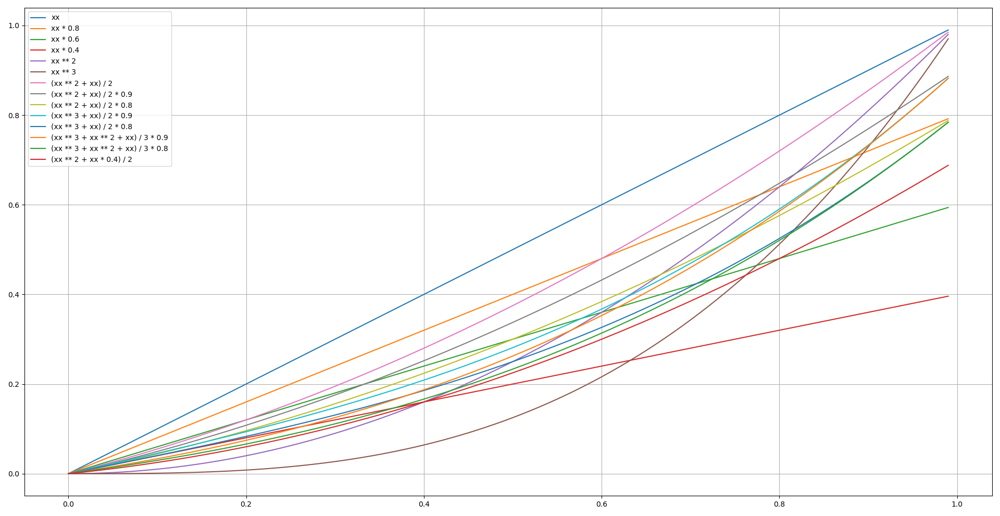
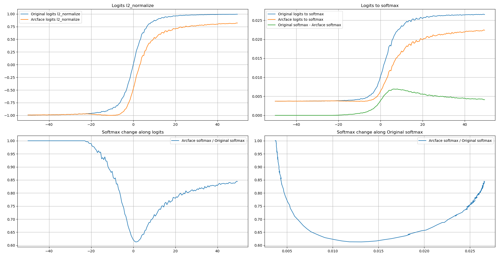

# ___2019 - 11 - 18 Keras Insightface___
***

# 目录
  <!-- TOC depthFrom:1 depthTo:6 withLinks:1 updateOnSave:1 orderedList:0 -->

  - [___2019 - 11 - 18 Keras Insightface___](#2019-11-18-keras-insightface)
  - [目录](#目录)
  - [Fine tune](#fine-tune)
  - [人脸识别损失函数](#人脸识别损失函数)
  - [ImageDataGenerator](#imagedatagenerator)
  - [训练模型拟合 embeddings](#训练模型拟合-embeddings)
  	- [First try](#first-try)
  	- [数据处理](#数据处理)
  	- [模型训练](#模型训练)
  	- [模型测试](#模型测试)
  - [Keras Insightface](#keras-insightface)
  	- [tf-insightface train](#tf-insightface-train)
  	- [MXnet record to folder](#mxnet-record-to-folder)
  	- [Loading data by ImageDataGenerator](#loading-data-by-imagedatagenerator)
  	- [Loading data by Datasets](#loading-data-by-datasets)
  	- [Evaluate](#evaluate)
  	- [Basic model](#basic-model)
  	- [Gently stop fit callbacks](#gently-stop-fit-callbacks)
  	- [Softmax train](#softmax-train)
  	- [Arcface loss](#arcface-loss)
  	- [Arcface loss 3](#arcface-loss-3)
  	- [Arcface loss 4](#arcface-loss-4)
  	- [Center loss](#center-loss)
  	- [Offline Triplet loss train SUB](#offline-triplet-loss-train-sub)
  	- [Online Triplet loss train](#online-triplet-loss-train)
  	- [TF 通用函数](#tf-通用函数)
  	- [模型测试](#模型测试)
  - [人脸旋转角度与侧脸](#人脸旋转角度与侧脸)
  - [人脸跟踪](#人脸跟踪)
  - [ncnn](#ncnn)

  <!-- /TOC -->
***

# Fine tune
  - **fine-tuning** 在实践中，由于数据集不够大，很少会从头开始训练网络，常见的做法是使用预训练的网络来重新 **微调 fine-tuning**，或当做特征提取器
    - 卷积网络当做 **特征提取器**，使用在 ImageNet 上预训练的网络，去掉最后的全连接层，剩余部分当做特征提取器，得到特征后可以使用线性分类器 Liner SVM / Softmax 等来分类图像
    - **Fine-tuning 卷积网络** 替换掉网络的输入层，使用新的数据继续训练，可以选择 fine-tune 全部层或部分层，通常前面的层提取的是图像的 **通用特征 generic features**，如边缘 / 色彩特征，后面的层提取的是与特定类别有关的特征，因此常常只需要 fine-tuning 后面的层
    - 一般如果新数据集比较小且和原数据集相似，可以使用预训练网络当做特征提取器，用提取的特征训练线性分类器，如果新数据集足够大，可以 fine-tune 整个网络
    - 与重新训练相比，fine-tune 要使用 **更小的学习率**，因为训练好的网络模型权重已经平滑，不希望太快扭曲 distort 它们
***

# 人脸识别损失函数
  - 人脸识别模型训练的损失函数主要分为 **基于分类 softmax 的损失函数** 和 **基于 triplet loss 的损失函数** 两大类
    - **基于分类 softmax 的损失函数** 因为是否对 embedding 或分类权重 W 做归一化以及是否增加额外的间隔 margin 等产生了多种变体
    - **基于 triplet loss 的损失函数** 则分为基于欧氏距离和基于角度距离两种
  - **基于分类 softmax 的损失函数**
    - **基本的 softmax 分类** 通过将 embedding 输入一层全连接层以及 softmax 函数得到分类概率，由于 softmax 的分母对 embedding 在各个类别上的结果进行了求和，因此最小化这一损失一定程度上能够使类间距离变大，类内距离变小
      - N 表示样本数量
      - n 表示类别总数
      - yi 表示样本 xi 的真实类别
    - **Sphereface Loss** 在 softmax 的基础上进一步引入了显式的角度间隔 angular margin，从而训练时能够进一步缩小类内距离，扩大类间距离
    - **CosineFace Loss** 进一步对人脸表示 embedding 进行了归一化，从而使分类结果仅取决于夹角余弦，并进一步引入了余弦间隔 m，用于扩大类间距离，缩小类内距离。由于余弦的取值范围较小，为了使类别间差别更显著，进一步引入一个超参数 s 用于放大余弦值
    - **Arcface Loss** 为了使人脸表示 embedding 的学习更符合超球体流形假设，Arcface 进一步将 Cosineface 中的余弦间隔修改为角度间隔，得到如下损失

    | 损失函数   | 分类边界                      |
    | ---------- | ----------------------------- |
    | Softmax    | (W1 - W2) * x + b1 - b2 = 0   |
    | SphereFace | ∥x∥ * (cosmθ1 - cosθ2) = 0    |
    | CosineFace | s * (cosθ1 - m - cosθ2) = 0   |
    | ArcFace    | s * (cos(θ1 + m) - cosθ2) = 0 |

  - **基于 triplet loss 的损失函数** 与通过 softmax 优化使类内距离缩小，类间距离扩大不同，Triplet Loss 直接对样本间的距离进行优化，使不同类样本间的距离比同类样本间的距离大出一个间隔，因此计算 Triplet Loss 每次需要采样三个样本 anchor / positive / negative，其中，anchor 与 positive 样本属于同一类别，与 negative 样本属于不同类别

    - x代表人脸表示 embedding
    - 上标 a,p,n 分别表示 anchor，positive 和 negative
    - dist(x,y) 表示 x,y 的距离函数
    - m 则表示不同类样本间距离比同类样本间距离大出的间隔，这里的距离函数和间隔既可以是欧氏距离也可以是角度距离等形式
  - **softmax 损失与 Triplet Loss 结合**
    - Triplet Loss 直接对样本表示间的距离进行优化，在训练数据足够多，模型表示能力足够强的情况下，能够学得很好的结果
    - 其缺点是，一方面训练时模型收敛速度较慢，另一方面在构造triplet时需要选择合适的正样本对和负样本对，因此需要设计 triplet 的构造选择机制，这一过程通常比较复杂
    - 较好的训练方式是先用分类损失训练模型，然后再用 Triplet Loss 对模型进行 finetune 以进一步提升模型性能
***

# ImageDataGenerator
  - **基本使用**
    ```py
    import numpy as np
    import matplotlib.pyplot as plt
    from keras.preprocessing.image import ImageDataGenerator

    img = np.random.rand(1, 500, 500, 3)

    fig, ax = plt.subplots(1, 5, figsize=(20, 10))
    ax = ax.ravel()
    ax[0].imshow(img[0])
    ax[1].imshow(next(ImageDataGenerator().flow(img))[0])
    ax[2].imshow(next(ImageDataGenerator(brightness_range=(0., 0.)).flow(img))[0])
    ax[3].imshow(next(ImageDataGenerator(brightness_range=(1., 1.)).flow(img))[0])
    ax[4].imshow(next(ImageDataGenerator(brightness_range=(1., 1.)).flow(img))[0] / 255)
    ```
    
  - **flow_from_directory**
    ```py
    seed = 1
    from tensorflow.python.keras.preprocessing.image import ImageDataGenerator

    data_gen = ImageDataGenerator(rescale=1./255, validation_split=0.1)


    img_gen = data_gen.flow_from_directory('segmentation_dataset/tumorImage/', target_size=(512, 512), batch_size=4,
                                           class_mode=None, seed=seed, color_mode='grayscale')
    mask_gen = data_gen.flow_from_directory('segmentation_dataset/maskImage/', target_size=(512, 512), batch_size=4,
                                           class_mode=None, seed=seed, color_mode='grayscale')

    train_gen = zip(img_gen, mask_gen)
    ```
  - **模型训练 fit_generator**
    ```py
    from keras.preprocessing.image import ImageDataGenerator
    # construct the training image generator for data augmentation
    aug = ImageDataGenerator(rotation_range=20, zoom_range=0.15,
        width_shift_range=0.2, height_shift_range=0.2, shear_range=0.15,
        horizontal_flip=True, fill_mode="nearest")

    model.fit_generator(aug.flow(trainX, trainY, batch_size=BS),
      	validation_data=(testX, testY), steps_per_epoch=len(trainX) // BS,
      	epochs=EPOCHS)
    ```
  - **ImageDataGenerator 生成图像数据与对应 mask**
    - TF 1.14 与 TF 2.0 中的 `ImageDataGenerator` 实现不能将 `zip` 对象识别为 `generators` / `sequences`，需要转化为 **内联的生成器 inline generator**
      ```py
      train_gen = (pair for pair in zip(img_gen, mask_gen))
      ```
      ```py
      data_gen_args = dict(rotation_range=0.2,
                          width_shift_range=0.05,
                          height_shift_range=0.05,
                          shear_range=0.05,
                          zoom_range=0.05,
                          horizontal_flip=True,
                          fill_mode='nearest',
                          rescale=1./255)

      image_generator = tf.keras.preprocessing.image.ImageDataGenerator(data_gen_args)
      mask_generator = tf.keras.preprocessing.image.ImageDataGenerator(data_gen_args)

      imageGenerator = image_generator.flow_from_directory('membrane/train', color_mode="grayscale", classes=['image'], class_mode=None, batch_size=5)
      maskGenerator = mask_generator.flow_from_directory('membrane/train', color_mode="grayscale", classes=['label'], class_mode=None, batch_size=5)

      train_generator = (pair for pair in zip(imageGenerator, maskGenerator))


      history = model.fit_generator(train_generator, steps_per_epoch=100, epochs=3)
      ```
    - **ImageDataGenerator 转化为 `tf.data.Dataset`** 提升读取效率
      ```py
      def my_input_fn(total_items, epochs):
          dataset = tf.data.Dataset.from_generator(lambda: my_generator(total_items),
                                                   output_types=(tf.float64, tf.int64))

          dataset = dataset.repeat(epochs)
          dataset = dataset.batch(32)
          return dataset

      if __name__ == "__main__":
          tf.enable_eager_execution()

          model = tf.keras.Sequential([tf.keras.layers.Flatten(input_shape=(4, 20, 1)),
                                       tf.keras.layers.Dense(64, activation=tf.nn.relu),
                                       tf.keras.layers.Dense(12, activation=tf.nn.softmax)])

          model.compile(optimizer='adam',
                        loss='categorical_crossentropy',
                        metrics=['accuracy'])

          total_items = 100
          batch_size = 32
          epochs = 10
          num_batches = int(total_items/batch_size)
          dataset = my_input_fn(total_items, epochs)
          model.fit_generator(dataset, epochs=epochs, steps_per_epoch=num_batches)
      ```
***

# 训练模型拟合 embeddings
## First try
  ```py
  import glob2
  from skimage.io import imread

  loaded = tf.saved_model.load('model_resnet')
  interf = loaded.signatures['serving_default']
  teacher_model_interf = lambda images: interf(tf.convert_to_tensor(images, dtype=tf.float32))['output'].numpy()

  def data_gen(path, teacher_model_interf, batch_size=64, base_path_replace=[]):
      image_path_files = glob2.glob(os.path.join(path, '*/*'))
      total = len(image_path_files)
      while True:
          image_path_files = np.random.permutation(image_path_files)
          print("This should be the epoch start, total files = %d" % (image_path_files.shape[0]))
          for id in range(0, total, batch_size):
              image_batch_data = image_path_files[id: id + batch_size]
              if len(base_path_replace) != 0:
                  image_batch_data = [ii.replace(base_path_replace[0], base_path_replace[1]) for ii in image_batch_data]
              images = (np.array([imread(ii) for ii in image_batch_data]) / 255).astype('float32')
              embs = teacher_model_interf(images)
              yield (images, embs)
              print("Processed Id: %d - %d" % (id, id + batch_size))

  gpus = tf.config.experimental.list_physical_devices('GPU')
  tf.config.experimental.set_visible_devices(gpus[0], 'GPU')
  tf.config.experimental.set_memory_growth(gpus[0], True)

  BATCH_SIZE = 100
  DATA_PATH = './'
  # train_gen = data_gen(DATA_PATH, batch_size=BATCH_SIZE, base_path_replace=['/media/uftp/images', '/home/leondgarse/workspace/images'])
  train_gen = data_gen(DATA_PATH, teacher_model_interf, batch_size=BATCH_SIZE)
  steps_per_epoch = int(np.ceil(5822653 / BATCH_SIZE))
  ixx, iyy = next(train_gen)
  print(ixx.shape, iyy.shape)
  # (100, 112, 112, 3) (100, 512)

  xx = tf.keras.applications.MobileNetV2(input_shape=[112, 112, 3], include_top=False, weights=None)
  # xx = tf.keras.applications.NASNetMobile(input_shape=[112, 112, 3], include_top=False, weights=None)
  xx.trainable = True
  model = tf.keras.models.Sequential([
      xx,
      tf.keras.layers.GlobalAveragePooling2D(),
      tf.keras.layers.BatchNormalization(),
      tf.keras.layers.Dropout(0.1),
      tf.keras.layers.Dense(512)
  ])
  model.compile(optimizer='adam', loss='mse', metrics=["mae",'accuracy'])
  model.summary()

  hist = model.fit_generator(train_gen, epochs=50, steps_per_epoch=steps_per_epoch, verbose=1)
  ```
## 数据处理
  - 生成图像数据集对应的 embedding 数据
  ```py
  from skimage.io import imread
  gpus = tf.config.experimental.list_physical_devices('GPU')
  tf.config.experimental.set_visible_devices(gpus[0], 'GPU')
  tf.config.experimental.set_memory_growth(gpus[0], True)

  ''' 图片路径列表 '''
  pp = '/datasets/faces_emore_112x112_folders/'
  with open('faces_emore_img.foo', 'w') as ff:
      for dd in os.listdir(pp):
          dd = os.path.join(pp, dd)
          for ii in os.listdir(dd):
              ff.write(os.path.join(dd, ii) + '\n')
  # 5822653

  ''' 分割图片路径列表，每 100000 张图片作为一个文件 '''
  with open('faces_emore_img.foo', 'r') as ff:
      tt = [ii.strip() for ii in ff.readlines()]

  for ii in range(59):
      print(ii * 100000, (ii+1) * 100000)
      with open('./{}_img.foo'.format(ii), 'w') as ff:
          ff.write('\n'.join(tt[ii * 100000: (ii+1) * 100000]))

  ''' 加载目标模型 '''
  loaded = tf.saved_model.load('./model_resnet')
  _interp = loaded.signatures["serving_default"]
  interp = lambda ii: _interp(tf.convert_to_tensor(ii, dtype="float32"))["output"].numpy()

  ''' 转化特征向量 embedding 值 '''
  import glob2
  for fn in glob2.glob('./*_img.foo'):
      with open(fn, 'r') as ff:
          tt = [ii.strip() for ii in ff.readlines()]
      target_file = fn.replace('_img.foo', '_emb')
      print(fn, len(tt), target_file)

      ees = []
      for id, ii in enumerate(tt):
          # ii = ii.replace('/media/uftp', '/home/leondgarse/workspace')
          imm = imread(ii)
          ees.append(interp([imm])[0])
          if id % 100 == 0:
              print("Processing %d..." % id)
      ees = np.array(ees)
      print(ees.shape)
      np.save(target_file, ees)

  ''' 合并处理完的数据 '''
  import glob2

  path = '/home/tdtest/workspace/insightface-master/faces_emore_img/emb_done'
  image_path_files = glob2.glob(os.path.join(path, '*_img.foo'))
  emb_files = [ii.replace('_img.foo', '_emb.npy') for ii in image_path_files]
  image_names = []
  image_embs = []
  for ii, ee in zip(image_path_files, emb_files):
      with open(ii, 'r') as ff:
          image_names.extend([ii.strip() for ii in ff.readlines()])
      image_embs.append(np.load(ee))
  image_embs = np.concatenate(image_embs)
  image_classes = np.array([int(os.path.basename(os.path.dirname(ii))) for ii in image_names])
  image_names=np.array(image_names)
  classes = np.max(image_classes) + 1

  np.savez('faces_emore_class_emb', image_names=image_names, image_classes=image_classes, image_embs=image_embs)
  print(image_names.shape, image_classes.shape, image_embs.shape, classes)
  # (5822653,) (5822653,) (5822653, 512) 85742
  ```
## 模型训练
  ```py
  from keras.preprocessing.image import ImageDataGenerator
  from tensorflow.keras import layers
  from tensorflow.keras.callbacks import ModelCheckpoint, EarlyStopping, ReduceLROnPlateau

  aa = np.load('faces_emore_class_emb.npz')
  image_names, image_classes, image_embs = aa['image_names'], aa['image_classes'], aa['image_embs']
  classes = np.max(image_classes) + 1
  print(image_names.shape, image_classes.shape, image_embs.shape, classes)
  # (5822653,) (5822653,) (5822653, 512) 85742

  data_df = pd.DataFrame({"image_names": image_names, "image_classes": image_classes, "image_embs": list(image_embs)})
  image_gen = ImageDataGenerator(rescale=1./255, validation_split=0.1)
  train_data_gen = image_gen.flow_from_dataframe(data_df, directory=None, x_col='image_names', y_col=["image_classes", "image_embs"], class_mode='multi_output', target_size=(112, 112), batch_size=128, seed=1, subset='training', validate_filenames=False)
  # Found 5240388 non-validated image filenames.
  val_data_gen = image_gen.flow_from_dataframe(data_df, directory=None, x_col='image_names', y_col=["image_classes", "image_embs"], class_mode='multi_output', target_size=(112, 112), batch_size=128, seed=1, subset='validation', validate_filenames=False)
  # Found 582265 non-validated image filenames.

  xx = tf.keras.applications.MobileNetV2(include_top=False, weights=None)
  xx.trainable = True
  inputs = layers.Input(shape=(112, 112, 3))
  nn = xx(inputs)
  nn = layers.GlobalAveragePooling2D()(nn)
  nn = layers.BatchNormalization()(nn)
  nn = layers.Dropout(0.1)(nn)
  embedding = layers.Dense(512, name="embeddings")(nn)
  logits = layers.Dense(classes, activation='softmax', name="logits")(embedding)

  model = keras.models.Model(inputs, [logits, embedding])
  model.compile(optimizer='adam', loss=[keras.losses.sparse_categorical_crossentropy, keras.losses.mse])
  # model.compile(optimizer='adam', loss=[keras.losses.sparse_categorical_crossentropy, keras.losses.mse], metrics=['accuracy', 'mae'])
  model.summary()

  reduce_lr = ReduceLROnPlateau('val_loss', factor=0.1, patience=5, verbose=1)
  model_checkpoint = ModelCheckpoint("./keras_checkpoints", 'val_loss', verbose=1, save_best_only=True)
  callbacks = [model_checkpoint, reduce_lr]
  hist = model.fit_generator(train_data_gen, validation_data=val_data_gen, epochs=200, verbose=1, callbacks=callbacks)
  ```
## 模型测试
  ```py
  from skimage.io import imread
  from sklearn.preprocessing import normalize

  def model_test(image_paths, model_path, scale=1.0, output_key="output"):
      loaded = tf.saved_model.load(model_path)
      interf = loaded.signatures['serving_default']
      images = [imread(ipp) * scale for ipp in image_paths]

      preds = interf(tf.convert_to_tensor(images, dtype='float32'))[output_key].numpy()
      return np.dot(normalize(preds), normalize(preds).T), preds

  images = ['/home/leondgarse/workspace/samba/1770064353.jpg', '/home/leondgarse/workspace/samba/541812715.jpg']
  model_test(images, 'keras_checkpoints/', output_key='embeddings')
  ```
***

# Keras Insightface
## tf-insightface train
  - [Github Fei-Wang/insightface](https://github.com/Fei-Wang/insightface)
  - Arcface loss
    ```py
    epoch: 25, step: 60651, loss = 15.109766960144043, logit_loss = 15.109766960144043, center_loss = 0
    epoch: 25, step: 60652, loss = 17.565662384033203, logit_loss = 17.565662384033203, center_loss = 0
    Saving checkpoint for epoch 25 at /home/tdtest/workspace/tf_insightface/recognition/mymodel-26
    Time taken for epoch 25 is 8373.555536031723 sec
    ```
  - Arcface center loss
    ```py
    epoch: 0, step: 60652, loss = 11.264640808105469, logit_loss = 11.262413024902344, center_loss = 0.002227420685812831
    Saving checkpoint for epoch 0 at /home/tdtest/workspace/tf_insightface/recognition/mymodel-1
    Time taken for epoch 0 is 8373.187638521194 sec
    ```
## MXnet record to folder
  - [Insightface Dataset Zoo](https://github.com/deepinsight/insightface/wiki/Dataset-Zoo)
  - **转化 faces_emore 训练数据集**
    ```py
    import os
    import numpy as np
    import mxnet as mx
    from tqdm import tqdm

    # read_dir = '/datasets/faces_glint/'
    # save_dir = '/datasets/faces_glint_112x112_folders'
    read_dir = '/datasets/faces_emore'
    save_dir = '/datasets/faces_emore_112x112_folders'
    idx_path = os.path.join(read_dir, 'train.idx')
    bin_path = os.path.join(read_dir, 'train.rec')

    imgrec = mx.recordio.MXIndexedRecordIO(idx_path, bin_path, 'r')
    rec_header, _ = mx.recordio.unpack(imgrec.read_idx(0))

    # for ii in tqdm(range(1, 10)):
    for ii in tqdm(range(1, int(rec_header.label[0]))):
        img_info = imgrec.read_idx(ii)
        header, img = mx.recordio.unpack(img_info)
        img_idx = str(int(np.sum(header.label)))
        img_save_dir = os.path.join(save_dir, img_idx)
        if not os.path.exists(img_save_dir):
            os.makedirs(img_save_dir)
        # print(os.path.join(img_save_dir, str(ii) + '.jpg'))
        with open(os.path.join(img_save_dir, str(ii) + '.jpg'), 'wb') as ff:
            ff.write(img)
    ```
  - **转化验证数据集 bin files** 有些数据的图片个是不能用 `tf.image.decode_jpeg` 解码
    ```sh
    #    bins   | issame_list
    img_1 img_2 | 1
    img_3 img_4 | 1
    img_5 img_6 | 0
    img_7 img_8 | 0
    ```
    ```py
    import io
    import pickle
    import tensorflow as tf
    from skimage.io import imread

    test_bin_files = ['/datasets/faces_emore/agedb_30.bin', '/datasets/faces_emore/cfp_fp.bin']
    for test_bin_file in test_bin_files:
        with open(test_bin_file, 'rb') as ff:
            bins, issame_list = pickle.load(ff, encoding='bytes')

        bb = [tf.image.encode_jpeg(imread(io.BytesIO(ii))) for ii in bins]
        with open(test_bin_file, 'wb') as ff:
            pickle.dump([bb, issame_list], ff)
    ```
## Loading data by ImageDataGenerator
  - **ImageDataGenerator 加载数据集** 可以应用 **数据增强**，分割 **训练/验证数据集**，但单独使用速度慢，可以结合 `tf.data.Dataset` 使用
  ```py
  ''' flow_from_dataframe '''
  import glob2
  import pickle
  image_names = glob2.glob('/datasets/faces_emore_112x112_folders/*/*.jpg')
  image_names = np.random.permutation(image_names).tolist()
  image_classes = [int(os.path.basename(os.path.dirname(ii))) for ii in image_names]

  with open('faces_emore_img_class_shuffle.pkl', 'wb') as ff:
      pickle.dump({'image_names': image_names, "image_classes": image_classes}, ff)

  import pickle
  from keras.preprocessing.image import ImageDataGenerator
  AUTOTUNE = tf.data.experimental.AUTOTUNE
  with open('faces_emore_img_class_shuffle.pkl', 'rb') as ff:
      aa = pickle.load(ff)
  image_names, image_classes = aa['image_names'], aa['image_classes']
  image_names = np.random.permutation(image_names).tolist()
  image_classes = [int(os.path.basename(os.path.dirname(ii))) for ii in image_names]
  print(len(image_names), len(image_classes))
  # 5822653 5822653

  data_df = pd.DataFrame({"image_names": image_names, "image_classes": image_classes})
  data_df.image_classes = data_df.image_classes.map(str)
  # image_gen = ImageDataGenerator(rescale=1./255, horizontal_flip=True, validation_split=0.1)
  image_gen = ImageDataGenerator(rescale=1./255, horizontal_flip=True, validation_split=0.05)
  train_data_gen = image_gen.flow_from_dataframe(data_df, directory=None, x_col='image_names', y_col="image_classes", class_mode='categorical', target_size=(112, 112), batch_size=128, subset='training', validate_filenames=False)
  # Found 5240388 non-validated image filenames belonging to 85742 classes.
  val_data_gen = image_gen.flow_from_dataframe(data_df, directory=None, x_col='image_names', y_col="image_classes", class_mode='categorical', target_size=(112, 112), batch_size=128, subset='validation', validate_filenames=False)
  # Found 582265 non-validated image filenames belonging to 85742 classes.

  classes = data_df.image_classes.unique().shape[0]
  steps_per_epoch = np.ceil(len(train_data_gen.classes) / 128)
  validation_steps = np.ceil(len(val_data_gen.classes) / 128)

  ''' Convert to tf.data.Dataset '''
  train_ds = tf.data.Dataset.from_generator(lambda: train_data_gen, output_types=(tf.float32, tf.int32), output_shapes=([None, 112, 112, 3], [None, classes]))
  # train_ds = train_ds.cache()
  # train_ds = train_ds.shuffle(buffer_size=128 * 1000)
  train_ds = train_ds.repeat()
  train_ds = train_ds.prefetch(buffer_size=AUTOTUNE)

  val_ds = tf.data.Dataset.from_generator(lambda: val_data_gen, output_types=(tf.float32, tf.int32), output_shapes=([None, 112, 112, 3], [None, classes]))

  xx, yy = next(iter(train_ds))
  print(xx.shape, yy.shape)
  # (128, 112, 112, 3) (128, 85742)
  ```
## Loading data by Datasets
  ```py
  import glob2
  import pickle
  image_names = glob2.glob('/datasets/faces_emore_112x112_folders/*/*.jpg')
  image_names = np.random.permutation(image_names).tolist()
  image_classes = [int(os.path.basename(os.path.dirname(ii))) for ii in image_names]

  with open('faces_emore_img_class_shuffle.pkl', 'wb') as ff:
      pickle.dump({'image_names': image_names, "image_classes": image_classes}, ff)

  import pickle
  AUTOTUNE = tf.data.experimental.AUTOTUNE
  with open('faces_emore_img_class_shuffle.pkl', 'rb') as ff:
      aa = pickle.load(ff)
  image_names, image_classes = aa['image_names'], aa['image_classes']
  classes = np.max(image_classes) + 1
  print(len(image_names), len(image_classes), classes)
  # 5822653 5822653 85742

  # list_ds = tf.data.Dataset.list_files('/datasets/faces_emore_112x112_folders/*/*')
  list_ds = tf.data.Dataset.from_tensor_slices(image_names)

  def process_path(file_path, classes, img_shape=(112, 112), random_convert=True):
      parts = tf.strings.split(file_path, os.path.sep)[-2]
      label = tf.cast(tf.strings.to_number(parts), tf.int32)
      label = tf.one_hot(label, depth=classes, dtype=tf.int32)
      img = tf.io.read_file(file_path)
      img = tf.image.decode_jpeg(img, channels=3)
      img = tf.image.convert_image_dtype(img, tf.float32)
      if random_convert:
          img = tf.image.random_flip_left_right(img)
          img = tf.image.random_brightness(img, 0.2)
          img = tf.image.random_crop(img, [100, 100, 3])
      img = tf.image.resize(img, img_shape)
      img = (img - 0.5) * 2
      return img, label

  def prepare_for_training(ds, cache=True, shuffle_buffer_size=None, batch_size=128):
      if cache:
          ds = ds.cache(cache) if isinstance(cache, str) else ds.cache()
      if shuffle_buffer_size == None:
          shuffle_buffer_size = batch_size * 100

      ds = ds.shuffle(buffer_size=shuffle_buffer_size)
      ds = ds.repeat()
      ds = ds.map(lambda xx: process_path(xx, classes), num_parallel_calls=AUTOTUNE)
      ds = ds.batch(batch_size)
      ds = ds.prefetch(buffer_size=AUTOTUNE)
      return ds

  # train_ds = prepare_for_training(labeled_ds, cache="/tmp/faces_emore.tfcache")
  batch_size = 128 * len(tf.config.experimental.get_visible_devices('GPU'))
  train_ds = prepare_for_training(list_ds, cache=False, shuffle_buffer_size=len(image_names), batch_size=batch_size)
  steps_per_epoch = np.ceil(len(image_names) / batch_size)
  image_batch, label_batch = next(iter(train_ds))
  print(image_batch.shape, label_batch.shape)
  # (128, 112, 112, 3) (128, 85742)
  ```
## Evaluate
  ```py
  import pickle
  import io
  from tqdm import tqdm
  from skimage.io import imread
  from sklearn.preprocessing import normalize

  class epoch_eval_callback(tf.keras.callbacks.Callback):
      def __init__(self, test_bin_file, batch_size=128, save_model=None, eval_freq=1, flip=False):
          super(epoch_eval_callback, self).__init__()
          bins, issame_list = np.load(test_bin_file, encoding='bytes', allow_pickle=True)
          ds = tf.data.Dataset.from_tensor_slices(bins)
          _imread = lambda xx: tf.image.convert_image_dtype(tf.image.decode_jpeg(xx), dtype=tf.float32)
          ds = ds.map(_imread)
          self.ds = ds.batch(batch_size)
          self.test_issame = np.array(issame_list)
          self.test_names = os.path.splitext(os.path.basename(test_bin_file))[0]
          self.max_accuracy = 0
          self.steps = int(np.ceil(len(bins) / batch_size))
          self.save_model = save_model
          self.eval_freq = eval_freq
          self.flip = flip

      # def on_batch_end(self, batch=0, logs=None):
      def on_epoch_end(self, epoch=0, logs=None):
          if epoch % self.eval_freq != 0:
              return
          dists = []
          embs = []
          tf.print("")
          for img_batch in tqdm(self.ds, 'Evaluating ' + self.test_names, total=self.steps):
              emb = basic_model.predict(img_batch)
              if self.flip:
                  emb_f = basic_model.predict(tf.image.flip_left_right(img_batch))
                  emb = (emb + emb_f) / 2
              embs.extend(emb)
          embs = np.array(embs)
          if np.isnan(embs).sum() != 0:
              tf.print("NAN in embs, not a good one")
              return
          embs = normalize(embs)
          embs_a = embs[::2]
          embs_b = embs[1::2]
          dists = (embs_a * embs_b).sum(1)

          tt = np.sort(dists[self.test_issame[:dists.shape[0]]])
          ff = np.sort(dists[np.logical_not(self.test_issame[:dists.shape[0]])])
          # self.tt = tt
          # self.ff = ff
          # self.embs = embs

          t_steps = int(0.1 * ff.shape[0])
          acc_count = np.array([(tt > vv).sum() + (ff <= vv).sum() for vv in ff[-t_steps:]])
          acc_max_indx = np.argmax(acc_count)
          acc_max = acc_count[acc_max_indx] / dists.shape[0]
          acc_thresh = ff[acc_max_indx - t_steps]

          tf.print("\n")
          if acc_max > self.max_accuracy:
              is_improved = True
              self.max_accuracy = acc_max
              if self.save_model:
                  save_path = '%s_%d' % (self.save_model, epoch)
                  tf.print("Saving model to: %s" % (save_path))
                  model.save(save_path)
          else:
              is_improved = False
          tf.print(">>>> %s evaluation max accuracy: %f, thresh: %f, overall max accuracy: %f, improved = %s" % (self.test_names, acc_max, acc_thresh, self.max_accuracy, is_improved))
  ```
  ```py
  class mi_basic_model:
      def __init__(self):
          self.predict = lambda xx: interf(xx)['embedding'].numpy()
      def save(self, path):
          print('Saved to %s' % (path))
  basic_model = mi_basic_model()

  # lfw_eval = epoch_eval_callback('/home/leondgarse/workspace/datasets/faces_emore/lfw.bin')
  lfw_eval = epoch_eval_callback('/datasets/faces_emore/lfw.bin', save_model=None, flip=True)
  cfp_fp_eval = epoch_eval_callback('/datasets/faces_emore/cfp_fp.bin', save_model=None, flip=True)
  agedb_30_eval = epoch_eval_callback('/datasets/faces_emore/agedb_30.bin', save_model=None, flip=True)
  lfw_eval.on_epoch_end()
  cfp_fp_eval.on_epoch_end()
  agedb_30_eval.on_epoch_end()
  ```
  ```py
  # basic_model_centsoft_0_split.h5
  >>>> lfw evaluation max accuracy: 0.992833, thresh: 0.188595, overall max accuracy: 0.992833
  >>>> cfp_fp evaluation max accuracy: 0.909571, thresh: 0.119605, overall max accuracy: 0.909571
  >>>> agedb_30 evaluation max accuracy: 0.887500, thresh: 0.238278, overall max accuracy: 0.887500
  ```
  ```py
  # basic_model_arc_8_split.h5
  >>>> lfw evaluation max accuracy: 0.994167, thresh: 0.141986, overall max accuracy: 0.994167
  >>>> cfp_fp evaluation max accuracy: 0.867429, thresh: 0.106673, overall max accuracy: 0.867429
  >>>> agedb_30 evaluation max accuracy: 0.902167, thresh: 0.128596, overall max accuracy: 0.902167
  ```
  ```py
  # basic_model_arc_split.h5
  >>>> lfw evaluation max accuracy: 0.993000, thresh: 0.125761, overall max accuracy: 0.993000
  >>>> cfp_fp evaluation max accuracy: 0.859143, thresh: 0.068290, overall max accuracy: 0.859143
  >>>> agedb_30 evaluation max accuracy: 0.912667, thresh: 0.084312, overall max accuracy: 0.912667
  ```
  ```py
  # ./keras_checkpoints_arc_2.h5 - Epoch 32 - softmax
  >>>> lfw evaluation max accuracy: 0.993333, thresh: 0.182575, overall max accuracy: 0.993333
  >>>> cfp_fp evaluation max accuracy: 0.900571, thresh: 0.095163, overall max accuracy: 0.900571
  >>>> agedb_30 evaluation max accuracy: 0.936500, thresh: 0.138070, overall max accuracy: 0.936500
  ```
  ```py
  # ./keras_checkpoints_arc_3.h5 - Epoch 32 - arcface
  >>>> lfw evaluation max accuracy: 0.991167, thresh: 0.109592, overall max accuracy: 0.991167
  >>>> cfp_fp evaluation max accuracy: 0.851714, thresh: 0.067722, overall max accuracy: 0.851714
  >>>> agedb_30 evaluation max accuracy: 0.912500, thresh: 0.082330, overall max accuracy: 0.912500
  ```
## Basic model
  - [TensorFlow Addons Layers: WeightNormalization](https://www.tensorflow.org/addons/tutorials/layers_weightnormalization)
  ```py
  from tensorflow.keras import layers

  ''' Basic model '''
  # xx = keras.applications.ResNet101V2(include_top=False, weights='imagenet')
  # xx = tf.keras.applications.MobileNetV2(input_shape=(112, 112, 3), include_top=False, weights=None)
  # xx = tf.keras.applications.ResNet50V2(include_top=False, weights='imagenet')
  xx = tf.keras.applications.ResNet50V2(input_shape=(112, 112, 3), include_top=False, weights='imagenet')
  xx.trainable = True

  inputs = xx.inputs[0]
  nn = xx.outputs[0]
  nn = layers.Conv2D(512, 3, use_bias=False)(nn)
  # BatchNormalization(momentum=0.99, epsilon=0.001)
  nn = layers.BatchNormalization(momentum=0.9, epsilon=2e-5)(nn)
  nn = layers.Dropout(0.4)(nn)
  nn = layers.Flatten()(nn)
  nn = layers.Dense(512)(nn)
  embedding = layers.BatchNormalization(momentum=0.9, epsilon=2e-5, name='embedding')(nn)
  # norm_emb = layers.Lambda(tf.nn.l2_normalize, name='norm_embedding', arguments={'axis': 1})(embedding)
  basic_model = keras.models.Model(inputs, embedding)

  ''' Callbacks '''
  from tensorflow.keras.callbacks import ModelCheckpoint, EarlyStopping, ReduceLROnPlateau

  # lfw_eval = epoch_eval_callback('/datasets/faces_emore/lfw.bin')
  lfw_eval = epoch_eval_callback('/datasets/faces_emore/lfw.bin', save_model=None, eval_freq=1, flip=True)
  cfp_fp_eval = epoch_eval_callback('/datasets/faces_emore/cfp_fp.bin', save_model=None, eval_freq=1, flip=True)
  agedb_30_eval = epoch_eval_callback('/datasets/faces_emore/agedb_30.bin', save_model=None, eval_freq=1, flip=True)

  # reduce_lr = ReduceLROnPlateau('val_loss', factor=0.1, patience=5, verbose=1)
  def scheduler(epoch):
      lr = 0.001 if epoch < 10 else 0.001 * np.exp(0.1 * (10 - epoch))
      print('\nLearning rate for epoch {} is {}'.format(epoch + 1, lr))
      return lr
  lr_scheduler = tf.keras.callbacks.LearningRateScheduler(scheduler)

  model_checkpoint = ModelCheckpoint("./keras_checkpoints.h5", verbose=1)
  # model_checkpoint = ModelCheckpoint("./keras_checkpoints_res_arcface", 'val_loss', verbose=1, save_best_only=True)
  callbacks = [lr_scheduler, model_checkpoint, lfw_eval, cfp_fp_eval, agedb_30_eval]

  ''' Model with bottleneck '''
  class NormDense(tf.keras.layers.Layer):
      def __init__(self, units=1000, **kwargs):
          super(NormDense, self).__init__(**kwargs)
          self.units = units
      def build(self, input_shape):
          self.w = self.add_weight(name='norm_dense_w', shape=(input_shape[-1], self.units), initializer='random_normal', trainable=True)
          super(NormDense, self).build(input_shape)
      def call(self, inputs, **kwargs):
          norm_w = tf.nn.l2_normalize(self.w, axis=0)
          inputs = tf.nn.l2_normalize(inputs, axis=1)
          return tf.matmul(inputs, norm_w)
      def compute_output_shape(self, input_shape):
          shape = tf.TensorShape(input_shape).as_list()
          shape[-1] = self.units
          return tf.TensorShape(shape)
      def get_config(self):
          config = super(NormDense, self).get_config()
          config.update({'units': self.units})
          return config
      @classmethod
      def from_config(cls, config):
          return cls(**config)

  inputs = basic_model.inputs[0]
  embedding = basic_model.outputs[0]
  # output = NormDense(classes, name='norm_dense')(embedding)
  output = layers.Dense(classes, name='softmax', activation="softmax")(embedding)
  # concate = layers.concatenate([embedding, output], name='concate')
  # model = keras.models.Model(inputs, concate)
  # model = keras.models.Sequential([basic_model, layers.Dense(classes, name='softmax', activation="softmax")])
  model = keras.models.Model(inputs, output)
  # model.load_weights('nn.h5')
  model.summary()
  ```
  ```py
  import multiprocessing as mp
  mp.set_start_method('forkserver')
  hist = model.fit(train_ds, epochs=200, verbose=1, callbacks=callbacks, steps_per_epoch=steps_per_epoch, initial_epoch=11, use_multiprocessing=True, workers=4)

  # hist = model.fit(train_ds, epochs=200, verbose=1, callbacks=callbacks, steps_per_epoch=steps_per_epoch)
  hist = model.fit(train_ds, epochs=200, verbose=1, callbacks=callbacks, steps_per_epoch=steps_per_epoch, validation_data=val_ds, validation_steps=validation_steps)

  hist = model.fit(train_ds, epochs=200, verbose=1, callbacks=callbacks, steps_per_epoch=steps_per_epoch, validation_data=val_ds, validation_steps=validation_steps)
  ```
  ```py
  from tensorflow.keras import layers

  ''' Basic model '''
  # Multi GPU
  # strategy = tf.distribute.MirroredStrategy()
  strategy = tf.distribute.OneDeviceStrategy(device="/gpu:0")
  with strategy.scope():
      xx = tf.keras.applications.ResNet50V2(input_shape=(112, 112, 3), include_top=False, weights='imagenet')
      xx.trainable = True

      inputs = xx.inputs[0]
      nn = xx.outputs[0]
      nn = layers.GlobalAveragePooling2D()(nn)
      nn = layers.Dropout(0.1)(nn)
      embedding = layers.Dense(512, name='embedding')(nn)
      basic_model = keras.models.Model(inputs, embedding)

      inputs = basic_model.inputs[0]
      embedding = basic_model.outputs[0]
      output = NormDense(classes, name='norm_dense')(embedding)
      concate = layers.concatenate([embedding, output], name='concate')
      model = keras.models.Model(inputs, concate)
      model.load_weights('nn.h5')
  ```
## Gently stop fit callbacks
  ```py
  import sys
  import select

  class Gently_stop_callback(keras.callbacks.Callback):
      def __init__(self, prompt="Continue? (Y/n)", time_out=3):
          super(Gently_stop_callback, self).__init__()
          self.yes_or_no = lambda : 'n' not in self.timeout_input(prompt, time_out, default="y")[1].lower()
      def on_epoch_end(self, epoch, logs={}):
          print()
          if not self.yes_or_no():
              self.model.stop_training = True
      def timeout_input(self, prompt, timeout=3, default=""):
          print(prompt, end=': ', flush=True)
          inputs, outputs, errors = select.select([sys.stdin], [], [], timeout)
          print()
          return (0, sys.stdin.readline().strip()) if inputs else (-1, default)

  class My_history(keras.callbacks.Callback):
      def __init__(self, initial_hist=None):
          super(My_history, self).__init__()
          self.history = initial_hist if initial_hist else {}
      def on_epoch_end(self, epoch, logs=None):
          logs = logs or {}
          for k, v in logs.items():
              self.history.setdefault(k, []).append(v)

  my_history = My_history(None)
  # my_history = My_history(my_history.history)
  callbacks.extend([my_history, Gently_stop_callback()])
  ```
## Softmax train
  ```py
  with strategy.scope():
      model.compile(optimizer='nadam', loss=keras.losses.categorical_crossentropy, metrics=["accuracy"])
  ```
  ```py
  Epoch 1/200
  43216/43216 [==============================] - 8650s 200ms/step - loss: 3.8481 - accuracy: 0.4496 - val_loss: 2.6660 - val_accuracy: 0.5180
  Epoch 2/200
  43216/43216 [==============================] - 8792s 203ms/step - loss: 0.9634 - accuracy: 0.8118 - val_loss: 1.2425 - val_accuracy: 0.7599
  Epoch 3/200
  43216/43216 [==============================] - 8720s 202ms/step - loss: 0.6660 - accuracy: 0.8676 - val_loss: 1.3942 - val_accuracy: 0.7380
  Epoch 4/200
  43216/43216 [==============================] - 8713s 202ms/step - loss: 0.5394 - accuracy: 0.8920 - val_loss: 0.6720 - val_accuracy: 0.8733
  Epoch 5/200
  43216/43216 [==============================] - 8873s 205ms/step - loss: 0.4662 - accuracy: 0.9063 - val_loss: 0.7837 - val_accuracy: 0.8540
  ```
  ```py
  Epoch 00016
  45490/45490 [==============================] - 7643s 168ms/step - loss: 0.3991 - logits_accuracy: 0.9451
  45490/45490 [==============================] - 7663s 168ms/step - loss: 0.2789 - logits_accuracy: 0.9597
  45490/45490 [==============================] - 7663s 168ms/step - loss: 0.2165 - logits_accuracy: 0.9677
  45490/45490 [==============================] - 7656s 168ms/step - loss: 0.1762 - logits_accuracy: 0.9731
  45490/45490 [==============================] - 7677s 169ms/step - loss: 0.1481 - logits_accuracy: 0.9770
  Epoch 00021
  45490/45490 [==============================] - 7674s 169ms/step - loss: 0.1274 - logits_accuracy: 0.9800
  45490/45490 [==============================] - 7653s 168ms/step - loss: 0.1118 - logits_accuracy: 0.9822
  45490/45490 [==============================] - 7683s 169ms/step - loss: 0.0999 - logits_accuracy: 0.9840
  45490/45490 [==============================] - 7672s 169ms/step - loss: 0.0910 - logits_accuracy: 0.9854
  45490/45490 [==============================] - 7670s 169ms/step - loss: 0.0838 - logits_accuracy: 0.9865
  Epoch 00026
  45490/45490 [==============================] - 7678s 169ms/step - loss: 0.0783 - logits_accuracy: 0.9873
  45490/45490 [==============================] - 7662s 168ms/step - loss: 0.0738 - logits_accuracy: 0.9880
  45490/45490 [==============================] - 7664s 168ms/step - loss: 0.0703 - logits_accuracy: 0.9886
  45490/45490 [==============================] - 7663s 168ms/step - loss: 0.0674 - logits_accuracy: 0.9890
  45490/45490 [==============================] - 7664s 168ms/step - loss: 0.0651 - logits_accuracy: 0.9894
  Epoch 00031
  45490/45490 [==============================] - 7664s 168ms/step - loss: 0.0633 - logits_accuracy: 0.9897
  45490/45490 [==============================] - 7661s 168ms/step - loss: 0.0617 - logits_accuracy: 0.9900
  ```
  ```py
  # ./keras_checkpoints_soft.h5
  Epoch 1/200
  45490/45490 [==============================] - 8141s 179ms/step - loss: 3.5892 - accuracy: 0.4865
  45490/45490 [==============================] - 8126s 179ms/step - loss: 0.8975 - accuracy: 0.8248
  45490/45490 [==============================] - 8126s 179ms/step - loss: 0.6311 - accuracy: 0.8750
  45490/45490 [==============================] - 8132s 179ms/step - loss: 0.5163 - accuracy: 0.8969
  45490/45490 [==============================] - 8180s 180ms/step - loss: 0.4481 - accuracy: 0.9101
  Epoch 6/200
  45490/45490 [==============================] - 8101s 178ms/step - loss: 0.4021 - accuracy: 0.9191
  45490/45490 [==============================] - 8214s 181ms/step - loss: 0.3688 - accuracy: 0.9256

  >>>> lfw evaluation max accuracy: 0.984167, thresh: 190.876343, overall max accuracy: 0.984167
  >>>> cfp_fp evaluation max accuracy: 0.853429, thresh: 79.759888, overall max accuracy: 0.856429
  >>>> agedb_30 evaluation max accuracy: 0.889667, thresh: 133.383347, overall max accuracy: 0.899000
  ```
  ```py
  ee = model.predict(image_batch)
  print((label_batch.numpy().argmax(1) == ee.argmax(1)).sum())
  # 119
  bb = ee[(label_batch.numpy().argmax(1) != ee.argmax(1))]
  print(bb.max(1))
  # [0.64594656, 0.23489477, 0.9657724, 0.8969463, 0.83450264, 0.46848086, 0.08751345, 0.0814515, 0.0754174]

  np.sort(bb, 1)[:, -3:]
  cc = ee[(label_batch.numpy().argmax(1) == ee.argmax(1))]
  print(cc.max(1).min())
  # 0.25448152
  ```
## Arcface loss
  - **Mxnet Insigntface Arcface loss**
    ```py
    # def arcface_loss(y_true, y_pred, margin1=0.9, margin2=0.4, margin3=0.15, scale=64.0):
    def arcface_loss(y_true, y_pred, margin1=1.0, margin2=0.5, margin3=0.0, scale=64.0):
        # norm_logits = y_pred[:, 512:]
        norm_logits = y_pred
        y_pred_vals = norm_logits[tf.cast(y_true, dtype=tf.bool)]
        y_pred_vals = tf.clip_by_value(y_pred_vals, clip_value_min=-1.0, clip_value_max=1.0)
        theta = tf.cos(tf.acos(y_pred_vals) * margin1 + margin2) - margin3
        theta_one_hot = tf.expand_dims(theta - y_pred_vals, 1) * tf.cast(y_true, dtype=tf.float32)
        arcface_logits = (theta_one_hot + norm_logits) * scale
        tf.assert_equal(tf.math.is_nan(tf.reduce_mean(arcface_logits)), False)
        return tf.keras.losses.categorical_crossentropy(y_true, arcface_logits, from_logits=True)
    ```
    **Plot**
    ```py
    def plot_arc_trans(margin_list, new_fig=True):
        xx = np.arange(-1, 1, 0.01)
        y_true = tf.ones_like(xx)
        if new_fig:
            fig = plt.figure()
        for margin1, margin2, margin3 in margin_list:
            y_pred_vals = xx[tf.cast(y_true, dtype=tf.bool)]
            theta = tf.cos(tf.acos(y_pred_vals) * margin1 + margin2) - margin3
            theta_one_hot = (theta - y_pred_vals) * y_true
            arcface_logits = (theta_one_hot + xx).numpy()
            plt.plot(xx, arcface_logits, label="Margin1, 2, 3 [{}, {}, {}]".format(margin1, margin2, margin3))
        plt.plot(xx, xx, label="Original")
        plt.legend()
        plt.grid()
        plt.tight_layout()

    insightface_results = {
        "W&F Norm Softmax": [1, 0, 0],
        "SphereFace": [1.5, 0, 0],
        "CosineFace": [1, 0, 0.35],
        "ArcFace": [1, 0.5, 0],
        "Combined Margin_1": [1.2, 0.4, 0],
        "Combined Margin_2": [1.1, 0, 0.35],
        "Combined Margin_3": [1, 0.3, 0.2],
        "Combined Margin_4": [0.9, 0.4, 0.15],
    }
    plot_arc_trans(list(insightface_results.values()))
    ```
    
  - **Modified Arcface loss** 限制转化后的值不能大于原值
    ```py
    # def arcface_loss(y_true, y_pred, margin1=0.9, margin2=0.4, margin3=0.15, scale=64.0):
    def arcface_loss(y_true, y_pred, margin1=1.0, margin2=0.5, margin3=0.0, scale=64.0):
        # norm_logits = y_pred[:, 512:]
        norm_logits = tf.clip_by_value(y_pred, clip_value_min=-1.0, clip_value_max=1.0)
        theta = tf.cos(tf.acos(norm_logits) * margin1 + margin2) - margin3
        cond = tf.logical_and(tf.cast(y_true, dtype=tf.bool), theta < norm_logits)
        arcface_logits = tf.where(cond, theta, norm_logits) * scale
        # tf.assert_equal(tf.math.is_nan(tf.reduce_mean(arcface_logits)), False)
        return tf.keras.losses.categorical_crossentropy(y_true, arcface_logits, from_logits=True)

    def arcface_loss(y_true, y_pred, margin1=0.9, margin2=0.4, margin3=0.15, scale=64.0):
        norm_logits = y_pred[:, 512:]
        y_pred_vals = norm_logits[tf.cast(y_true, dtype=tf.bool)]
        theta = tf.cos(tf.acos(y_pred_vals) * margin1 + margin2) - margin3
        theta_valid = tf.where(theta < y_pred_vals, theta, y_pred_vals)
        theta_one_hot = tf.expand_dims(theta_valid - y_pred_vals, 1) * tf.cast(y_true, dtype=tf.float32)
        arcface_logits = theta_one_hot + norm_logits
        # tf.assert_equal(tf.math.is_nan(tf.reduce_mean(arcface_logits)), False)
        return tf.keras.losses.categorical_crossentropy(y_true, arcface_logits, from_logits=True)

    with strategy.scope():
        model.compile(optimizer='nadam', loss=arcface_loss, metrics=["accuracy"])

    with strategy.scope():
        model.compile(optimizer='adamax', loss=arcface_loss, metrics=[logits_accuracy])
    ```
    **Plot**
    ```py
    def plot_arc_trans(margin_list, new_fig=True):
        xx = np.arange(-1, 1, 0.01)
        y_true = tf.ones_like(xx)
        if new_fig:
            fig = plt.figure()
        for margin1, margin2, margin3 in margin_list:
            y_pred_vals = xx[tf.cast(y_true, dtype=tf.bool)]
            theta = tf.cos(tf.acos(y_pred_vals) * margin1 + margin2) - margin3
            theta_valid = tf.where(theta < y_pred_vals, theta, y_pred_vals)
            theta_one_hot = (theta_valid - y_pred_vals) * y_true
            arcface_logits = (theta_one_hot + xx).numpy()
            plt.plot(xx, arcface_logits, label="Margin1, 2, 3 [{}, {}, {}]".format(margin1, margin2, margin3))
        plt.plot(xx, xx, label="Original")
        plt.legend()
        plt.grid()
        plt.tight_layout()

    fig = plt.figure()
    ax = plt.subplot(2, 2, 1)
    plot_arc_trans([[ii, 0.4, 0.15] for ii in [0.8, 0.9, 1.0, 1.1, 1.2, 1.3, 1.4, 1.5]], new_fig=False)
    plt.title('Margin 1')
    ax = plt.subplot(2, 2, 2)
    plot_arc_trans([[1.0, ii, 0.15] for ii in [0, 0.1, 0.2, 0.3, 0.4, 0.5, 0.6]], new_fig=False)
    plt.title('Margin 2')
    ax = plt.subplot(2, 2, 3)
    plot_arc_trans([[1.0, 0.4, ii] for ii in [0, 0.05, 0.1, 0.15, 0.2, 0.25, 0.3, 0.35]], new_fig=False)
    plt.title('Margin 3')
    ax = plt.subplot(2, 2, 4)
    plot_arc_trans(list(insightface_results.values()), new_fig=False)
    plt.title('Insightface')
    fig.tight_layout()
    ```
    
  - **Training result**
    ```py
    # arcface from scratch
    45490/45490 [==============================] - 7573s 166ms/step - loss: 17.2420 - logits_accuracy: 0.0033
    45490/45490 [==============================] - 7558s 166ms/step - loss: 14.9532 - logits_accuracy: 0.0025
    45490/45490 [==============================] - 7551s 166ms/step - loss: 14.9645 - logits_accuracy: 0.0034
    45490/45490 [==============================] - 7538s 166ms/step - loss: 14.9531 - logits_accuracy: 0.0042
    45490/45490 [==============================] - 7536s 166ms/step - loss: 14.9377 - logits_accuracy: 0.0051
    45490/45490 [==============================] - 7542s 166ms/step - loss: 14.9266 - logits_accuracy: 0.0060
    ```
    ```py
    # Fine tune on softmax
    Epoch 00016
    45490/45490 [==============================] - 7650s 168ms/step - loss: 7.4638 - logits_accuracy: 0.9441
    45490/45490 [==============================] - 7673s 169ms/step - loss: 6.7531 - logits_accuracy: 0.9505
    45490/45490 [==============================] - 7673s 169ms/step - loss: 6.2979 - logits_accuracy: 0.9545
    45490/45490 [==============================] - 7669s 169ms/step - loss: 5.9736 - logits_accuracy: 0.9573
    45490/45490 [==============================] - 7684s 169ms/step - loss: 5.7335 - logits_accuracy: 0.9594
    Epoch 00021
    45490/45490 [==============================] - 7696s 169ms/step - loss: 5.5467 - logits_accuracy: 0.9611
    45490/45490 [==============================] - 7658s 168ms/step - loss: 5.4025 - logits_accuracy: 0.9623
    45490/45490 [==============================] - 7704s 169ms/step - loss: 5.2873 - logits_accuracy: 0.9634
    45490/45490 [==============================] - 7685s 169ms/step - loss: 5.1977 - logits_accuracy: 0.9641
    45490/45490 [==============================] - 7678s 169ms/step - loss: 5.1219 - logits_accuracy: 0.9648
    Epoch 00026
    45490/45490 [==============================] - 7701s 169ms/step - loss: 5.0629 - logits_accuracy: 0.9653
    45490/45490 [==============================] - 7674s 169ms/step - loss: 5.0147 - logits_accuracy: 0.9657
    45490/45490 [==============================] - 7674s 169ms/step - loss: 4.9736 - logits_accuracy: 0.9661
    45490/45490 [==============================] - 7672s 169ms/step - loss: 4.9430 - logits_accuracy: 0.9663
    45490/45490 [==============================] - 7670s 169ms/step - loss: 4.9173 - logits_accuracy: 0.9665
    Epoch 00031
    45490/45490 [==============================] - 7667s 169ms/step - loss: 4.8958 - logits_accuracy: 0.9667
    45490/45490 [==============================] - 7663s 168ms/step - loss: 4.8778 - logits_accuracy: 0.9669
    ```
## Soft arcface
  - **Soft Arcface loss** 直接调整 softmax 值
    ```py
    # def soft_arcface_loss(y_true, y_pred, power=1, scale=0.4):
    def soft_arcface_loss(y_true, y_pred, power=2, scale=0.4):
        arcface_soft = tf.where(tf.cast(y_true, dtype=tf.bool), (y_pred ** power + y_pred * scale) / 2, y_pred)
        return tf.keras.losses.categorical_crossentropy(y_true, arcface_soft, from_logits=False)

    def soft_arcface_loss(y_true, y_pred, power=3, scale=0.8):
        y_pred_vals = y_pred[tf.cast(y_true, dtype=tf.bool)]
        shrink_vals = (y_pred_vals ** power + y_pred_vals) / 2 * scale
        shrink_vals_one_hot = tf.expand_dims(shrink_vals, 1) * tf.cast(y_true, dtype=tf.float32)
        arcface_soft = tf.where(tf.cast(y_true, dtype=tf.bool), shrink_vals_one_hot, y_pred)
        return tf.keras.losses.categorical_crossentropy(y_true, arcface_soft, from_logits=False)

    with strategy.scope():
        model.compile(optimizer='nadam', loss=soft_arcface_loss, metrics=["accuracy"])
    ```
  - **Plot**
    ```py
    xx = np.arange(0, 1, 0.01)
    plt.plot(xx, xx, label="xx")
    plt.plot(xx, xx * 0.8, label="xx * 0.8")
    plt.plot(xx, xx * 0.6, label="xx * 0.6")
    plt.plot(xx, xx * 0.4, label="xx * 0.4")
    plt.plot(xx, xx ** 2, label="xx ** 2")
    plt.plot(xx, xx ** 3, label="xx ** 3")
    plt.plot(xx, (xx ** 2 + xx) / 2, label="(xx ** 2 + xx) / 2")
    plt.plot(xx, (xx ** 2 + xx) / 2 * 0.9, label="(xx ** 2 + xx) / 2 * 0.9")
    plt.plot(xx, (xx ** 2 + xx) / 2 * 0.8, label="(xx ** 2 + xx) / 2 * 0.8")
    plt.plot(xx, (xx ** 3 + xx) / 2 * 0.9, label="(xx ** 3 + xx) / 2 * 0.9")
    plt.plot(xx, (xx ** 3 + xx) / 2 * 0.8, label="(xx ** 3 + xx) / 2 * 0.8")
    plt.plot(xx, (xx ** 3 + xx ** 2 + xx) / 3 * 0.9, label="(xx ** 3 + xx ** 2 + xx) / 3 * 0.9")
    plt.plot(xx, (xx ** 3 + xx ** 2 + xx) / 3 * 0.8, label="(xx ** 3 + xx ** 2 + xx) / 3 * 0.8")
    plt.plot(xx, (xx ** 2 + xx * 0.4) / 2, label="(xx ** 2 + xx * 0.4) / 2")
    plt.legend()
    plt.grid()
    plt.tight_layout()
    ```
    
  - **Soft Arcface loss train and analysis**
    ```py
    # (xx ** 3 + xx) / 2 * 0.9 ./keras_checkpoints_arc.h5
    Epoch 1/200
    45490/45490 [==============================] - 7550s 166ms/step - loss: 3.0022 - accuracy: 0.6337
    45490/45490 [==============================] - 7413s 163ms/step - loss: 1.7561 - accuracy: 0.8070
    45490/45490 [==============================] - 7409s 163ms/step - loss: 1.5444 - accuracy: 0.8411
    45490/45490 [==============================] - 7405s 163ms/step - loss: 1.4415 - accuracy: 0.8576
    45490/45490 [==============================] - 7435s 163ms/step - loss: 1.3726 - accuracy: 0.8682
    Epoch 6/200
    45490/45490 [==============================] - 7417s 163ms/step - loss: 1.3179 - accuracy: 0.8761
    45490/45490 [==============================] - 7396s 163ms/step - loss: 1.2761 - accuracy: 0.8820

    >>>> lfw evaluation max accuracy: 0.978333, thresh: 215.697418, overall max accuracy: 0.978333
    >>>> cfp_fp evaluation max accuracy: 0.836286, thresh: 100.552765, overall max accuracy: 0.837286
    >>>> agedb_30 evaluation max accuracy: 0.890667, thresh: 166.642136, overall max accuracy: 0.890667
    ```
  - **softarc comparing arcface transform**
    ```py
    ee = model.predict(image_batch)
    print((label_batch.numpy().argmax(1) == ee.argmax(1)).sum())
    # 118
    bb = ee[(label_batch.numpy().argmax(1) != ee.argmax(1))]
    print(bb.max(1))
    # [0.3375861, 0.6404413, 0.48641488, 0.5133861, 0.5124478, 0.25524074, 0.44766012, 0.12621331, 0.38196886, 0.98597974]

    cc = ee[(label_batch.numpy().argmax(1) == ee.argmax(1))]
    print(cc.max(1).min())
    # 0.77941155

    np.sort(bb, 1)[:, -3:]
    yy = lambda xx: (xx ** 3 + xx) / 2 * 0.9
    yy(bb.max(1))
    ```
    ```py
    from sklearn.preprocessing import normalize

    # margin1, margin2, margin3 = 0.9 ,0.4, 0.15
    # margin1, margin2, margin3 = 1.0 ,0.3, 0.2
    margin1, margin2, margin3 = 1.0 ,0.5, 0
    # margin1, margin2, margin3 = 1.0, 0, 0.35
    aa = np.random.uniform(-1, 1, (200, 100))
    cc = np.zeros_like(aa)
    dd = np.random.choice(100, 200)
    for ii, jj in enumerate(dd):
        cc[ii, jj] = 1
        aa[ii, jj] = ii * 0.5 - 50
        # print(aa[ii, jj])

    bb = normalize(aa)
    ff = keras.activations.softmax(tf.convert_to_tensor(bb)).numpy()

    ee = bb.copy()
    for ii, jj in enumerate(dd):
        tt = np.cos(np.math.acos(ee[ii, jj]) * margin1 + margin2) - margin3
        # print(ee[ii, jj], tt)
        ee[ii, jj] = np.min([tt, ee[ii, jj]])

    gg = keras.activations.softmax(tf.convert_to_tensor(ee)).numpy()
    xx = np.arange(-50, 50, 0.5)
    fig = plt.figure()
    ax = plt.subplot(2, 2, 1)
    plt.plot(xx, [bb[ii, jj] for ii, jj in enumerate(dd)], label='Original logits l2_normalize')
    plt.plot(xx, [ee[ii, jj] for ii, jj in enumerate(dd)], label='Arcface logits l2_normalize')
    plt.title("Logits l2_normalize")
    plt.grid()
    plt.legend()
    ax = plt.subplot(2, 2, 2)
    plt.plot(xx, [ff[ii, jj] for ii, jj in enumerate(dd)], label="Original logits to softmax")
    plt.plot(xx, [gg[ii, jj] for ii, jj in enumerate(dd)], label="Arcface logits to softmax")
    plt.plot(xx, [ff[ii, jj] - gg[ii, jj] for ii, jj in enumerate(dd)], label="Original softmax - Arcface softmax")
    plt.title("Logits to softmax")
    plt.grid()
    plt.legend()
    ax = plt.subplot(2, 2, 3)
    plt.plot(xx, [gg[ii, jj] / ff[ii, jj] for ii, jj in enumerate(dd)], label="Arcface softmax / Original softmax")
    plt.title("Softmax change along logits")
    plt.grid()
    plt.legend()
    ax = plt.subplot(2, 2, 4)
    plt.plot([ff[ii, jj] for ii, jj in enumerate(dd)], [gg[ii, jj] / ff[ii, jj] for ii, jj in enumerate(dd)], label="Arcface softmax / Original softmax")
    plt.title("Softmax change along Original softmax")
    plt.grid()
    plt.legend()
    plt.tight_layout()
    ```
    
## Center loss
  ```py
  class Save_Numpy_Callback(tf.keras.callbacks.Callback):
      def __init__(self, save_file, save_tensor):
          super(Save_Numpy_Callback, self).__init__()
          self.save_file = os.path.splitext(save_file)[0]
          self.save_tensor = save_tensor

      def on_epoch_end(self, epoch=0, logs=None):
          np.save(self.save_file, self.save_tensor.numpy())

  class Center_loss(keras.losses.Loss):
      def __init__(self, num_classes, feature_dim=512, alpha=0.5, factor=1.0, initial_file=None, logits_loss=None):
          super(Center_loss, self).__init__()
          self.alpha = alpha
          self.factor = factor
          centers = tf.Variable(tf.zeros([num_classes, feature_dim]), trainable=False)
          if initial_file:
              if os.path.exists(initial_file):
                  aa = np.load(initial_file)
                  centers.assign(aa)
              self.save_centers_callback = Save_Numpy_Callback(initial_file, centers)
          self.centers = centers
          self.logits_loss = logits_loss

      def call(self, y_true, y_pred):
          embedding = y_pred[:, :512]
          labels = tf.argmax(y_true, axis=1)
          centers_batch = tf.gather(self.centers, labels)
          # loss = tf.reduce_mean(tf.square(embedding - centers_batch))
          loss = tf.reduce_mean(tf.square(embedding - centers_batch), axis=-1)

          # Update centers
          # diff = (1 - self.alpha) * (centers_batch - embedding)
          diff = centers_batch - embedding
          unique_label, unique_idx, unique_count = tf.unique_with_counts(labels)
          appear_times = tf.gather(unique_count, unique_idx)
          appear_times = tf.reshape(appear_times, [-1, 1])

          diff = diff / tf.cast((1 + appear_times), tf.float32)
          diff = self.alpha * diff
          # print(centers_batch.shape, self.centers.shape, labels.shape, diff.shape)
          self.centers.assign(tf.tensor_scatter_nd_sub(self.centers, tf.expand_dims(labels, 1), diff))
          # centers_batch = tf.gather(self.centers, labels)
          if self.logits_loss:
              return self.logits_loss(y_true, y_pred[:, 512:]) + loss * self.factor
          else:
              return loss * self.factor

  center_loss = Center_loss(classes, factor=1.0, initial_file='./centers.npy', logits_loss=None)
  center_loss = Center_loss(classes, factor=1.0, initial_file='./centers.npy', logits_loss=keras.losses.categorical_crossentropy)
  center_loss = Center_loss(classes, factor=1.0, initial_file='./centers.npy', logits_loss=soft_arcface_loss)

  callbacks.append(center_loss.save_centers_callback)

  ''' Accuracy function '''
  def logits_accuracy(y_true, y_pred):
      logits = y_pred[:, 512:]
      return keras.metrics.categorical_accuracy(y_true, logits)

  cent_model = keras.models.Model(model.inputs[0], layers.concatenate([basic_model.outputs[0], model.outputs[0]]))
  with strategy.scope():
      # model.compile(optimizer='adamax', loss=single_center_loss, metrics=[logits_accuracy()])
      cent_model.compile(optimizer='nadam', loss=center_loss, metrics=[logits_accuracy])
  ```
  ```py
  Epoch 1/200
  >>>> lfw evaluation max accuracy: 0.956833, thresh: 0.628311, overall max accuracy: 0.956833, improved = True
  43216/43216 [==============================] - 9838s 228ms/step - loss: 9.3089 - logits_accuracy: 0.0376 - val_loss: 7.7020 - val_logits_accuracy: 0.1513
  Epoch 2/200
  >>>> lfw evaluation max accuracy: 0.986000, thresh: 0.321373, overall max accuracy: 0.986000, improved = True
  43216/43216 [==============================] - 9979s 231ms/step - loss: 6.3202 - logits_accuracy: 0.4252 - val_loss: 5.1966 - val_logits_accuracy: 0.6057
  Epoch 3/200
  >>>> lfw evaluation max accuracy: 0.991667, thresh: 0.287180, overall max accuracy: 0.991667, improved = True
  43216/43216 [==============================] - 9476s 219ms/step - loss: 4.5633 - logits_accuracy: 0.7169 - val_loss: 3.9777 - val_logits_accuracy: 0.7618
  Epoch 4/200
  >>>> lfw evaluation max accuracy: 0.992333, thresh: 0.250578, overall max accuracy: 0.992333, improved = True
  43216/43216 [==============================] - 9422s 218ms/step - loss: 3.6551 - logits_accuracy: 0.8149 - val_loss: 3.2682 - val_logits_accuracy: 0.8270
  Epoch 5/200
  >>>> lfw evaluation max accuracy: 0.993500, thresh: 0.232111, overall max accuracy: 0.993500, improved = True
  43216/43216 [==============================] - 9379s 217ms/step - loss: 3.1123 - logits_accuracy: 0.8596 - val_loss: 2.8836 - val_logits_accuracy: 0.8516
  Epoch 6/200
  >>>> lfw evaluation max accuracy: 0.992500, thresh: 0.208816, overall max accuracy: 0.993500, improved = False
  43216/43216 [==============================] - 9068s 210ms/step - loss: 2.7492 - logits_accuracy: 0.8851 - val_loss: 2.5630 - val_logits_accuracy: 0.8771                                                         
  Epoch 7/200
  >>>> lfw evaluation max accuracy: 0.992667, thresh: 0.207485, overall max accuracy: 0.993500, improved = False
  43216/43216 [==============================] - 9145s 212ms/step - loss: 2.4826 - logits_accuracy: 0.9015 - val_loss: 2.3668 - val_logits_accuracy: 0.8881
  ```
## Offline Triplet loss train SUB
  ```py
  import pickle
  with open('faces_emore_img_class_shuffle.pkl', 'rb') as ff:
      aa = pickle.load(ff)
  image_names, image_classes = aa['image_names'], aa['image_classes']
  classes = np.max(image_classes) + 1
  print(len(image_names), len(image_classes), classes)
  # 5822653 5822653 85742

  from sklearn.preprocessing import normalize
  from tqdm import tqdm
  import pandas as pd

  class Triplet_datasets:
      def __init__(self, image_names, image_classes, batch_size_t=64, alpha=0.2, image_per_class=4, max_class=10000):
          self.AUTOTUNE = tf.data.experimental.AUTOTUNE
          image_dataframe = pd.DataFrame({'image_names': image_names, "image_classes" : image_classes})
          self.image_dataframe = image_dataframe.groupby("image_classes").apply(lambda xx: xx.image_names.values)
          self.image_per_class = image_per_class
          self.max_class = max_class
          self.alpha = alpha
          self.batch_size_trip = batch_size_t
          self.batch_size_emb = batch_size_t * 3
          self.sub_total = np.ceil(max_class * image_per_class / self.batch_size_emb)

      def update_triplet_datasets(self):
          list_ds = self.prepare_sub_list_dataset()
          anchors, poses, negs = self.mine_triplet_data_pairs(list_ds)
          return self.gen_triplet_train_dataset(anchors, poses, negs)

      def process_path(self, img_name, img_shape=(112, 112)):
          parts = tf.strings.split(img_name, os.path.sep)[-2]
          label = tf.cast(tf.strings.to_number(parts), tf.int32)
          img = tf.io.read_file(img_name)
          img = tf.image.decode_jpeg(img, channels=3)
          img = tf.image.convert_image_dtype(img, tf.float32)
          img = tf.image.resize(img, img_shape)
          img = tf.image.random_flip_left_right(img)
          return img, label, img_name

      def prepare_sub_list_dataset(self):
          cc = np.random.choice(self.image_dataframe.shape[0], self.max_class)
          tt = self.image_dataframe[cc].map(lambda xx: np.random.permutation(xx)[:self.image_per_class])
          ss = np.concatenate(tt.values)
          list_ds = tf.data.Dataset.from_tensor_slices(ss)
          list_ds = list_ds.map(self.process_path, num_parallel_calls=self.AUTOTUNE)
          list_ds = list_ds.batch(self.batch_size_emb)
          list_ds = list_ds.prefetch(buffer_size=self.AUTOTUNE)
          return list_ds

      def batch_triplet_image_process(self, anchors, poses, negs):
          anchor_labels = tf.zeros_like(anchors, dtype=tf.float32)
          labels = tf.concat([anchor_labels, anchor_labels + 1, anchor_labels + 2], 0)
          image_names = tf.concat([anchors, poses, negs], 0)
          images = tf.map_fn(lambda xx: self.process_path(xx)[0], image_names, dtype=tf.float32)
          return images, labels

      def mine_triplet_data_pairs(self, list_ds):
          embs, labels, img_names = [], [], []
          for imgs, label, img_name in tqdm(list_ds, "Embedding", total=self.sub_total):
              emb = basic_model.predict(imgs)
              embs.extend(emb)
              labels.extend(label.numpy())
              img_names.extend(img_name.numpy())
          embs = np.array(embs)
          not_nan_choice = np.isnan(embs).sum(1) == 0
          embs = embs[not_nan_choice]
          # embs = normalize(embs)
          labels = np.array(labels)[not_nan_choice]
          img_names = np.array(img_names)[not_nan_choice]

          '''
          where we have same label: pos_idx --> [10, 11, 12, 13]
          image names: pose_imgs --> ['a', 'b', 'c', 'd']
          anchor <--> pos: {10: [11, 12, 13], 11: [12, 13], 12: [13]}
          distance of anchor and pos: stack_pos_dists -->
              [[10, 11], [10, 12], [10, 13], [11, 12], [11, 13], [12, 13]]
          anchors image names: stack_anchor_name --> ['a', 'a', 'a', 'b', 'b', 'c']
          pos image names: stack_pos_name --> ['b', 'c', 'd', 'c', 'd', 'd']
          distance between anchor and all others: stack_dists -->
              [d(10), d(10), d(10), d(11), d(11), d(12)]
          distance between pos and neg for all anchor: neg_pos_dists -->
              [d([10, 11]) - d(10), d([10, 12]) - d(10), d([10, 13]) - d(10),
               d([11, 12]) - d(11), d([11, 13]) - d(11),
               d([12, 13]) - d(12)]
          valid pos indexes: neg_valid_x --> [0, 0, 0, 1, 1, 1, 2, 5, 5, 5]
          valid neg indexss: neg_valid_y --> [1022, 312, 3452, 6184, 294, 18562, 82175, 9945, 755, 8546]
          unique valid pos indexes: valid_pos --> [0, 1, 2, 5]
          random valid neg indexs in each pos: valid_neg --> [1022, 294, 82175, 8546]
          anchor names: stack_anchor_name[valid_pos] --> ['a', 'a', 'a', 'c']
          pos names: stack_pos_name[valid_pos] --> ['b', 'c', 'd', 'd']
          '''
          anchors, poses, negs = [], [], []
          for label in tqdm(np.unique(labels), "Mining triplet pairs"):
          # for label in np.unique(labels):
              pos_idx = np.where(labels == label)[0]
              pos_imgs = img_names[pos_idx]
              total = pos_idx.shape[0]
              pos_embs = embs[pos_idx[:-1]]
              dists = np.dot(pos_embs, embs.T)
              pos_dists = [dists[id, pos_idx[id + 1:]] for id in range(total - 1)]
              stack_pos_dists = np.expand_dims(np.hstack(pos_dists), -1)

              elem_repeats = np.arange(1, total)[::-1]
              stack_anchor_name = pos_imgs[:-1].repeat(elem_repeats, 0)
              stack_pos_name = np.hstack([pos_imgs[ii:] for ii in range(1, total)])
              stack_dists = dists.repeat(elem_repeats, 0)

              neg_pos_dists = stack_pos_dists - stack_dists - self.alpha
              neg_pos_dists[:, pos_idx] = 1
              neg_valid_x, neg_valid_y = np.where(neg_pos_dists < 0)

              if len(neg_valid_x) > 0:
                  valid_pos = np.unique(neg_valid_x)
                  valid_neg = [np.random.choice(neg_valid_y[neg_valid_x == ii]) for ii in valid_pos]
                  anchors.extend(stack_anchor_name[valid_pos])
                  poses.extend(stack_pos_name[valid_pos])
                  negs.extend(img_names[valid_neg])
                  # self.minning_print_func(pos_imgs, valid_pos, valid_neg, stack_anchor_name, stack_pos_name, labels, stack_dists)
          print(">>>> %d triplets found." % (len(anchors)))
          return anchors, poses, negs

      def gen_triplet_train_dataset(self, anchors, poses, negs):
          num_triplets = len(anchors)
          train_dataset = tf.data.Dataset.from_tensor_slices((anchors, poses, negs))
          train_dataset = train_dataset.shuffle(num_triplets + 1)
          train_dataset = train_dataset.batch(self.batch_size_trip)
          train_dataset = train_dataset.map(self.batch_triplet_image_process, num_parallel_calls=self.AUTOTUNE)
          train_dataset = train_dataset.repeat()
          train_dataset = train_dataset.prefetch(buffer_size=self.AUTOTUNE)

          steps_per_epoch = np.ceil(num_triplets / self.batch_size_trip)
          return train_dataset, steps_per_epoch

      def minning_print_func(self, pose_imgs, valid_pos, valid_neg, stack_anchor_name, stack_pos_name, labels, stack_dists):
          img2idx = dict(zip(pose_imgs, range(len(pose_imgs))))
          valid_anchor_idx = [img2idx[stack_anchor_name[ii]] for ii in valid_pos]
          valid_pos_idx = [img2idx[stack_pos_name[ii]] for ii in valid_pos]
          print("anchor: %s" % (list(zip(valid_anchor_idx, labels[pos_idx[valid_anchor_idx]]))))
          print("pos: %s" % (list(zip(valid_pos_idx, labels[pos_idx[valid_pos_idx]]))))
          print("neg: %s" % (labels[valid_neg]))
          print("pos dists: %s" % ([stack_dists[ii, pos_idx[jj]] for ii, jj in zip(valid_pos, valid_pos_idx)]))
          print("neg dists: %s" % ([stack_dists[ii, jj] for ii, jj in zip(valid_pos, valid_neg)]))
          print()

  def triplet_loss(labels, embeddings, alpha=0.2):
      labels = tf.squeeze(labels)
      labels.set_shape([None])
      anchor_emb = embeddings[labels == 0]
      pos_emb = embeddings[labels == 1]
      neg_emb = embeddings[labels == 2]
      pos_dist = tf.reduce_sum(tf.multiply(anchor_emb, pos_emb), -1)
      neg_dist = tf.reduce_sum(tf.multiply(anchor_emb, neg_emb), -1)
      basic_loss = neg_dist - pos_dist + alpha
      return tf.reduce_mean(tf.maximum(basic_loss, 0.0), axis=0)

  basic_model.compile(optimizer='adamax', loss=triplet_loss)
  triplet_datasets = Triplet_datasets(image_names, image_classes, image_per_class=5, max_class=10000)
  train_per_dataset = 1
  for epoch in range(0, 100, train_per_dataset):
      train_dataset, steps_per_epoch = triplet_datasets.update_triplet_datasets()
      basic_model.fit(train_dataset, epochs=epoch+train_per_dataset, verbose=1, callbacks=callbacks, steps_per_epoch=steps_per_epoch, initial_epoch=epoch, use_multiprocessing=True, workers=4)
  ```
  ```py
  def mine_triplet_data_pairs(embs, labels, img_names, alpha=0.2):
      anchors, poses, negs = [], [], []
      for idx, (emb, label) in enumerate(zip(embs, labels)):
          dist = np.dot(emb, embs.T)
          pos_indexes = np.where(labels == label)[0]
          pos_indexes = pos_indexes[pos_indexes > idx]
          neg_indxes = np.where(labels != label)[0]
          for pos in pos_indexes:
              if pos == idx:
                  continue
              pos_dist = dist[pos]
              neg_valid = neg_indxes[pos_dist - dist[neg_indxes] < alpha]
              if neg_valid.shape[0] == 0:
                  continue
              neg_random = np.random.choice(neg_valid)
              anchors.append(img_names[idx])
              poses.append(img_names[pos])
              negs.append(img_names[neg_random])
              print("label: %d, pos: %d, %f, neg: %d, %f" % (label, labels[pos], dist[pos], labels[neg_random], dist[neg_random]))
      return anchors, poses, negs
  ```
  ```py
  Epoch 1
  4447/4447 [==============================] - 951s 214ms/step - loss: 0.0250
  4447/4447 [==============================] - 939s 211ms/step - loss: 0.0081
  5895/5895 [==============================] - 1224s 208ms/step - loss: 0.0170
  5895/5895 [==============================] - 1222s 207ms/step - loss: 0.0056
  6167/6167 [==============================] - 1276s 207ms/step - loss: 0.0160
  6167/6167 [==============================] - 1271s 206ms/step - loss: 0.0054
  6139/6139 [==============================] - 1262s 206ms/step - loss: 0.0176
  6139/6139 [==============================] - 1267s 206ms/step - loss: 0.0058
  6304/6304 [==============================] - 1270s 201ms/step - loss: 0.0166
  6304/6304 [==============================] - 1272s 202ms/step - loss: 0.0055
  Epoch 11
  6436/6436 [==============================] - 1294s 201ms/step - loss: 0.0164
  6436/6436 [==============================] - 1295s 201ms/step - loss: 0.0047
  6184/6184 [==============================] - 1245s 201ms/step - loss: 0.0184
  6184/6184 [==============================] - 1246s 202ms/step - loss: 0.0049
  5890/5890 [==============================] - 1188s 202ms/step - loss: 0.0211
  5890/5890 [==============================] - 1189s 202ms/step - loss: 0.0060
  5581/5581 [==============================] - 1128s 202ms/step - loss: 0.0247
  5581/5581 [==============================] - 1128s 202ms/step - loss: 0.0086
  5469/5469 [==============================] - 1107s 202ms/step - loss: 0.0285
  5469/5469 [==============================] - 1107s 202ms/step - loss: 0.0119
  Epoch 21
  5338/5338 [==============================] - 1079s 202ms/step - loss: 0.0318
  5338/5338 [==============================] - 1080s 202ms/step - loss: 0.0162
  5110/5110 [==============================] - 1040s 204ms/step - loss: 0.0354
  5110/5110 [==============================] - 1041s 204ms/step - loss: 0.0209
  4946/4946 [==============================] - 1011s 204ms/step - loss: 0.0391
  4946/4946 [==============================] - 1007s 204ms/step - loss: 0.0269
  >>>> lfw evaluation max accuracy: 0.994167, thresh: 0.245675, overall max accuracy: 0.994500
  >>>> cfp_fp evaluation max accuracy: 0.918143, thresh: 0.112114, overall max accuracy: 0.919286
  >>>> agedb_30 evaluation max accuracy: 0.938333, thresh: 0.160105, overall max accuracy: 0.939500
  ```
## Online Triplet loss train
  - [TensorFlow Addons Losses: TripletSemiHardLoss](https://www.tensorflow.org/addons/tutorials/losses_triplet)
  ```py
  import pickle
  import pandas as pd
  with open('faces_emore_img_class_shuffle.pkl', 'rb') as ff:
      aa = pickle.load(ff)
  image_names, image_classes = aa['image_names'], aa['image_classes']
  classes = np.max(image_classes) + 1
  print(len(image_names), len(image_classes), classes)
  # 5822653 5822653 85742

  class Triplet_datasets:
      def __init__(self, image_names, image_classes, batch_size=48, image_per_class=4, img_shape=(112, 112, 3)):
          self.AUTOTUNE = tf.data.experimental.AUTOTUNE
          image_dataframe = pd.DataFrame({'image_names': image_names, "image_classes" : image_classes})
          image_dataframe = image_dataframe.groupby("image_classes").apply(lambda xx: xx.image_names.values)
          aa = image_dataframe.map(len)
          self.image_dataframe = image_dataframe[aa > image_per_class]
          self.split_func = lambda xx: np.array(np.split(np.random.permutation(xx)[:len(xx) // image_per_class * image_per_class], len(xx) // image_per_class))
          self.image_per_class = image_per_class
          self.batch_size = batch_size
          self.img_shape = img_shape[:2]
          self.channels = img_shape[2] if len(img_shape) > 2 else 3
          print("The final train_dataset batch will be %s" % ([batch_size * image_per_class, * self.img_shape, self.channels]))

      def random_init_triplet_dataset(self):
          shuffle_dataset = self.image_dataframe.map(self.split_func)
          tt = np.vstack(shuffle_dataset.values)
          total = len(tt)
          print("%d paired images found" % (total))
          train_dataset = tf.data.Dataset.from_tensor_slices(tt)
          train_dataset = train_dataset.shuffle(total)
          train_dataset = train_dataset.batch(self.batch_size)
          train_dataset = train_dataset.map(self.process_batch_path, num_parallel_calls=self.AUTOTUNE)
          train_dataset = train_dataset.prefetch(buffer_size=self.AUTOTUNE)
          steps_per_epoch = np.ceil(total / self.batch_size)
          return train_dataset, steps_per_epoch

      def process_batch_path(self, image_name_batch):
          image_names = tf.reshape(image_name_batch, [-1])
          images, labels = tf.map_fn(self.process_single_path, image_names, dtype=(tf.float32, tf.int32))
          return images, labels

      def process_single_path(self, img_name):
          parts = tf.strings.split(img_name, os.path.sep)[-2]
          label = tf.cast(tf.strings.to_number(parts), tf.int32)
          img = tf.io.read_file(img_name)
          img = tf.image.decode_jpeg(img, channels=self.channels)
          img = tf.image.convert_image_dtype(img, tf.float32)
          img = tf.image.resize(img, self.img_shape)
          img = tf.image.random_flip_left_right(img)
          return img, label

  def batch_hard_triplet_loss(labels, embeddings, alpha=0.3):
      labels = tf.squeeze(labels)
      labels.set_shape([None])
      pos_mask = tf.equal(tf.expand_dims(labels, 0), tf.expand_dims(labels, 1))
      norm_emb = tf.nn.l2_normalize(embeddings, 1)
      dists = tf.matmul(norm_emb, tf.transpose(norm_emb))
      # pos_dists = tf.ragged.boolean_mask(dists, pos_mask)
      pos_dists = tf.where(pos_mask, dists, tf.ones_like(dists))
      hardest_pos_dist = tf.reduce_min(pos_dists, -1)
      # neg_dists = tf.ragged.boolean_mask(dists, tf.logical_not(pos_mask))
      neg_dists = tf.where(pos_mask, tf.ones_like(dists) * -1, dists)
      hardest_neg_dist = tf.reduce_max(neg_dists, -1)
      basic_loss = hardest_neg_dist - hardest_pos_dist + alpha
      return tf.reduce_mean(tf.maximum(basic_loss, 0.0))

  def batch_all_triplet_loss(labels, embeddings, alpha=0.3):
      labels = tf.squeeze(labels)
      labels.set_shape([None])
      pos_mask = tf.equal(tf.expand_dims(labels, 0), tf.expand_dims(labels, 1))
      norm_emb = tf.nn.l2_normalize(embeddings, 1)
      dists = tf.matmul(norm_emb, tf.transpose(norm_emb))

      pos_dists = tf.where(pos_mask, dists, tf.ones_like(dists))
      pos_dists_loss = tf.reduce_sum(1. - pos_dists, -1) / tf.reduce_sum(tf.cast(pos_mask, dtype=tf.float32), -1)
      hardest_pos_dist = tf.expand_dims(tf.reduce_min(pos_dists, -1), 1)

      neg_valid_mask = tf.logical_and(tf.logical_not(pos_mask), (hardest_pos_dist - dists) < alpha)
      neg_dists_valid = tf.where(neg_valid_mask, dists, tf.zeros_like(dists))
      neg_dists_loss = tf.reduce_sum(neg_dists_valid, -1) / (tf.reduce_sum(tf.cast(neg_valid_mask, dtype=tf.float32), -1) + 1)
      return pos_dists_loss + neg_dists_loss

  basic_model.compile(optimizer='nadam', loss=batch_all_triplet_loss)
  basic_model.compile(optimizer='nadam', loss=batch_hard_triplet_loss)
  triplet_datasets = Triplet_datasets(image_names, image_classes, batch_size=48, image_per_class=4)
  gg = Gently_stop_callback()
  for epoch in range(0, 100):
      train_dataset, steps_per_epoch = triplet_datasets.random_init_triplet_dataset()
      basic_model.fit(train_dataset, epochs=epoch+1, verbose=1, callbacks=callbacks[:-1], steps_per_epoch=steps_per_epoch, initial_epoch=epoch)
      del train_dataset
      print()
      if not gg.yes_or_no():
          break
  ```
  ```py
  labels = tf.convert_to_tensor([0, 0, 2, 1, 1, 2])
  dists = tf.convert_to_tensor([[1, 0.9, 0.8, 0.7, 0.2, 0.1], [0.9, 1, 0.7, 0.5, 0.6, 0.3],
                                [0.1, 0.2, 1, 0.2, 0.2, 0.8], [0.6, 0.9, 0.3, 1, 0.6, 0.2],
                                [0.4, 0.5, 0.6, 0.2, 1, 0.2], [0.5, 0.4, 0.2, 0.3, 0.2, 1]])
  ```
  ```py
  # batch_all_triplet_loss
  Epoch 1/1
  29650/29650 [==============================] - 6162s 208ms/step - loss: 0.4569
  >>>> lfw evaluation max accuracy: 0.978333, thresh: 0.391538, overall max accuracy: 0.978333
  >>>> cfp_fp evaluation max accuracy: 0.891429, thresh: 0.185161, overall max accuracy: 0.891429
  >>>> agedb_30 evaluation max accuracy: 0.796333, thresh: 0.351609, overall max accuracy: 0.796333

  29650/29650 [==============================] - 5864s 198ms/step - loss: 0.3908
  29650/29650 [==============================] - 5870s 198ms/step - loss: 0.3633
  29650/29650 [==============================] - 6338s 214ms/step - loss: 0.3842
  29650/29650 [==============================] - 5857s 198ms/step - loss: 0.3154
  Epoch 6/6
  29650/29650 [==============================] - 5852s 197ms/step - loss: 0.3039
  29650/29650 [==============================] - 5866s 198ms/step - loss: 0.2966
  29650/29650 [==============================] - 5875s 198ms/step - loss: 0.2904
  29650/29650 [==============================] - 5897s 199ms/step - loss: 0.2850
  29650/29650 [==============================] - 5884s 198ms/step - loss: 0.2801
  Epoch 11/11
  29650/29650 [==============================] - 5886s 199ms/step - loss: 0.2744
  29650/29650 [==============================] - 5916s 200ms/step - loss: 0.2684
  29650/29650 [==============================] - 5901s 199ms/step - loss: 0.2630
  >>>> lfw evaluation max accuracy: 0.987667, thresh: 0.444083, overall max accuracy: 0.988333
  >>>> cfp_fp evaluation max accuracy: 0.921286, thresh: 0.201033, overall max accuracy: 0.928857
  >>>> agedb_30 evaluation max accuracy: 0.886500, thresh: 0.427934, overall max accuracy: 0.897167
  ```
  ```py
  # softarc hh.h5 --> batch_all_triplet_loss
  Epoch 11/11
  29650/29650 [==============================] - 6365s 215ms/step - loss: 0.3880
  29650/29650 [==============================] - 6337s 214ms/step - loss: 0.3521
  29650/29650 [==============================] - 6336s 214ms/step - loss: 0.3369
  29650/29650 [==============================] - 6346s 214ms/step - loss: 0.3260
  29650/29650 [==============================] - 6341s 214ms/step - loss: 0.3170
  Epoch 16/16
  29650/29650 [==============================] - 6376s 215ms/step - loss: 0.3097
  29650/29650 [==============================] - 6750s 228ms/step - loss: 0.3030
  >>>> lfw evaluation max accuracy: 0.988833, thresh: 0.433936, overall max accuracy: 0.989167
  >>>> cfp_fp evaluation max accuracy: 0.928143, thresh: 0.196322, overall max accuracy: 0.929000
  >>>> agedb_30 evaluation max accuracy: 0.904833, thresh: 0.379133, overall max accuracy: 0.910167
  ```
  ```py
  # softarc hh.h5 --> batch_hard_triplet_loss
  Epoch 24/24
  29650/29650 [==============================] - 6475s 218ms/step - loss: 0.0523
  29650/29650 [==============================] - 6373s 215ms/step - loss: 0.0510
  29650/29650 [==============================] - 6378s 215ms/step - loss: 0.0498
  29650/29650 [==============================] - 6373s 215ms/step - loss: 0.0487
  29650/29650 [==============================] - 6368s 215ms/step - loss: 0.0478
  Epoch 29/29
  29650/29650 [==============================] - 6363s 215ms/step - loss: 0.0469
  29650/29650 [==============================] - 6358s 214ms/step - loss: 0.0460
  29650/29650 [==============================] - 6346s 214ms/step - loss: 0.0454
  29650/29650 [==============================] - 6345s 214ms/step - loss: 0.0447
  29650/29650 [==============================] - 6487s 219ms/step - loss: 0.0439
  Epoch 34/34
  29650/29650 [==============================] - 6503s 219ms/step - loss: 0.0435
  29650/29650 [==============================] - 6515s 220ms/step - loss: 0.0429
  29650/29650 [==============================] - 6433s 217ms/step - loss: 0.0425
  29650/29650 [==============================] - 6432s 217ms/step - loss: 0.0421
  29650/29650 [==============================] - 6428s 217ms/step - loss: 0.0416
  Epoch 39/39
  29650/29650 [==============================] - 6373s 215ms/step - loss: 0.0413
  29650/29650 [==============================] - 6389s 215ms/step - loss: 0.0410
  29650/29650 [==============================] - 6366s 215ms/step - loss: 0.0407
  29650/29650 [==============================] - 6357s 214ms/step - loss: 0.0404
  29650/29650 [==============================] - 6353s 214ms/step - loss: 0.0402
  Epoch 44/44
  29650/29650 [==============================] - 6375s 215ms/step - loss: 0.0400
  29650/29650 [==============================] - 6406s 216ms/step - loss: 0.0398
  alpha 0.3 --> alpha 0.2
  Epoch 46/46
  29650/29650 [==============================] - 6452s 218ms/step - loss: 0.0156

  Epoch 32/32
  >>>> lfw evaluation max accuracy: 0.995667, thresh: 0.342895, overall max accuracy: 0.996167
  >>>> cfp_fp evaluation max accuracy: 0.949857, thresh: 0.167578, overall max accuracy: 0.950857
  >>>> agedb_30 evaluation max accuracy: 0.956500, thresh: 0.298158, overall max accuracy: 0.956500
  Epoch 46/46
  >>>> lfw evaluation max accuracy: 0.995833, thresh: 0.365894, overall max accuracy: 0.995833
  >>>> cfp_fp evaluation max accuracy: 0.951143, thresh: 0.158986, overall max accuracy: 0.951143
  >>>> agedb_30 evaluation max accuracy: 0.959333, thresh: 0.279509, overall max accuracy: 0.959333
  ```
## TF 通用函数
  - **tf.compat.v1.scatter_sub** 将 `ref` 中 `indices` 指定位置的值减去 `updates`，会同步更新 `ref`
    ```py
    scatter_sub(ref, indices, updates, use_locking=False, name=None)
    ```
    ```py
    ref = tf.Variable([1, 2, 3, 4, 5, 6, 7, 8],dtype = tf.int32)
    indices = tf.constant([4, 3, 1, 7],dtype = tf.int32)
    updates = tf.constant([9, 10, 11, 12],dtype = tf.int32)
    print(tf.compat.v1.scatter_sub(ref, indices, updates).numpy())
    # [ 1 -9  3 -6 -4  6  7 -4]
    print(ref.numpy())
    [ 1 -9  3 -6 -4  6  7 -4]
    ```
  - **tf.tensor_scatter_nd_sub** 多维数据的 `tf.compat.v1.scatter_sub`
    ```py
    tensor = tf.ones([8], dtype=tf.int32)
    indices = tf.constant([[4], [3], [1] ,[7]])
    updates = tf.constant([9, 10, 11, 12])
    print(tf.tensor_scatter_nd_sub(tensor, indices, updates).numpy())
    # [ 1 -9  3 -6 -4  6  7 -4]
    ```
  - **tf.gather** 根据 `indices` 切片选取 `params` 中的值
    ```py
    gather_v2(params, indices, validate_indices=None, axis=None, batch_dims=0, name=None)
    ```
    ```py
    print(tf.gather([[1, 2, 3], [4, 5, 6], [7, 8, 9]], [0, 1, 0]).numpy())
    # [[1 2 3] [4 5 6] [1 2 3]]
    ```
  - **l2 normalize**
    ```py
    aa = [x1, x2]
    bb = [[y1, y2], [y3, y4]]

    ''' tf.nn.l2_normalize(tf.matmul(aa, bb)) '''
    tf.matmul(aa, bb) = [x1 * y1 + x2 * y3, x1 * y2 + x2 * y4]
    tf.nn.l2_normalize(tf.matmul(aa, bb)) = [
        (x1 * y1 + x2 * y3) / sqrt((x1 * y1 + x2 * y3) ** 2 + (x1 * y2 + x2 * y4) ** 2)
        (x1 * y2 + x2 * y4) / sqrt((x1 * y1 + x2 * y3) ** 2 + (x1 * y2 + x2 * y4) ** 2)
    ]

    ''' tf.matmul(tf.nn.l2_normalize(aa), tf.nn.l2_normalize(bb)) '''
    tf.nn.l2_normalize(aa) = [x1 / sqrt(x1 ** 2 + x2 ** 2), x2 / sqrt(x1 ** 2 + x2 ** 2)]
    tf.nn.l2_normalize(bb) = [[y1 / sqrt(y1 ** 2 + y3 ** 2), y2 / sqrt(y2 ** 2 + y4 ** 2)],
                              [y3 / sqrt(y1 ** 2 + y3 ** 2), y4 / sqrt(y2 ** 2 + y4 ** 2)]]
    tf.matmul(tf.nn.l2_normalize(aa), tf.nn.l2_normalize(bb)) = [
        (x1 * y1 + x2 * y3) / sqrt((x1 ** 2 + x2 ** 2) * (y1 ** 2 + y3 ** 2)),
        (x1 * y2 + x2 * y4) / sqrt((x1 ** 2 + x2 ** 2) * (y2 ** 2 + y4 ** 2))
    ]
    ```
    ```py
    aa = tf.convert_to_tensor([[1, 2]], dtype='float32')
    bb = tf.convert_to_tensor(np.arange(4).reshape(2, 2), dtype='float32')
    print(aa.numpy())
    # [[1. 2.]]
    print(bb.numpy())
    # [[0. 1.] [2. 3.]]

    print(tf.matmul(aa, bb).numpy())
    # [[4. 7.]]
    print(tf.nn.l2_normalize(tf.matmul(aa, bb), axis=1).numpy())
    # [[0.49613893 0.8682431 ]]

    print(tf.nn.l2_normalize(aa, 1).numpy())
    # [[0.4472136 0.8944272]]
    print(tf.nn.l2_normalize(bb, 0).numpy())
    # [[0.         0.31622776] [1.         0.94868326]]
    print(tf.matmul(tf.nn.l2_normalize(aa, 1), tf.nn.l2_normalize(bb, 0)).numpy())
    # [[0.8944272  0.98994946]]
    ```
## 模型测试
  ```py
  def model_verification_images(model_interf, iaa, ibb):
      eea = model_interf(tf.convert_to_tensor([iaa]))
      eeb = model_interf(tf.convert_to_tensor([ibb]))
      return np.dot(normalize(eea), normalize(eeb).T)

  model_verification_images(lambda xx: mm.predict(xx), aa / 255, bb / 255)
  ```
  ```py
  from tensorflow.keras import layers
  basic_model = keras.models.load_model('./keras_checkpoints_mobilenet_hard_63.h5', compile=False)
  inputs = basic_model.inputs[0]
  embedding = basic_model.outputs[0]
  norm_emb = layers.Lambda(tf.nn.l2_normalize, name='norm_embedding', arguments={'axis': 1})(embedding)
  norm_basic_model = keras.models.Model(inputs, norm_emb)
  norm_basic_model.summary()
  tf.saved_model.save(norm_basic_model, './model_mobilenet_norm_hard_63')
  ```
  ```py
  def register_detect(model, regist_image, detect_images):
      aa = imread(regist_image)
      bb, cc, pp = model.get_face_location(aa)
      ee = model.get_embedded_feature(aa, bb, pp)[0]
      uus = []
      for ii in detect_images:
          aa = imread(ii)
          bb, cc, pp = model.get_face_location(aa)
          if len(bb) > 0:
              uus.append(model.get_embedded_feature(aa, bb, pp)[0])
      unk = normalize(np.vstack(uus))
      known = normalize(ee)
      dists = np.dot(unk, known.T)
      return unk, known, dists
  ```
***

# 人脸旋转角度与侧脸
  ```py
  from skimage.transform import SimilarityTransform
  import insightface
  dd = insightface.model_zoo.face_detection.retinaface_mnet025_v1()
  dd.prepare(-1)

  def rotation_detect(dd, image_path, image_show=True):
      dst = np.array([[38.2946, 51.6963], [73.5318, 51.5014], [56.0252, 71.7366], [41.5493, 92.3655], [70.729904, 92.2041]])
      aa = imread(image_path)
      if image_show:
          fig = plt.figure()
          plt.imshow(aa)

      bbox, points = dd.detect(aa)
      rrs = []
      for src in points:
          src = src.astype(np.float32)
          tform = SimilarityTransform()
          tform.estimate(src, dst)

          cc = tform.params[:2]
          ne = np.dot(cc, np.vstack([src.T, np.ones(src.shape[0])])).T
          # lean = nose - (left_eye + right_eye) / 2
          lean = ne[2, 0] - (ne[0, 0] + ne[1, 0]) / 2
          rrs.append({'rotation' : tform.rotation, 'lean': lean})

          if image_show:
              plt.scatter(src[:, 0], src[:, 1])
              plt.scatter(ne[:, 0], ne[:, 1])
              template = "Rotation: %(rotation).4f, Lean: %(lean).4f"
              plt.text(src[:, 0].min(), src[:, 1].max() + 30, template %(rrs[-1]), color='r')
      return points, rrs

  points, ne = rotation_detect(dd, 'test_images/rotate.png')
  points, ne = rotation_detect(dd, 'test_images/side.png')
  points, ne = rotation_detect(dd, 'test_images/side_rotate.png')
  ```
***

# 人脸跟踪
  - [zeusees/HyperFT](https://github.com/zeusees/HyperFT)
  - [Ncnn_FaceTrack](https://github.com/qaz734913414/Ncnn_FaceTrack)
  - HyperFT 项目多人脸跟踪算法
    - 第一部分是初始化，通过mtcnn的人脸检测找出第一帧的人脸位置然后将其结果对人脸跟踪进行初始化
    - 第二部分是更新，利用模板匹配进行人脸目标位置的初步预判，再结合mtcnn中的onet来对人脸位置进行更加精细的定位，最后通过mtcnn中的rnet的置信度来判断跟踪是否为人脸，防止当有手从面前慢慢挥过去的话，框会跟着手走而无法跟踪到真正的人脸
    - 第三部分是定时检测，通过在更新的部分中加入一个定时器来做定时人脸检测，从而判断中途是否有新人脸的加入，本项目在定时人脸检测中使用了一个trick就是将已跟踪的人脸所在位置利用蒙版遮蔽起来，避免了人脸检测的重复检测，减少其计算量，从而提高了检测速度
***

# ncnn
  - [Github Tencent/ncnn](https://github.com/Tencent/ncnn)
  ```sh
  cd local_bin/
  wget https://sdk.lunarg.com/sdk/download/1.1.126.0/linux/vulkansdk-linux-x86_64-1.1.126.0.tar.gz?Human=true -O vulkansdk-linux-x86_64-1.1.126.0.tar.gz
  tar xvf vulkansdk-linux-x86_64-1.1.126.0.tar.gz
  export VULKAN_SDK=`pwd`/1.1.126.0/x86_64
  cd workspace/ncnn

  cd build-android-armv7/
  rm ./* -rf
  cmake -DCMAKE_TOOLCHAIN_FILE=/home/leondgarse/Android/Sdk/ndk/20.0.5594570/build/cmake/android.toolchain.cmake -DANDROID_ABI="armeabi-v7a" -DANDROID_ARM_NEON=ON -DANDROID_PLATFORM=android-24 -DNCNN_VULKAN=ON ..
  make -j4
  make install

  cd ../build-android-aarch64/
  cmake -DCMAKE_TOOLCHAIN_FILE=/home/leondgarse/Android/Sdk/ndk/20.0.5594570/build/cmake/android.toolchain.cmake -DANDROID_ABI="arm64-v8a" -DANDROID_PLATFORM=android-24 -DNCNN_VULKAN=ON ..
  make -j4
  make install

  cd ../ncnn-android-vulkan-lib
  rm include/ arm64-v8a/libncnn.a armeabi-v7a/libncnn.a -rf
  cd ..

  cp build-android-aarch64/install/include/ ncnn-android-vulkan-lib/ -r
  cp build-android-armv7/install/lib/libncnn.a ncnn-android-vulkan-lib/armeabi-v7a/
  cp build-android-aarch64/install/lib/libncnn.a ncnn-android-vulkan-lib/arm64-v8a/
  rm ../ncnn-android-squeezenet/app/src/main/jni/ncnn-android-vulkan-lib -r
  cp ncnn-android-vulkan-lib/ ../ncnn-android-squeezenet/app/src/main/jni/ -r
  ```
***
